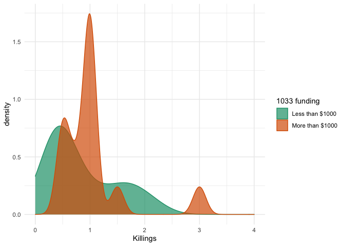

The effect of police militarization on the number of fatal shootings in
Georgia
================
Nick Thieme
9/15/2020

## 

This is the code behind the AJC story about the [effect of police
militarization on the number of killings by
police](https://www.ajc.com/news/police-killings-more-likely-in-agencies-that-get-military-gear-data-shows/MBPQ2ZE3XFHR5NIO37BKONOCGI/).
I’m including the full pipeline and analysis here to hopefully make this
kind of analysis easier for other newsrooms / researchers to replicate
for themselves.

## Library

We load in the required libraries. Most of these aren’t used more than
once or twice, others are used all the time.

``` r
library(tidyverse)
library(readxl)
library("tidycensus")
library(gghighlight)
library("pacman")
library("RMySQL")
library("sf")
library(mgcv)
library(lubridate)
library(data.table)
library(tigris)
library(MASS)
library(httr)
library(tsibble)
library(tools)
library(fbi)
library(gmailr)

#this is a useful function I use to email myself when long code chunks have finished running. Since I often work late on these projects, I like to be able to move around and cook or clean or work on a personal project while my code runs, and setting up email notifications really helps with that. 

email_me<-function(subj, mess){
  
  test_email<-gm_mime() %>%
  gm_to("nick.thieme5@gmail.com") %>%
  gm_from("nick.thieme5@gmail.com") %>%
  gm_subject(subj) %>%
  gm_text_body(mess)
  gm_send_message(test_email)
}
```

## Data loading

Loading and formatting the data is the real difficulty with this
analysis. The data is all over the place, and there isn’t any natural
way to join it all together. You can do it, but it takes time. I hope my
presenting the code here makes it a little easier to replicate.

### Load police department data

Police departments are indexed by their Originating Agency Identifier
(ORI, very upsetting acronym), and we can use that information to later
get their employment statistics, as well as the crime statistics in
their precincts.

To get the ORI’s go through the FBI’s API. I get the identifying
information for all departments in the country, extract the information,
and filter to the departments in Georgia.

If you want to do this in a state other than Georgia, change the filter
on line 80 below. All of this requires an FBI API
key.

``` r
police_D_stat<-"https://api.usa.gov/crime/fbi/sapi/api/agencies/?api_key="
api<-"YOUR_API_KEY"
police_D <- GET(str_c(police_D_stat, api))
police_D_f<-content(police_D)

#format police department data
num_jur<-police_D_f %>% length
D_pds<-data.frame()

for(i in 1:num_jur){
  jur_dat<-police_D_f[[i]]
  num_depts <-length(jur_dat)
  
  D_state<-data.frame()
  
  for(j in 1:num_depts){
    agency_dat<-jur_dat[[j]]
    
    D_agency<-tibble(agency_name=agency_dat$agency_name,
                     agency_type_name=agency_dat$agency_type_name,
                     state_abbr=agency_dat$state_abbr,
                     county_name=agency_dat$county_name,
                     ori = agency_dat$ori)
    
    D_state<-rbind(D_agency, D_state)
  }
  
  D_pds<-rbind(D_pds, D_state)
}

GA_pds<-D_pds %>% filter(state_abbr=="GA")
#write_csv(GA_pds, path = "GA_pds.csv")
#GA_pds<-read_csv("GA_pds.csv")
```

I find it very helpful to write out intermediary datasets during these
long data loading and cleaning pipelines, especially when there are API
bottlenecks. I’m commenting out the write and read statements here.

### Loading violent crime

Once we have the ORI’s for the police departments in GA, we can use them
in another query to the FBI’s API to get the violent crime statistics
per year.

This is where I use the email functions to let me know if my code
finished running because it ran the whole way through or because I hit
an API bottleneck. We query the FBI API and get back the crimes per type
per year, which we group into violent and non-violent according to the
FBI’s definitions to get a dataset of violent crimes per department per
year.

``` r
root<-"https://api.usa.gov/crime/fbi/sapi/api/summarized/agencies/"
stem<-"/offenses/2009/2018"
api<-"YOUR_API_KEY"
D_crime_totals<-data.frame()

for(i in 1:nrow(GA_pds)){
  agency<-GA_pds$ori[i]
  URL<-str_c(root, agency, stem,alt_api)
  a<-content(GET(URL))
  
  if(is_null(a$error)){
    if(i ==nrow(GA_pds)){
      email_me("code block ended", "finished")
    }
  }else{
    print('out of api uses. wait')
    break
    email_me("code block ended", "api usage out")
  }
  
  pd_crimes<-a$results
  
  if(length(pd_crimes)==0){
    next
  }
  
  D_pd_crime<-data.frame()
  
  for(j in 1:length(pd_crimes)){
    ori<-pd_crimes[[j]]$ori
    year<-pd_crimes[[j]]$data_year
    actual<-pd_crimes[[j]]$actual
    offense<-pd_crimes[[j]]$offense
    D_row<-tibble(year, ori, offense, actual)
    D_pd_crime<-rbind(D_pd_crime,D_row)
  }
  
  D_crime_totals<-rbind(D_crime_totals,D_pd_crime)
}

#write_csv(D_crime_totals, path = "Crime_totals.csv")
#D_crime_totals<-read_csv( "Crime_totals.csv")

D_crime_agg<-D_crime_totals %>% group_by(year, ori) %>% 
  summarise(v_crime=actual[which(offense%in%c("aggravated-assault",
                                      "burglary","rape","rape-legacy",
                                      "robbery"))] %>% sum,
            v_crime_a=actual[which(offense=="violent-crime")]
            )

GA_pds_per_county<-data.frame()

for(i in 1:nrow(GA_pds)){
  check_for_cross_county<-GA_pds[i,]$county_name %>% str_detect(.,";")
  
  if(check_for_cross_county==FALSE){
    
    GA_pds_per_county<-rbind(GA_pds_per_county,GA_pds[i,] %>%
                               add_column(divisor=1))
    
  }else{
    counties_to_split<-GA_pds[i,]$county_name %>% str_split(";") %>% unlist %>% 
      trimws
    
    D_county<-data.frame()
    
    for(j in 1:length(counties_to_split)){
      
      D_county_split<-tibble(agency_name=GA_pds[i,]$agency_name,
                             agency_type_name=GA_pds[i,]$agency_type_name,
                             state_abbr=GA_pds[i,]$state_abbr,
                             county_name=counties_to_split[j],
                             ori=GA_pds[i,]$ori,
                             divisor = length(counties_to_split)
                             )
                             
      GA_pds_per_county<-rbind(GA_pds_per_county,D_county_split)
      
    }
    
  }
}

D_crime_f_a<-GA_pds_per_county %>% left_join(D_crime_agg, by ="ori") %>%
  mutate(year=replace_na(year, "2010"),
         v_crime=replace_na(v_crime, 0)
         )

oris<-GA_pds$ori %>% unique
employment_data_list <- vector(mode = "list", length = length(oris))

api<-"YOUR_API_KEY"

#get the employment statistics
for(i in 1:length(oris)){
  
  employment_data_list[[i]]<-get_police_employment(
    ori= oris[i],
    key = api) %>% 
    dplyr::select(year, ori, ncic_agency_name, agency_name_edit, 
                  officers_total, population) %>% 
    na.omit
  # 
  # if(is_null(a$error)){
  #   if(i ==nrow(GA_pds)){
  #     email_me("code block ended", "finished")
  #   }
  # }else{
  #   print('out of api uses. wait')
  #   break
  #   email_me("code block ended", "api usage out")
  # }
  
}

email_me("done", "done")

employment_data<-employment_data_list %>% do.call("rbind",.)
#write_csv(employment_data,"employment_data_f.csv")
#employment_data<-read_csv("employment_data_f.csv")

#cleaning D_crime_f. adding in missing years
years<-D_crime_f_a$year %>% unique %>% sort
d_oris<-D_crime_f_a$ori %>% unique

D_crime_f_a<-D_crime_f_a %>% dplyr::select(order(colnames(.))) %>% 
  dplyr::select(-v_crime_a) 

D_crime_f_filled<-tibble()

for(i in 1:length(d_oris)){
  years_ori<-D_crime_f_a %>% filter(ori==d_oris[i]) %>% pull(year) %>% sort
  missing_years<-years[-which(years%in%years_ori)]
  
  county<-(D_crime_f_a %>% filter(ori==d_oris[i]) %>% pull(county_name))[1]
  
  D_ori_minus<-D_crime_f_a %>% filter(ori==d_oris[i]) %>% 
    dplyr::select(agency_name, agency_type_name, state_abbr,ori, divisor) %>% 
    distinct
  
  if(length(missing_years)>0){
    D_to_add<-D_ori_minus%>% slice(rep(1:n(), each = length(missing_years))) %>% 
      add_column(year= missing_years, county_name= county,
                 v_crime =rep(0, length(missing_years))) %>% 
      dplyr::select(order(colnames(.))) 
    
    D_to_add_f<-rbind(D_to_add, D_crime_f_a %>% filter(ori==d_oris[i])) %>% 
      arrange(year) %>% filter(county_name == county)
  }else{
    D_to_add_f <- D_crime_f_a %>% filter(ori==d_oris[i])
  }
  
  D_crime_f_filled<-rbind(D_crime_f_filled,D_to_add_f)
}

D_crime_f_filled<-D_crime_f_filled %>% mutate(year = as.numeric(year))
```

One important step we take is to add in years without violent crimes.
This is a step we take with all of the data we include. When we have
years that don’t have any, say, fatal shootings or 1033 acquisitions, we
need to include those years, otherwise, the inferences we make later on
will be incorrect.

We do the same thing with the police employment data, getting the number
of officers per department, and join it with the crime data.

``` r
employment_data_f<-employment_data %>% filter(year>=2009)%>% 
  dplyr::select(order(colnames(.))) 

d_oris<-employment_data_f$ori %>% unique
employment_data_filled<-tibble()

for(i in 1:length(d_oris)){
  years_t<-employment_data_f %>% filter(ori==d_oris[i]) %>% pull(year)
  years_ori<-years_t %>% sort
  
  missing_years<-years[-which(years%in%years_ori)] %>% as.numeric
  
  D_ori_minus<-employment_data_f %>% filter(ori==d_oris[i]) %>% 
    dplyr::select(ncic_agency_name,ori, agency_name_edit) %>% 
    distinct
  
  if(length(missing_years)>0){
    
    officer_year_rep<-rep(0, length(missing_years))
    population_year_rep<-rep(0, length(missing_years))
    
    for(j in 1:length(missing_years)){
      officer_year_rep[j] <-(employment_data_f %>% filter(ori==d_oris[i]))[
        which.min(abs(years_t-missing_years[j])),
        ]$officers_total
      
      population_year_rep[j] <-(employment_data_f %>% filter(ori==d_oris[i]))[
        which.min(abs(years_t-missing_years[j])),
        ]$population
    }
    
    D_to_add<-D_ori_minus%>% slice(rep(1:n(), each = length(missing_years))) %>% 
      add_column(year= missing_years, 
                 officers_total =officer_year_rep,
                 population = population_year_rep) %>% 
      dplyr::select(order(colnames(.))) 
    
    D_to_add_f<-rbind(D_to_add, employment_data_f %>%filter(ori==d_oris[i])) %>% 
      arrange(year) 
  }else{
    D_to_add_f <- employment_data_f %>% filter(ori==d_oris[i])
  }
  
  employment_data_filled<-rbind(employment_data_filled,D_to_add_f)
}

D_ori_j<- employment_data_filled%>% 
  left_join(D_crime_f_filled, by = c("year","ori")) %>% 
  mutate(ncic_agency_name=
           case_when(is.na(ncic_agency_name)~agency_name,
                     is.na(ncic_agency_name)==FALSE~ncic_agency_name
                     ),
         agency_name_edit=
           case_when(is.na(agency_name_edit)~agency_name,
                     is.na(agency_name_edit)==FALSE~agency_name_edit
           )
         )

#write_csv(D_ori_j, path = "D_middle_emp_crim_new.csv")
```

### Loading fatal shootings data

Here we read in the shootings data. The AJC has maintained a database of
fatal shootings by Georgia police since the ‘Over the Line’
[series](https://investigations.ajc.com/overtheline/). We use that
database as our source for fatal shootings. Other studies, like
[Delehanty, 2017](https://journals.sagepub.com/doi/full/10.1177/2053168017712885)
and
[Lawson, 2019](https://journals.sagepub.com/doi/full/10.1177/1065912918784209),
used the [Fatal Encounters data](https://fatalencounters.org/).

Regardless of which data provides the fatal shooting numbers, assign
that to d. I’m hiding the specifics of our query for security reasons,
but I use RMySQL to access the database.

``` r
query<-"QUERY"

db_user <- ''
db_password <- ''
db_name <- ''
db_host <- '' 
db_port <- 

#connect to server
mydb <-  dbConnect(MySQL(), user = db_user, password = db_password,
                   dbname = db_name, host = db_host, port = db_port)

#fetch and transform data
rs <- dbSendQuery(mydb, query)
d <-  fetch(rs, n = -1)%>%data.table

d_agg<-d %>% mutate(y = year(incident_date), lea_f=officer_department) %>% group_by(y,lea_f,case_id) %>% 
   summarise(n= n()) %>% group_by(y, lea_f) %>% summarise(n = n()) %>% 
   mutate( year_shooting= y) %>% ungroup %>% dplyr::select(-y)
 
d_name<-d_agg$lea_f %>% unique 
d_agg_filled<-tibble()
 
for(i in 1:length(d_name)){
  years_t<-d_agg %>% filter(lea_f ==d_name[i]) %>%
    pull(year_shooting) %>% unique

  years_ori<-years_t %>% sort

  missing_years<-years[-which(years%in%years_ori)] %>% as.numeric

  D_ori_minus<-d_agg %>% filter(lea_f ==d_name[i])%>% ungroup %>%
    dplyr::select(lea_f) %>%  distinct

  if(length(missing_years)>0){

    D_to_add<-D_ori_minus%>% slice(rep(1:n(), each = length(missing_years))) %>%
      add_column(year_shooting= missing_years, n = 0) %>%
      dplyr::select(order(colnames(.)))

    D_to_add_f<-rbind(D_to_add, d_agg %>% filter(lea_f ==d_name[i]))%>%
      arrange(year_shooting)
  }else{
    D_to_add_f <- d_agg %>% filter(lea_f ==d_name[i])
  }

  d_agg_filled<-rbind(d_agg_filled,D_to_add_f)
}

#write_csv(d_agg_filled, "shootings_cleaned.csv")
# d_agg_filled<-read_csv("shootings_cleaned.csv"
```

### Loading 1033 data

The last data we need is the 1033 data. As always, this is a little more
complicated than it would seem at first. Not all kinds of 1033 gear are
necessarily what we consider militarized gear. It makes more sense to
measure militarization as a function of military gear than it does to
measure it as a function of how many socks are received.

Using NSN (NATO or National Stock Number) codes from the Department of
Defense, we can classify and select certain acquisitions in the
categories of guns, ammunition, vehicles, communications equipment, and
Federal Supply Code critical gear.

However, the value of items is often dependent on the local supply
center that evaluates the gear, making comparisons between different
centers unequal. In order to account for those differences, we calculate
the median value of a particular item across the dataset, and assign
each department that acquired that item the median value multipled by
the number of that item they received.

Finally, we add in the years for which departments did not receive any
1033 gear.

``` r
path<-"disp_fed_to_states.xlsx"

mad <- path %>%
  excel_sheets() %>%
  set_names() %>%
  map_df(read_excel,
         path = path)

D_ga_dept<-mad %>% filter(State == "GA") %>% 
  mutate(ship_year = year(`Ship Date`)) %>% 
  group_by(`Item Name`,`Station Name (LEA)`, ship_year) %>% 
  summarise(total= sum(`Acquisition Value`),quantity=sum(Quantity)) %>% 
  arrange(desc(total)) %>% add_column(id = 1:nrow(.))

items_cost<-D_ga_dept %>% mutate(price_per_item = total/quantity) %>% 
  group_by(`Item Name`) %>% summarise(med_value = median(price_per_item))

items_demo <- read_csv("items_1033.csv") %>% 
  mutate(crit_fsc = ifelse(is.na(crit_fsc), 0, 1),
         viol_flag = case_when(FSC%in%c(10,13,23,58)~"viol",
                               crit_fsc==1~"viol")) %>% 
  mutate(viol_flag= replace_na(viol_flag, "no_viol" ))

items_demo_f<-items_demo %>% dplyr::select(`Item Name`, viol_flag, FSC) %>% left_join(items_cost, by = "Item Name")

#10, 13, 15, 23, 58 
D_ga_dept_filled<-D_ga_dept %>%
  left_join(items_demo_f, by = "Item Name")%>% 
  mutate(viol_flag= replace_na(viol_flag, "no_viol" ),
         total_fixed = med_value*quantity)

D_ga_dept_f_2<-D_ga_dept_filled%>% filter(between(ship_year,2008,2018))%>%
  dplyr::select(order(colnames(.))) %>% ungroup

d_name_2<-D_ga_dept_f_2$`Station Name (LEA)` %>% unique
D_ga_dept_2<-tibble()
years<-D_ga_dept_f_2$ship_year %>% unique

D_ga_dept_f_3<-D_ga_dept_f_2 %>% group_by(`Station Name (LEA)`, ship_year) %>%
  summarise(n_v = sum(quantity[viol_flag=="viol"]),
            value_v = sum(total_fixed[viol_flag=="viol"]),
            n_nv = sum(quantity[viol_flag=="no_viol"]),
            value_nv = sum(total_fixed[viol_flag=="no_viol"])) %>%
dplyr::select(order(colnames(.)))

for(i in 1:length(d_name_2)){
  years_t<-D_ga_dept_f_3 %>% filter(`Station Name (LEA)` ==d_name_2[i]) %>%
    pull(ship_year) %>% unique

  years_ori<-years_t %>% sort

  missing_years<-years[-which(years%in%years_ori)] %>% as.numeric

  D_ori_minus<-D_ga_dept_f_3 %>% filter(`Station Name (LEA)` ==d_name_2[i])%>%
    dplyr::select(`Station Name (LEA)`) %>% distinct

  if(length(missing_years)>0){

    D_to_add<-D_ori_minus%>% slice(rep(1:n(), each = length(missing_years))) %>%
      add_column(ship_year= missing_years,
                 value_v = 0,
                 n_v =0,
                 value_nv = 0,
                 n_nv =0) %>%
      dplyr::select(order(colnames(.)))

    D_to_add_f<-rbind(D_to_add,
                      D_ga_dept_f_3 %>%
                        filter(`Station Name (LEA)` ==d_name_2[i])
    ) %>%  arrange(ship_year)
  }else{
    D_to_add_f <- D_ga_dept_f_3 %>% filter(`Station Name (LEA)` ==d_name_2[i])
  }

  D_ga_dept_2<-bind_rows(D_ga_dept_2,D_to_add_f)
}
```

We’re now faced with an additional difficulty. The names of departments
and areas don’t exactly match between datasets, and there isn’t a clear
crosswalk file to use to put them together. The next section tries to
get as close as possible, matching on word stems, and then I go by hand
to match the remaining departments.

The difficulty of this steps depends on how closely the data matches
between different datasets for the geography you’re interested in. It
took about 5 hours for the state of Georgia, but it may take more or
less for your area.

``` r
ag_names_og<-D_ori_j$ncic_agency_name %>% unique %>% tolower
ag_names<-ag_names_og

for(i in 1:length(ag_names)){
  
  if(is.na(ag_names[i])){
    next
  }
  
  co_flag<-ag_names[i] %>% str_detect("co so")
  pd_flag<-ag_names[i] %>% str_detect("pd")
  po_de_flag<-ag_names[i] %>% str_detect("police department")
  dps_flag<-ag_names[i] %>% str_detect("dps")
  dept_flag<-ag_names[i] %>% str_detect("dept")
  off_flag<-ag_names[i] %>% str_detect("office")
  
  if(co_flag){
    locs<-ag_names[i] %>% str_locate("co so")
    ag_names[i]<-str_sub(ag_names[i], 1,locs[2])
  }
  
  if(pd_flag){
    locs<-ag_names[i] %>% str_locate("pd")
    ag_names[i]<-str_sub(ag_names[i], 1,locs[2])
  }
  
  if(po_de_flag){
    locs<-ag_names[i] %>% str_locate("police department")
    ag_names[i]<-str_sub(ag_names[i], 1,locs[2])
  }
  
  if(dps_flag){
    locs<-ag_names[i] %>% str_locate("dps")
    ag_names[i]<-str_sub(ag_names[i], 1,locs[2])
  }
  
  if(dept_flag){
    locs<-ag_names[i] %>% str_locate("dept")
    ag_names[i]<-str_sub(ag_names[i], 1,locs[2])
  }
  
  if(off_flag){
    locs<-ag_names[i] %>% str_locate("office")
    ag_names[i]<-str_sub(ag_names[i], 1,locs[2])
  }
}

#editing the lastones by hand
  
ag_names<-ag_names %>% str_replace("pd", "police department")
ag_names<-ag_names%>% str_replace("co so", "county sheriff's department")

ag_names<-ag_names%>% str_replace("county sheriff's office",
                                  "county sheriff's department") %>% 
  str_replace("county sheriff office",
              "county sheriff's department")

#manual match

d_names<-d_agg_filled$lea_f %>% unique %>% tolower 
d_names_og<-d_agg_filled$lea_f %>% unique %>% tolower
#which are in there?
in_there<-d_names[which(d_names%in%ag_names)]

#which arent
not_in_there<-d_names[-which(d_names%in%ag_names)]
not_in_there_ag <- ag_names[-which(ag_names%in%d_names)]

#this is a bit of code to use over and over to find the matches
not_in_there_ag[which(not_in_there_ag %>% str_detect("MISSING DEPARTMENT"))]
ag_names[ag_names %>% str_detect("MISSING DEPARTMENT")]

#other matching tool
d_names[which(d_names=="savannah police department")]<-
  "savannah-chatham metro police department"

ag_names[which(ag_names=="gwinnett co public school police lawrenceville")]<-
  "gwinnett co public school police"

ag_names[which(ag_names=="gwinnett co public school police lawrenceville")]<-
  "gwinnett co public school police"

ag_names[which(ag_names=="fulton co school syst campus pol atlanta")]<-
  "fulton co school syst campus pol"

ag_names[which(ag_names== "dalton college security police dalton")]<-
  "dalton college security police"  

ag_names[which(ag_names== "georgia ports authority savannah" )]<-
  "georgia ports authority" 

ag_names[which(ag_names== "ga pub safety training ctr sec police forsyth" )]<-
  "ga pub safety training ctr sec police"

ag_names[which(ag_names== "co board of educ campus police savannah" )]<-
  "co board of educ campus police" 

ag_names[which(ag_names=="de kalb county police department")]<-
  "dekalb county police department"

ag_names[which(ag_names=="georgia tech police department")]<-
  "georgia tech police"

ag_names[which(ag_names=="metro atlanta rapid transit auth police department")]<-
  "marta police department"

ag_names[which(ag_names=="mc duffie county sheriff's department")]<-
  "mcduffie county sheriff's department"

ag_names[which(ag_names=="savannah chatham metropolitan police depart")]<-
  "savannah-chatham metro police department"

ag_names[which(ag_names=="savannah chatham metropolitan police depart")]<-
  "savannah-chatham metro police department"

#now doing the same thing for 1033 data
names_1033_og<-D_ga_dept_2$`Station Name (LEA)` %>% table%>%names %>% 
  tolower

names_1033<-names_1033_og %>% 
  str_replace(.,"sherrif's", "sheriff") %>% 
  str_replace(.,"sheriff's", "sheriff") %>% 
  str_replace(.,"sheriff", "sheriff's") %>% 
  str_replace(.,"dept", "department") %>% 
  str_replace(.,"office", "department") %>% 
  str_replace(.,"cso", "county sheriff's department ") %>% 
  str_replace(.,"sheriff'ss", "sheriff's") %>% 
  str_replace(.,"pd", "police department") %>% 
  trimws()

names_1033_match<-names_1033[which(names_1033 %in%ag_names)]
names_1033_missing <-names_1033[-which(names_1033 %in%ag_names)]

#matching tool
ag_names[which(ag_names %>% str_detect("MISSING_DEPARTMENT"))]
d_names[which(d_names %>% str_detect("MISSING_DEPARTMENT"))]

#manual match
names_1033[
  which(names_1033=="savannah police department")]<-
  "savannah-chatham metro police department"

ag_names[which(ag_names=="west georgia technical college" )]<-
  "west ga tech college police hi_ed" 

ag_names[which(ag_names=="west ga college dept")]<-
  "univ of west georgia police hi_ed" 

names_1033[
  which(names_1033=="troup cty sheriff's department")]<-
  "troup county sheriff's department"

ag_names[which(ag_names=="swainsboro")]<-
  "swainsboro police department"

names_1033[
  which(names_1033=="southern crescent college police department hi_ed")]<-
  "southern crescent technical college police" 

names_1033[which(names_1033=="quitman county sheriff's  department")]<-
  "quitman county sheriff's department"

names_1033[which(names_1033=="public safety training center")]<-
  "ga pub safety training ctr sec police"

names_1033[which(names_1033=="perry police departmentment")]<-
  "perry police department"

names_1033[which(names_1033=="paulding county  sheriff's department")]<-
  "paulding county sheriff's department"

names_1033[which(names_1033=="mount zion police department")]<-
  "mt zion police department"

ag_names[which(ag_names=="poulan")]<-
  "poulan police department"

ag_names[which(ag_names=="norman park")]<-
  "norman park police department"

ag_names[which(ag_names=="lyons")]<-
  "lyons police department"

ag_names[which(ag_names=="marshallville")]<-
  "marshallville police department"

names_1033[which(names_1033=="fulton county schools police k-12"  )]<-
  "fulton co school syst campus pol"

names_1033[which(names_1033=="lake city police depaftment"   )]<-
  "lake city police department"

names_1033[which(names_1033=="kennesaw state univ dps hi_ed")]<-
  "kennesaw state college dps"

names_1033[which(names_1033=="evans co sheriff's department")]<-
  "evans county sheriff's department"

ag_names[which(ag_names=="cohutta")]<-
  "cohutta police department"

names_1033[which(names_1033=="blue ridge police department")]<-
  "blue ridge"

names_1033[which(names_1033=="blythe police department" )]<-
  "city of blythe police department"

names_1033[which(names_1033=="brookhaven police department" )]<-
  "brookhaven"

names_1033[which(names_1033=="canon police department" )]<-
  "canon"

names_1033[
  which(names_1033=="augusta tech coll campus police department hi_ed" )]<-
  "augusta technical colleg"

names_1033[which(names_1033== "bibb co. boe campus police department k-12")]<-
  "bibb co board of ed campus police dept"

ag_names[which(ag_names=="chattahoochee hill country police department")]<-
  "chattahoochee hills police department"

D_ag_name<-tibble(ag_names=ag_names%>% as.character, ag_names_og=ag_names_og %>% as.character)
D_names_1033<-tibble(names_1033, names_1033_og)
D_names_killings<-tibble(d_names, d_names_og)

D_ga_dept_j<-D_ga_dept_2 %>% 
  mutate(station_name = `Station Name (LEA)` %>% tolower) %>% 
  left_join(D_names_1033, by = c("station_name"="names_1033_og")) %>% 
  mutate(year= ship_year+1)
```

Now, that we have common names, we can match these datasets together.

``` r
#ag_names
D_ga_dept_j <- D_ga_dept_j %>% dplyr::select(names_1033,year,n_v,value_v, value_nv, n_nv)

D_ori_j_2<-D_ori_j %>% 
  mutate(ncic_agency_name = ncic_agency_name %>% tolower) %>% 
  left_join(D_ag_name, by = c("ncic_agency_name"="ag_names_og")) %>% mutate(ag_names = as.character(ag_names))

D_1033_crime_emp<-D_ori_j_2 %>% 
  left_join(D_ga_dept_j, by = c("year","ag_names"="names_1033")) %>% 
  mutate(n_v = replace_na(n_v, 0),value_v = replace_na(value_v, 0),
         n_nv = replace_na(n_nv, 0),value_nv = replace_na(value_nv, 0))
  
#match with both
d_agg_filled_2<-d_agg_filled %>% 
  mutate(officer_department = lea_f %>% tolower) %>% 
  left_join(D_names_killings, by = c("officer_department"="d_names_og")) %>% 
  mutate(n_kill = n,d_names = as.character(d_names)) %>% dplyr::select(-n)

D_1033_crime_emp_kill<-D_1033_crime_emp %>% 
  left_join(d_agg_filled_2, by = c("year"="year_shooting",
                                   "ag_names"="d_names")) %>% 
  mutate(n_kill = replace_na(n_kill, 0)) %>% distinct %>% 
  group_by(ag_names, year) %>% summarise(officers_total=officers_total[1],
                                         population=population[1],
                                   ori = ori[1],
                                   year=year[1],
                                   agency_name = agency_name[1],
                                   agency_type_name = agency_type_name[1],
                                   county_name = county_name[1],
                                   v_crime = v_crime[1],
                                   n_v = n_v[1],
                                   value_v = value_v %>% sum,
                                   n_nv = n_nv[1],
                                   value_nv = value_nv %>% sum,
                                   n_kill = n_kill[1])%>% 
  mutate(county_name = county_name %>% tolower)
```

There are just two steps left. We still need to add in the ACS data and
the drug use data. The Census data is quite coarse for our datasets.
It’s at the county level.

There is, unfortunately, no real way to fix this without manually
assigning Census tracts to police departments. The FBI API gives the
county of the police department, so that’s as close as we can currently
get. This means the estimates of the effect of black residents will
likely not be as well estimated as other effects.

The SAMSHA data
[here](https://www.samhsa.gov/data/data-we-collect/nsduh-national-survey-drug-use-and-health)
also required downloading
[shapefiles](https://www.samhsa.gov/data/report/2014-2016-nsduh-substate-region-shapefile).

We perform some spatial joins using those shapefiles to get the drug use
data matched with the county data. However, as drug use is measured in
surveys whose regions are defined by SAMSHA, those areas are not fully
coincident with our Census counties.

We use simple linear interpolation to assign values of drug use to
counties. There are well-known problems with linear interpolation
(namely, violations of homogeneity, which is certainly the case with
drug use), but it’s more accurate than only using a single estimate.

``` r
drug_use<-read_csv("map_data.csv")

drug_use_f<-drug_use%>% filter(str_detect(geography,"Georgia")) %>% 
  mutate(region= str_remove(geography, "Georgia") %>% trimws) %>% 
  filter(region!="", age_group=="18 or Older") %>% as.data.table()

shp<-st_read("ShapeFile2016/SubstateRegionData141516.shp")
shp_f <-shp%>% filter(ST_NAME=="Georgia")%>% as.data.table()
D_drugs_f<-drug_use_f[shp_f, on = c("region"="SR_NAME")] %>% st_as_sf()

get_yr_acs<-function(x, survey){
  d_acs<-get_acs(
    geography = "county",
    variables = c(med_inc="B19013_001", black = "B02001_003"),
    summary_var = "B01003_001",
    state = "GA",
    year = x,
    survey = survey
  )
  return(d_acs)
}

D_acs_09<-get_yr_acs(2009, "acs5")%>% add_column(year=2009)
D_acs_10<-get_yr_acs(2010, "acs5")%>% add_column(year=2010)
D_acs_11<-get_yr_acs(2011, "acs5")%>% add_column(year=2011)
D_acs_12<-get_yr_acs(2012, "acs5")%>% add_column(year=2012)
D_acs_13<-get_yr_acs(2013, "acs5")%>% add_column(year=2013)
D_acs_14<-get_yr_acs(2014, "acs5")%>% add_column(year=2014)
D_acs_15<-get_yr_acs(2015, "acs5")%>% add_column(year=2015)
D_acs_16<-get_yr_acs(2016, "acs5")%>% add_column(year=2016)
D_acs_17<-get_yr_acs(2017, "acs5")%>% add_column(year=2017)
D_acs_18<-get_yr_acs(2018, "acs5")%>% add_column(year=2018)

D_acs_ts<-rbind(D_acs_09,D_acs_10,D_acs_11,D_acs_12,D_acs_13,D_acs_14,D_acs_15,
                D_acs_16,D_acs_17, D_acs_18) %>% as.data.table()

county<-counties(state="GA", cb = TRUE)
county_sf <- county %>% st_as_sf()

county_sf_f<-county_sf %>% mutate(NAME = str_c(NAME, " County, Georgia")) %>% 
  as.data.table()

D_acs_f <- D_acs_ts[county_sf_f, on = "GEOID"] %>% st_as_sf
D_drugs_f<-st_transform(D_drugs_f, st_crs(D_acs_f))
D_acs_f_2<-D_acs_f 

temp_acs<-D_acs_f_2 %>% mutate(area = st_area(geometry)) %>%
  dplyr::select(GEOID, area) %>% as.data.table %>% dplyr::select(GEOID, area) %>%
  unique

temp_drugs<-D_drugs_f %>% dplyr::select(geography, estimate) %>% as.data.table
D_acs_f_2 <- st_buffer(D_acs_f_2 %>% st_as_sf, dist = 0)
D_drugs_f <- st_buffer(D_drugs_f %>% st_as_sf, dist = 0)

q<-D_acs_f_2  %>% st_intersection(D_drugs_f) %>% as.data.table

D_acs_f_2<-D_acs_f %>%dplyr::select(GEOID, NAME, variable, estimate, summary_est,
                                    year) %>% as.data.table() %>% na.omit

q_2<-q %>% mutate(area=st_area(geometry)) %>% 
  dplyr::select(GEOID,geography,area)%>%as.data.table() %>% unique

q_3<-q_2[temp_acs, on = "GEOID"] %>% dplyr::mutate(perc_area = area/i.area) %>% 
  dplyr::select(GEOID, geography, area, i.area,perc_area) %>% as.data.frame()%>% 
  dplyr::mutate(perc_area =  str_remove(perc_area, "\\[") %>% as.numeric,
                area =  str_remove(area, "\\["),
                i.area =  str_remove(i.area, "\\[")
  ) %>% filter(perc_area>.06) %>% as.data.table

D_acs_drugs<-q_3[temp_drugs, on = "geography"] %>% st_as_sf

D_acs_drugs_f<-D_acs_f_2[D_acs_drugs, on = "GEOID"] %>%
  mutate(county_name = 
           NAME %>% str_remove("County, Georgia") %>% tolower %>% trimws) %>% 
  dplyr::select(variable, estimate, year, drug_use = i.estimate, county_name,
                tot_pop = summary_est)%>% 
pivot_wider(names_from = variable, values_from = estimate)
  
D_1033_crime_emp_kill_drugs_acs<-D_1033_crime_emp_kill %>% 
  left_join(D_acs_drugs_f, by = c("year", "county_name")) %>% 
  mutate(drug_use=as.numeric(drug_use), black_perc = black/tot_pop,
         ag_names = as_factor(ag_names))

#write_csv(D_1033_crime_emp_kill_drugs_acs, #"D_1033_crime_emp_kill_drugs_acs_f.csv")
```

And there we go. With only some 800 lines of code, we have our data
joined (flat face emoji, eye roll emoji). Now that the code is written,
though, it should be a little easier to edit for other geographies.

With all of that, we can finally start the analysis.

## Analysis

### Summary statistics

An interesting place to start is just looking at the number of killings
by police per year per department. That gives us an idea of how killings
have changed over time. Years that show a value less than 0 are
artefacts of the smoothing process.

    ## `geom_smooth()` using method = 'loess' and formula 'y ~ x'

<!-- -->

Now we can incorporate 1033 $s. At the absolute simplest level, let’s
look at the average number of killings for departments receiving more
than $1,000 in 1033 gear in a year, and compare to to those receiving
less than that amount.

The number is nearly 4 times as high for departments receiving more than
$1,000.

    ## [1] 0.03323653

    ## [1] 0.1258278

Here are the average number of killings per year by police for the top
ten most lethal counties in GA. The left column gives the county and the
right column gives the average killings per
    year.

    ## `summarise()` regrouping output by 'year' (override with `.groups` argument)

    ## `summarise()` ungrouping output (override with `.groups` argument)

    ## # A tibble: 10 x 2
    ##    ag_names                                 m
    ##    <chr>                                <dbl>
    ##  1 dekalb county police department        2.1
    ##  2 atlanta police department              1.7
    ##  3 gwinnett county police department      1.7
    ##  4 cobb county police department          1.5
    ##  5 clayton county police department       0.9
    ##  6 bartow county sheriff's department     0.6
    ##  7 columbus police department             0.6
    ##  8 richmond county sheriff's department   0.6
    ##  9 henry county police department         0.5
    ## 10 paulding county sheriff's department   0.5

### Looking at distributions

We can also split the counties by which counties have ever received more
than $1,000 in 1033 gear. Then, we can compare the most killings in the
first group with the most killings in the second group, the second most
killings in the first group with the second most killings in the second
group, the third most….and so on.

Doing this shows that 10 out of the 14 top ranks are larger for the
\>$1000 group, 1 of 14 are equal, and just 3 of 14 are
    smaller.

    ## `summarise()` ungrouping output (override with `.groups` argument)
    ## `summarise()` ungrouping output (override with `.groups` argument)

    ## # A tibble: 651 x 2
    ##    ag_names                                 m
    ##    <chr>                                <dbl>
    ##  1 dekalb county police department      2.1  
    ##  2 atlanta police department            1.7  
    ##  3 gwinnett county police department    1.7  
    ##  4 cobb county police department        1.33 
    ##  5 clayton county police department     1    
    ##  6 richmond county sheriff's department 0.714
    ##  7 lowndes county sheriff's department  0.5  
    ##  8 paulding county sheriff's department 0.5  
    ##  9 henry county police department       0.444
    ## 10 bibb county sheriff's department     0.4  
    ## # … with 641 more rows

    ## # A tibble: 164 x 2
    ##    ag_names                                     m
    ##    <chr>                                    <dbl>
    ##  1 cobb county police department              3  
    ##  2 bartow county sheriff's department         1.5
    ##  3 brantley county sheriff's department       1  
    ##  4 columbus police department                 1  
    ##  5 douglas county sheriff's department        1  
    ##  6 henry county police department             1  
    ##  7 kingsland police department                1  
    ##  8 leesburg police department                 1  
    ##  9 savannah-chatham metro police department   1  
    ## 10 forsyth county sheriff's department        0.8
    ## # … with 154 more rows

We can visualize this as well. The bars that show a faded section are
ones where the rank was larger for the \>$1,000 group. The bars with an
orange section are those where the rank was larger for the \<$1,000
group. No faded or orange bar means the ranks were equal.

<!-- -->

However, the actual difference is larger than it appears here. There are
more police departments that didn’t receive 1033 money than did receive
1033 money. A good deal more.

Because of that, comparing the 10th deadliest department above $1,000 to
the 10th deadliest department below $1,000 isn’t fair. If there are only
10 departments above $1,000 (there are a couple hundred, this is just
for explanation), the 10th deadliest department is also the least deadly
department.

Instead, we can look at the probability distribution of each. That tells
us: for each possible number of killings (1,2,3,…), what is the
probability a random department that received more than $1,000 in 1033
money killed that many people?

<!-- -->

This is a fairly technical plot, but the higher you are on the y-axis,
the more likely that outcome. At 0, for example, we can see that the
green group (less than $1,000 in 1033 funding) is higher (receives more
density) than the orange group (more than $1,000). That means
departments receiving fewer than $1,000 were more likely than
departments receiving more than $1,000 to have no killings in a year.

Departments that receive funding are more likely to kill between .5 and
1.25 people per year. Interestingly, less funded departments have more
density between 1.25 and 2.6 fatal shootings per year, at which point
the well-funded departmets become more likely again (between 2.6 and 3.5
fatal shootings per year).

This density plot tells me that departments receiving 1033 gear are both
more likely to have a fatal shooting in a year, and more likely to have
more than 2.6 fatal shootings in a year.

### Statistical analysis

At the most complicated level, we have our statistical analysis. Most
people will never read this, but I need to run it to be sure what we’re
seeing can be more rigorously supported.

I’m not including the model testing and checking and so forth, only the
final models. These models were landed on by splitting data into
training and testing sets, fiddling on the training set, and choosing
the final model on the testing set, before reporting the final model on
the full data. There’s no substantive difference between the hypothesis
tests on the testing set and the full data.

We cluster our errors by department to account for the strong
relationship between a department’s data in one year and that same
department’s data in another. Final inferences are drawn from the
clustered model.

    ## Loading required namespace: sandwich

    ## 
    ## Call:
    ## glm(formula = n_kill ~ log(value_v + 1) + log(value_nv + 1) + 
    ##     v_crime + population + officers_total + black_perc + med_inc + 
    ##     drug_use + year, family = "quasipoisson", data = D_1033_crime_emp_kill_drugs_acs)
    ## 
    ## Deviance Residuals: 
    ##     Min       1Q   Median       3Q      Max  
    ## -2.9210  -0.2321  -0.1980  -0.1767   4.5481  
    ## 
    ## Coefficients:
    ##                     Estimate Std. Error t value Pr(>|t|)    
    ## (Intercept)       -8.572e+01  4.488e+01  -1.910  0.05619 .  
    ## log(value_v + 1)   1.144e-01  1.638e-02   6.985 3.12e-12 ***
    ## log(value_nv + 1) -5.669e-03  2.605e-02  -0.218  0.82777    
    ## v_crime            1.033e-04  3.498e-05   2.952  0.00317 ** 
    ## population         4.382e-06  3.821e-07  11.466  < 2e-16 ***
    ## officers_total     8.632e-04  2.761e-04   3.126  0.00178 ** 
    ## black_perc         4.880e-01  4.446e-01   1.098  0.27242    
    ## med_inc            2.651e-05  5.068e-06   5.231 1.74e-07 ***
    ## drug_use          -1.560e+01  9.318e+00  -1.674  0.09412 .  
    ## year               4.071e-02  2.231e-02   1.825  0.06804 .  
    ## ---
    ## Signif. codes:  0 '***' 0.001 '**' 0.01 '*' 0.05 '.' 0.1 ' ' 1
    ## 
    ## (Dispersion parameter for quasipoisson family taken to be 0.8559306)
    ## 
    ##     Null deviance: 1879.0  on 6489  degrees of freedom
    ## Residual deviance: 1239.8  on 6480  degrees of freedom
    ##   (20 observations deleted due to missingness)
    ## AIC: NA
    ## 
    ## Number of Fisher Scoring iterations: 6

    ##                        Estimate   Std. Error    t value     Pr(>|t|)
    ## (Intercept)       -8.615238e+01 4.507334e+01 -1.9113821 5.595550e-02
    ## log(value_v + 1)   1.138559e-01 1.595116e-02  7.1377841 9.484744e-13
    ## log(value_nv + 1) -5.881885e-03 2.422811e-02 -0.2427711 8.081827e-01
    ## v_crime            1.048863e-04 3.216852e-05  3.2605272 1.112053e-03
    ## population         4.387262e-06 5.486784e-07  7.9960527 1.284714e-15
    ## black             -1.838089e-07 9.618650e-07 -0.1910963 8.484501e-01
    ## officers_total     8.732468e-04 3.896537e-04  2.2410842 2.502062e-02
    ## black_perc         5.612604e-01 8.327544e-01  0.6739807 5.003236e-01
    ## med_inc            2.715166e-05 6.164208e-06  4.4047285 1.059165e-05
    ## drug_use          -1.541552e+01 1.113669e+01 -1.3842105 1.662940e-01
    ## year               4.089232e-02 2.239741e-02  1.8257613 6.788623e-02

Nearly all the inferences from this make logical sense: the amount of
“violent” 1033 funding departments receive in-kind has a large
positive coefficient, but “non-violent” does not. Violent crime in a
precinct, population of a precinct, number of officers in a police
department, and year also have positive coefficients that are large
relative to the scale of the variable.

There are a couple unintuitive results here, however. We fail to reject
the t-tests for number of black residents and percent of black residents
in a precinct, and we have a positive coefficient for median income, all
of which are contrary to prior research. Importantly, there is an
absolutely overwhelming body of evidence showing that Black americans
are at higher risk of being killed by police:
[WaPo](https://www.washingtonpost.com/graphics/investigations/police-shootings-database/),
[PNAS](https://www.pnas.org/content/116/34/16793),
[PLOS](https://journals.plos.org/plosone/article?id=10.1371/journal.pone.0229686),…

The issue with these estimates is almost certainly due to the
granularity of the ACS data mentioned earlier. Our ACS data is at the
county level, and there’s no complete mapping of counties onto
precincts, so data on 1033 acquisitions, killings, crime, population,
and officers come from one population, while the ACS data come from
another. This has the effect of making the ACS estimates unreliable.
Knowing this, we still include these variables as nuisance parameters,
but don’t believe their estimates. Population, in our case, is
population covered by department, which is reported by the
FBI.

<!-- --><!-- --><!-- -->

Determining the relative importance of these variables is difficult.
Various research studies have come down on either side, and depending on
which methodology is used, either conclusion can be supported.

If you use a slightly different model at the county level, you can find
that 1033 investment has a larger effect on the number of killings than
violent crime or violent crime has a larger effect than 1033 investment.
However, the confidence intervals on that difference overlap, and,
additionally (because these points are often confused), there isn’t
enough evidence to distinguish between the estimates.

We’re not to only people to observe this. I basically replicated two
studies that did this analysis. One worked at the county level and the
other worked at the department level. In those studies, at the county
level, $ is more important, at the department level violent crime is
more important.

I’m presenting the department-level results here because it seems like
the better methodology, and the model is better specified. In our case,
that means an increase in 1033 funding has a slightly larger effect on
expected killings by police than an increase in the amount of violent
crime, but again, the effects are indistinguishable.

Having set the table, departments receiving the most 1033 dollars are
expected to kill roughly 5x more people per year than those receiving
the fewest amount of 1033 $s. On the other hand, departments in the
areas of Georgia with the most violent crime are expected to kill
slightly less than 5x more people per year than those in the areas with
the least crime.

Interestingly, however, we can see that posessing 1033 equipment makes
departments in areas at varying levels of violent crime more likely to
kill civilians. Setting 1033 investment at a high level and calculating
the effect of violent crime on the number of people police kill a year
increases the effect of violent crime compared with that at a low level
by 5 times.
