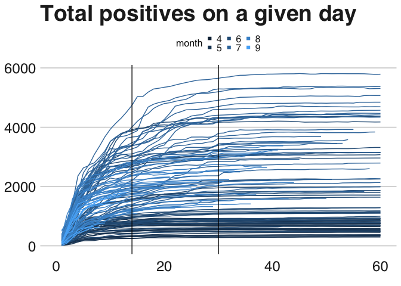
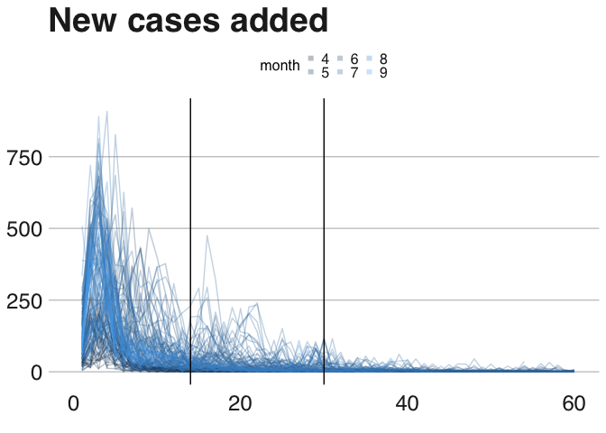
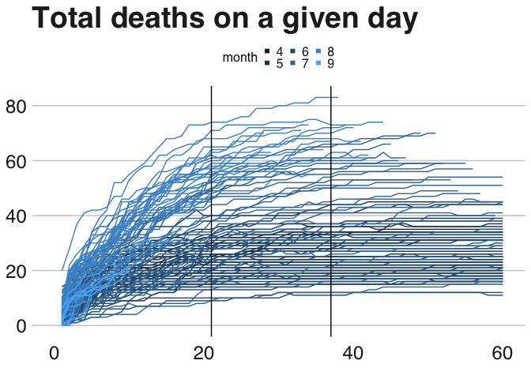
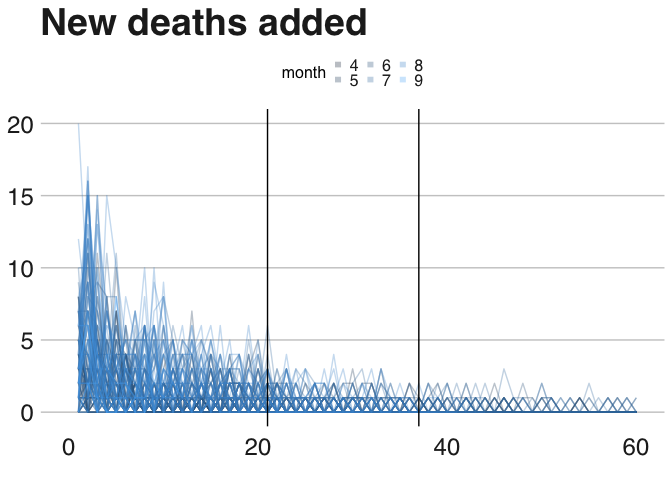

Convergence of reported Covid cases and deaths
================
Nick Thieme
8/31/2020

## Reporting delays

### Cases

Because the GA Department of Public Health attempts to assign positive
COVID tests to the date of symptom onset, the number of positive tests
on a given day increases for some time after that date.

For example, when looking for the number of positive cases on April 7th
2020, one must wait a number of weeks so that people who were sick on
April 7th but tested on April 14th and whose results only came back
April 21st are included in the count for April 7th. That person’s
positive COVID test, which will eventually increase the number of
infected on April 7th, won’t be added to the total for April 7th until
April 21st. This is not an unusual scenario.

One can ask: how much time must I wait before I can be confident the
infected count on a particular day won’t change all that much?

A statistically rigorous way to do this would be to calculate local
regression coefficients, and set the threshold when the confidence
interval for the slope is narrow around 0, for some definition of
narrow.

A simpler way is to look at how the number of cases on a given day
changes over
time.

<!-- --><!-- -->

There are two ways to look at this. We can look at the total number of
positives for a given day over time or we can look at the new cases
added to a given day over time. Both are useful.

The x-axis on both charts above is the number of days out from the
reporting date. So, with regards to the eventual total of April 7th,
April 8th is 1, April 9th is 2, April 10th is 3,…

The vertical lines are at 14 and 30 days out.

The first chart has total positives as its y-axis and the second has the
number of new cases added on the y-axis.

In general, we can see two things: both prior to the second wave and in
the recent days “after” the second wave, a threshold of about 2 weeks is
acceptable. In May and June, cases stabilized at about 2 weeks. This is
also true in August, although to a lesser extent, possibly because of
the effect of early August, which was still very much part of the second
wave.

However, for the month of July, cases were still increasing two weeks
out. We need to look about 30 days out for cases to stabilize in
July.

### Deaths

<!-- --><!-- -->

We can do the same thing with the number of deaths and the results are
relatively similar.

The vertical lines here are at 21 and 37 days out.

Originally, in May, June, and July, deaths flattened out at around the
3-week-mark, with only slight increases in deaths afterwards. However,
starting in July and especially visible in August, deaths continued
increasing through the 5-week-mark, after which they flattened out. This
conforms with the earlier chart as cases from July become deaths in
August.

## Discussion

All in all, I think our thresholds were well-chosen for the time in
which they were chosen, and they also seem relatively well-chosen for
the present. The case and death thresholds did not provide enough
backdating time for the second wave, however, and don’t provide quite
enough time for the new data either. I’m curious to see whether when
(if) cases drop to May levels, the original threshold will match the
data as well as they once did.
