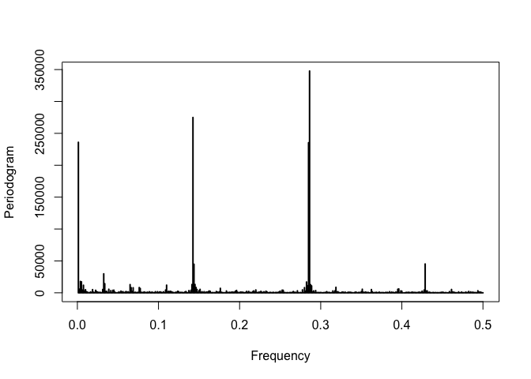
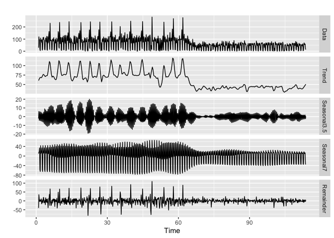
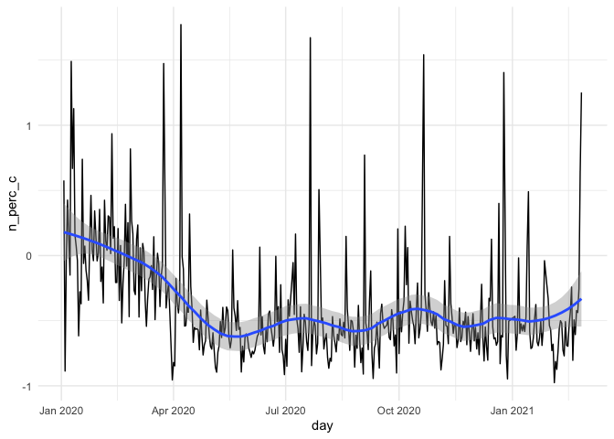
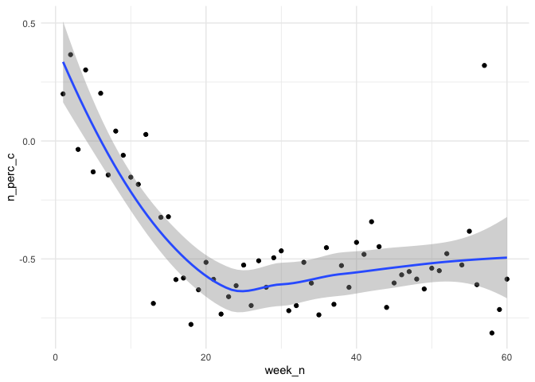

Code for Falling Through the Cracks
================
Nick Thieme
3/5/2021

This is the first article in a series investigating the economic and
financial fallout of the pandemic on people and businesses in GA. We
show that while the number of bankruptcies in GA is still significantly
lower than it was pre-pandemic, bankruptcies are rising and there is
strong evidence of large amount of pent-up demand.

### Library

``` r
####Function to produce R_t estimates on the server
if (!require("pacman")) install.packages("pacman",repos = "http://cran.us.r-project.org" )
```

    ## Loading required package: pacman

``` r
p_load("RMySQL", "tidyverse", "lubridate","EpiEstim","aws.s3","numbers", "log4r", "forecast", 
       "ISOweek","TSA")

###library
return_data_week<-function(D_tbats_13_f,D_tbats_7_f,D_tbats_n_f,D_tbats_m_f,D_tbats_s_f ){
  D_tbats_13_f_w<-D_tbats_13_f %>% group_by(year, week) %>% summarise(n_year_w = sum(n_year), n_year_19 = sum(n_2019)) %>%
    head(nrow(.)-1) %>% filter(year>=2020) %>%
    mutate(week_n = case_when(year=="2021"~week+53,year=="2020"~week),n_perc_c=(n_year_w-n_year_19)/n_year_19) %>%
    filter(n_perc_c<2)
  
  D_tbats_7_f_w<-D_tbats_7_f %>% group_by(year, week) %>% summarise(n_year_w = sum(n_year), n_year_19 = sum(n_2019)) %>%
    head(nrow(.)-1) %>%filter(year>=2020) %>%
    mutate(week_n = case_when(year=="2021"~week+53,year=="2020"~week),n_perc_c=(n_year_w-n_year_19)/n_year_19) 
  
  D_tbats_n_f_w<-D_tbats_n_f %>% group_by(year, week) %>% summarise(n_year_w = sum(n_year), n_year_19 = sum(n_2019)) %>%
    head(nrow(.)-1) %>%filter(year>=2020) %>%
    mutate(week_n = case_when(year=="2021"~week+53,year=="2020"~week),n_perc_c=(n_year_w-n_year_19)/n_year_19) 
  
  D_tbats_m_f_w<-D_tbats_m_f %>% group_by(year, week) %>% summarise(n_year_w = sum(n_year), n_year_19 = sum(n_2019)) %>%
    head(nrow(.)-1) %>% filter(year>=2020) %>%
    mutate(week_n = case_when(year=="2021"~week+53,year=="2020"~week),n_perc_c=(n_year_w-n_year_19)/n_year_19) 
  
  D_tbats_s_f_w<-D_tbats_s_f %>% group_by(year, week) %>% summarise(n_year_w = sum(n_year), n_year_19 = sum(n_2019)) %>%
    head(nrow(.)-1) %>%filter(year>=2020) %>%
    mutate(week_n = case_when(year=="2021"~week+53,year=="2020"~week),n_perc_c=(n_year_w-n_year_19)/n_year_19) 
  
  f_n<-D_tbats_n_f_w %>% filter(year>2019) %>%loess(n_perc_c~as.numeric(week_n), data =.)
  f_m<-D_tbats_m_f_w%>% filter(year>2019) %>%loess(n_perc_c~as.numeric(week_n), data =.)
  f_s<-D_tbats_s_f_w %>% filter(year>2019) %>%loess(n_perc_c~as.numeric(week_n), data =.)
  f_13<-D_tbats_13_f_w %>% filter(year>2019)%>%loess(n_perc_c~as.numeric(week_n), data =.)
  f_7<-D_tbats_7_f_w %>% filter(year>2019)%>%loess(n_perc_c~as.numeric(week_n), data =.)
  
  #
  D_smooths_pacer<-rbind(
    data.frame(day=f_n$x, 
               day_labels = D_tbats_n_f_w %>% filter(year>=2020) %>% 
                 pull(week_n),
               kind_of_smooth="Northern Bankruptcy Court", 
               n_2019 = D_tbats_n_f_w %>% filter(year>=2020)%>%
                 pull(n_year_19),
               n_year = D_tbats_n_f_w %>% filter(year>=2020)%>% 
                 pull(n_year_w),
               smooth_change_2019_y= f_n$fitted,
               daily_change_2019_y = D_tbats_n_f_w %>% filter(year>=2020)%>% 
                 pull(n_perc_c),
               plot_num=1) %>% rename(day = day_labels) %>% arrange(day),
    
    data.frame(day=f_m$x, 
               day_labels = D_tbats_m_f_w %>%  pull(week_n),
               kind_of_smooth="Middle Bankruptcy Court", 
               n_2019 = D_tbats_m_f_w %>%   pull(n_year_19),
               n_year = D_tbats_m_f_w  %>% pull(n_year_w),
               smooth_change_2019_y= f_m$fitted,
               daily_change_2019_y = D_tbats_m_f_w  %>% pull(n_perc_c),
               plot_num=1) %>% rename(day = day_labels) %>% arrange(day),
    
    data.frame(day=f_s$x, 
               day_labels = D_tbats_s_f_w %>% filter(year>=2020)%>% 
                 pull(week_n),
               kind_of_smooth="Southern Bankruptcy Court", 
               n_2019 = D_tbats_s_f_w %>% filter(year>=2020,) %>% 
                 pull(n_year_19),
               n_year = D_tbats_s_f_w %>% filter(year>=2020) %>% 
                 pull(n_year_w),
               smooth_change_2019_y= f_s$fitted,
               daily_change_2019_y = D_tbats_s_f_w %>% filter(year>=2020) %>% 
                 pull(n_perc_c),
               plot_num=1) %>% rename(day = day_labels) %>% arrange(day),
    
    data.frame(day=f_7$x, 
               day_labels = D_tbats_7_f_w %>% filter(year>=2020)%>% 
                 pull(week_n),
               kind_of_smooth="Consumer Chapter 7s", 
               n_2019 = D_tbats_7_f_w %>% filter(year>=2020)%>% 
                 pull(n_year_19),
               n_year = D_tbats_7_f_w %>% filter(year>=2020)%>% 
                 pull(n_year_w),
               smooth_change_2019_y= f_7$fitted,
               daily_change_2019_y = D_tbats_7_f_w %>% filter(year>=2020)%>% 
                 pull(n_perc_c),
               plot_num=2) %>% rename(day = day_labels) %>% arrange(day),
    
    data.frame(day=f_13$x, 
               day_labels = D_tbats_13_f_w %>% filter(year>=2020)%>% 
                 pull(week_n),
               kind_of_smooth="Consumer Chapter 13s", 
               n_2019 = D_tbats_13_f_w %>% filter(year>=2020)%>% 
                 pull(n_year_19),
               n_year = D_tbats_13_f_w %>% filter(year>=2020)%>% 
                 pull(n_year_w),
               smooth_change_2019_y= f_13$fitted,
               daily_change_2019_y = D_tbats_13_f_w %>% filter(year>=2020)%>% 
                 pull(n_perc_c),
               plot_num=2) %>% rename(day = day_labels) %>% arrange(day)
  ) %>% mutate(day_labels = (ifelse(day>53, day+1, day)-1)*7+ymd("2020-01-01"),
               day = (ifelse(day>53, day+1, day)-1)*7+as.numeric(ymd("2020-01-01")))
  
  return(D_smooths_pacer)
}

return_data_day<-function(D_tbats_13_f,D_tbats_7_f,D_tbats_n_f,D_tbats_m_f,D_tbats_s_f ){
  
  f_n<-D_tbats_n_f %>% filter(day>ymd("2020-01-01"),n_perc_c<2)%>% head(nrow(.)-1) %>%
    loess(n_perc_c~as.numeric(day), data =., span = .3)
  
  f_m<-D_tbats_m_f %>% filter(day>ymd("2020-01-01"), n_perc_c<3)%>% head(nrow(.)-1) %>%
    loess(n_perc_c~as.numeric(day), data =., span = .1)
  
  f_s<-D_tbats_s_f %>% filter(day>ymd("2020-01-01"), n_perc_c<3) %>% head(nrow(.)-1)%>%
    loess(n_perc_c~as.numeric(day), data =., span = .1)
  
  f_13<-D_tbats_13_f %>% filter(day>ymd("2020-01-01"),n_perc_c<2)%>% head(nrow(.)-1)%>%
    loess(n_perc_c~as.numeric(day), data =., span = .3)
  
  f_7<-D_tbats_7_f %>% filter(day>ymd("2020-01-01"), n_perc_c<2) %>% head(nrow(.)-1)%>%
    loess(n_perc_c~as.numeric(day), data =., span = .1)
  
  #
  D_smooths_pacer<-rbind(
    data.frame(day=f_n$x, 
               day_labels = D_tbats_n_f %>% filter(day>ymd("2020-01-01"),n_perc_c<2)%>% head(nrow(.)-1) %>% 
                 pull(day),
               kind_of_smooth="Northern Bankruptcy Court", 
               n_2019 = D_tbats_n_f %>% filter(day>ymd("2020-01-01"),n_perc_c<2)%>% head(nrow(.)-1) %>% 
                 pull(n_2019),
               n_year = D_tbats_n_f %>% filter(day>ymd("2020-01-01"),n_perc_c<2)%>% head(nrow(.)-1) %>% 
                 pull(n_year),
               smooth_change_2019_y= f_n$fitted,
               daily_change_2019_y = D_tbats_n_f %>% filter(day>ymd("2020-01-01"),n_perc_c<2)%>% head(nrow(.)-1) %>% 
                 pull(n_perc_c),
               plot_num=1) %>% rename(day = as.numeric.day.) %>% arrange(day),
    
    data.frame(day=f_m$x, 
               day_labels = D_tbats_m_f %>% filter(day>ymd("2020-01-01"),n_perc_c<3)%>% head(nrow(.)-1) %>% 
                 pull(day),
               kind_of_smooth="Middle Bankruptcy Court", 
               n_2019 = D_tbats_m_f %>% filter(day>ymd("2020-01-01"),n_perc_c<3)%>% head(nrow(.)-1) %>% 
                 pull(n_2019),
               n_year = D_tbats_m_f %>% filter(day>ymd("2020-01-01"),n_perc_c<3)%>% head(nrow(.)-1) %>% 
                 pull(n_year),
               smooth_change_2019_y= f_m$fitted,
               daily_change_2019_y = D_tbats_m_f %>% filter(day>ymd("2020-01-01"),n_perc_c<3)%>% head(nrow(.)-1) %>% 
                 pull(n_perc_c),
               plot_num=1) %>% rename(day = as.numeric.day.) %>% arrange(day),
    
    data.frame(day=f_s$x, 
               day_labels = D_tbats_s_f %>% filter(day>ymd("2020-01-01"),n_perc_c<3)%>% head(nrow(.)-1) %>% 
                 pull(day),
               kind_of_smooth="Southern Bankruptcy Court", 
               n_2019 = D_tbats_s_f %>% filter(day>ymd("2020-01-01"),n_perc_c<3)%>% head(nrow(.)-1) %>% 
                 pull(n_2019),
               n_year = D_tbats_s_f %>% filter(day>ymd("2020-01-01"),n_perc_c<3)%>% head(nrow(.)-1) %>% 
                 pull(n_year),
               smooth_change_2019_y= f_s$fitted,
               daily_change_2019_y = D_tbats_s_f %>% filter(day>ymd("2020-01-01"),n_perc_c<3)%>% head(nrow(.)-1) %>% 
                 pull(n_perc_c),
               plot_num=1) %>% rename(day = as.numeric.day.) %>% arrange(day),
    
    data.frame(day=f_7$x, 
               day_labels = D_tbats_7_f %>% filter(day>ymd("2020-01-01"),n_perc_c<2)%>% head(nrow(.)-1) %>% 
                 pull(day),
               kind_of_smooth="Consumer Chapter 7s", 
               n_2019 = D_tbats_7_f %>% filter(day>ymd("2020-01-01"),n_perc_c<2)%>% head(nrow(.)-1) %>% 
                 pull(n_2019),
               n_year = D_tbats_7_f %>% filter(day>ymd("2020-01-01"),n_perc_c<2)%>% head(nrow(.)-1) %>% 
                 pull(n_year),
               smooth_change_2019_y= f_7$fitted,
               daily_change_2019_y = D_tbats_7_f %>% filter(day>ymd("2020-01-01"),n_perc_c<2)%>% head(nrow(.)-1) %>% 
                 pull(n_perc_c),
               plot_num=2) %>% rename(day = as.numeric.day.) %>% arrange(day),
    
    data.frame(day=f_13$x, 
               day_labels = D_tbats_13_f %>% filter(day>ymd("2020-01-01"),n_perc_c<2)%>% head(nrow(.)-1) %>% 
                 pull(day),
               kind_of_smooth="Consumer Chapter 13s", 
               n_2019 = D_tbats_13_f %>% filter(day>ymd("2020-01-01"),n_perc_c<2)%>% head(nrow(.)-1) %>% 
                 pull(n_2019),
               n_year = D_tbats_13_f %>% filter(day>ymd("2020-01-01"),n_perc_c<2)%>% head(nrow(.)-1) %>% 
                 pull(n_year),
               smooth_change_2019_y= f_13$fitted,
               daily_change_2019_y = D_tbats_13_f %>% filter(day>ymd("2020-01-01"),n_perc_c<2)%>% head(nrow(.)-1) %>% 
                 pull(n_perc_c),
               plot_num=2) %>% rename(day = as.numeric.day.) %>% arrange(day)
  ) 
  return(D_smooths_pacer)
}
```

I haven’t posted the pipeline code to produce this data yet, but I’ll be
releasing it throughout the series as it becomes more modular and ready
to share.

### Load in data

We store the data in a server, but to avoid exposing the endpoints, I
saved our server data out to my local drive. I read that in here.

``` r
####this is the section for the pacer bankruptcy update counts
#define user and server information

#fetch and transform data
# rs <- dbSendQuery(mydb, bk_cases_q)
# 
# D_just_data_f_sub_f <-  fetch(rs, n = -1)%>%data.frame() %>% mutate(filed_date = ymd(str_sub(filed_date, 1, 10))) %>% 
#   distinct

D_just_data_f_sub_f<-read_csv("/Volumes/thieme_ehd/AJC/Covid_financial_crisis/Data/metadata_count_story.csv")
```

    ## Parsed with column specification:
    ## cols(
    ##   pacer_case_num = col_character(),
    ##   case_name = col_character(),
    ##   filed_date = col_date(format = ""),
    ##   court_name = col_character(),
    ##   case_ID = col_double(),
    ##   main_case_id = col_double(),
    ##   case_chapter = col_double(),
    ##   estimated_assets = col_logical(),
    ##   estimated_liabilities = col_logical(),
    ##   nature_of_business = col_logical(),
    ##   num_creditors = col_logical(),
    ##   small_business = col_logical(),
    ##   type_of_debtor = col_character()
    ## )

The data we start with here is a collection of metadata about all
bankruptcies in GA starting in 2019 and continuing to the present. We
update this data once a week. It contains the case number, name of the
filer, court of the filing, bankruptcy type, and filing date of the
case. We use this metadata for counting stories but also to access the
full bankruptcy data for an individual case through the Pacermonitor
API.

The first step is to group the data by court type and by bankruptcy type
by day to get the number of filings of each sort by day. We include a
line for plotting the code at the end to perform spot checks on the
data.

### Analysis

``` r
D_just_data_f_sub_f <-D_just_data_f_sub_f %>% filter(filed_date<ymd(str_sub(Sys.time(), 1, 10))-1)

##this is for looking at the daily time series
D_just_data_f_sub_f_ts_daily<-D_just_data_f_sub_f %>% 
  group_by(filed_date, case_chapter, type_of_debtor) %>%  summarise(n =n()) %>% ungroup %>% 
  mutate(filed_date = ymd(str_sub(filed_date,1,10)))
```

    ## `summarise()` regrouping output by 'filed_date', 'case_chapter' (override with `.groups` argument)

``` r
D_just_data_f_sub_f_ts_daily_court<-D_just_data_f_sub_f %>% 
  group_by(filed_date, court_name, type_of_debtor) %>%  summarise(n =n()) %>% ungroup %>% 
  mutate(filed_date = ymd(str_sub(filed_date,1,10)))
```

    ## `summarise()` regrouping output by 'filed_date', 'court_name' (override with `.groups` argument)

``` r
#getting total days to get 0s for days with no bks
min_day<-D_just_data_f_sub_f_ts_daily$filed_date %>% min
max_day<-D_just_data_f_sub_f_ts_daily$filed_date %>% max
num_days<-max_day-min_day
total_days<-min_day+1:num_days

#get individual time series
D_13_I_daily<-D_just_data_f_sub_f_ts_daily %>% filter(case_chapter==13, type_of_debtor=="I") %>%
  ungroup %>% mutate(logn=log(n))

#set 0s for days with no bks
missing_days_13<-which((total_days%in%D_13_I_daily$filed_date)==FALSE)

if(length(missing_days_13)>0){
  D_13_I_daily<-rbind(D_13_I_daily,
                      data.frame(filed_date=total_days[missing_days_13],case_chapter=13, type_of_debtor="I", n = 0, logn=-Inf)
  )%>% arrange(filed_date)
}

#rinse repeat
D_7_I_daily<-D_just_data_f_sub_f_ts_daily %>% filter(case_chapter==7, type_of_debtor=="I") %>% ungroup %>% 
  mutate(logn=log(n))

missing_days_7<-which((total_days%in%D_7_I_daily$filed_date)==FALSE)

if(length(missing_days_7)>0){
  D_7_I_daily<-rbind(D_7_I_daily,
                     data.frame(filed_date=total_days[missing_days_7],
                                case_chapter=7, 
                                type_of_debtor="I", 
                                n = 0,
                                logn=-Inf)
  )%>% arrange(filed_date)
}

D_north_I_daily <-  D_just_data_f_sub_f_ts_daily_court %>% 
  filter(court_name=="Georgia Northern Bankruptcy Court", type_of_debtor=="I") %>% ungroup

missing_days_n<-which((total_days%in%D_north_I_daily$filed_date)==FALSE)

if(length(missing_days_n)>0){
  D_north_I_daily<-rbind(D_north_I_daily,
                         data.frame(filed_date=total_days[missing_days_n],
                                    court_name="Georgia Northern Bankruptcy Court", 
                                    type_of_debtor="I", 
                                    n = 0)
  )%>% arrange(filed_date)
}

D_mid_I_daily <-  D_just_data_f_sub_f_ts_daily_court %>% 
  filter(court_name=="Georgia Middle Bankruptcy Court", type_of_debtor=="I") %>% ungroup

missing_days_m<-which((total_days%in%D_mid_I_daily$filed_date)==FALSE)

if(length(missing_days_m)>0){
  D_mid_I_daily<-rbind(D_mid_I_daily,
                       data.frame(filed_date=total_days[missing_days_m],
                                  court_name="Georgia Middle Bankruptcy Court", 
                                  type_of_debtor="I", 
                                  n = 0)
  )%>% arrange(filed_date)
}

D_south_I_daily <-  D_just_data_f_sub_f_ts_daily_court %>% 
  filter(court_name=="Georgia Southern Bankruptcy Court", type_of_debtor=="I") %>% ungroup

missing_days_s<-which((total_days%in%D_south_I_daily$filed_date)==FALSE)

if(length(missing_days_s)>0){
  D_south_I_daily<-rbind(D_south_I_daily,
                         data.frame(filed_date=total_days[missing_days_s],
                                    court_name="Georgia Southern Bankruptcy Court", 
                                    type_of_debtor="I", 
                                    n = 0)
  ) %>% arrange(filed_date)
}

# D_13_I_daily %>% ggplot(aes(x = filed_date, y = n, group = 1))+geom_line()
```

The next step is to remove seasonality from the data. One common way of
doing this is to use a time series decomposition to split the observed
time series into a trend component, a (or various) seasonality
component(s), and an error term. While there are methods for
automatically identifying the seasonality periods, it can be useful to
determine and specify those periods ourselves. One common way of doing
this is to look at spectral density plots of the time series to identify
the most common periods.

We show one spectral density plot and the top 20 periods by magnitude as
an example.

``` r
#spectral density plots to find periods to remove
p<-periodogram(D_north_I_daily$n)
```

<!-- -->

``` r
dd = data.frame(freq=p$freq, spec=p$spec)
order = dd[order(-dd$spec),]
top20north = head(order, 20) %>% mutate(period = 1/freq) %>% arrange(desc(period))

top20north
```

    ##       freq       spec     period
    ## 1  0.00125 235992.164 800.000000
    ## 2  0.00375  17840.129 266.666667
    ## 3  0.00500  17232.543 200.000000
    ## 4  0.00750  11859.422 133.333333
    ## 5  0.03250  29766.024  30.769231
    ## 6  0.03375  14249.108  29.629630
    ## 7  0.06500  12861.442  15.384615
    ## 8  0.11000  11991.718   9.090909
    ## 9  0.14125  12963.853   7.079646
    ## 10 0.14250 274869.453   7.017544
    ## 11 0.14375  44771.077   6.956522
    ## 12 0.14500  13060.691   6.896552
    ## 13 0.28250  16935.372   3.539823
    ## 14 0.28375  11212.099   3.524229
    ## 15 0.28500 235338.900   3.508772
    ## 16 0.28625 347699.804   3.493450
    ## 17 0.28750  12825.721   3.478261
    ## 18 0.28875  10839.396   3.463203
    ## 19 0.31875   8626.462   3.137255
    ## 20 0.42875  45203.119   2.332362

``` r
# 
# p<-periodogram(D_mid_I_daily$n)
# dd = data.frame(freq=p$freq, spec=p$spec)
# order = dd[order(-dd$spec),]
# top20mid = head(order, 20) %>% mutate(period = 1/freq) %>% arrange(desc(period))
# 
# p<-periodogram(D_south_I_daily$n)
# dd = data.frame(freq=p$freq, spec=p$spec)
# order = dd[order(-dd$spec),]
# top20south = head(order, 20) %>% mutate(period = 1/freq) %>% arrange(desc(period))
# 
# p<-periodogram(D_7_I_daily$n)
# dd = data.frame(freq=p$freq, spec=p$spec)
# order = dd[order(-dd$spec),]
# top20_7 = head(order, 20) %>% mutate(period = 1/freq) %>% arrange(desc(period))
# 
# p<-periodogram(D_13_I_daily$n)
# dd = data.frame(freq=p$freq, spec=p$spec)
# order = dd[order(-dd$spec),]
# top20_13 = head(order, 20) %>% mutate(period = 1/freq) %>% arrange(desc(period))
```

The density plot shows three primary periods with a fourth smaller one.
These correspond to time periods of every two days, bi-weekly, weekly,
and a much longer period. We include the weekly and bi-weeklly periods
in the decomposition because they correspond most closely to real filing
trends.

We use
[mstl](http://rstudio-pubs-static.s3.amazonaws.com/459291_5179b25483904a428dafdf8f47b3b9c3.html)
developed by Rob Hyndman for the decomposition.

``` r
D_13_ts_daily<-msts(D_13_I_daily$n+1, seasonal.periods = c(3.5, 7)) 
D_7_ts_daily<-msts(D_7_I_daily$n+1, seasonal.periods = c(3.5, 7)) 
D_north_ts_daily<-msts(D_north_I_daily$n+1, seasonal.periods = c(3.5,7)) 
D_mid_ts_daily<-msts(D_mid_I_daily$n+1, seasonal.periods = c(3.5, 7)) 
D_south_ts_daily<-msts(D_south_I_daily$n+1, seasonal.periods = c(3.5, 7)) 

#check results
decompose_m_seas<-mstl(D_north_ts_daily)
decompose_m_seas %>% autoplot()
```

<!-- -->

Because the trend is likely multiplicative, we need to adjust the output
to be on the same scale as the response, so we calculate the parameter
of the transformation and invert the transformation.

``` r
#remove seasonality with auto-selected box-cox transform
tbats_model_13 = mstl(D_13_ts_daily, lambda = "auto")
tbats_model_7 = mstl(D_7_ts_daily, lambda = "auto")
tbats_model_north = mstl(D_north_ts_daily, lambda = "auto")
tbats_model_middle = mstl(D_mid_ts_daily, lambda = "auto")
tbats_model_south = mstl(D_south_ts_daily, lambda = "auto")

#check results
# autoplot(tbats_model_13)
# autoplot(tbats_model_7)
# autoplot(tbats_model_north)
# autoplot(tbats_model_middle)
# autoplot(tbats_model_south)

#invert box cox transform  to get properly-scaled period-removed ests
lam_13_o <- forecast::BoxCox(D_13_ts_daily, lambda = "auto")
lam_13 <- attr(lam_13_o, "lambda")

if(lam_13!=0){
  tbats_est_13<-(lam_13*seasadj(tbats_model_13)+1)^(1/lam_13)
}else if(lam_13==0){
  tbats_est_13<-seasadj(tbats_model_13)%>% exp %>% {.-1}
}else{
  tbats_est_13<-seasadj(tbats_model_13)
}

lam_7_o <- forecast::BoxCox(D_7_ts_daily, lambda = "auto")
lam_7 <- attr(lam_7_o, "lambda")

if(lam_7!=0){
  tbats_est_7<-(lam_7*seasadj(tbats_model_7)+1)^(1/lam_7)
}else if(lam_7==0){
  tbats_est_7<-seasadj(tbats_model_7)%>% exp %>% {.-1}
}else{
  tbats_est_7<-seasadj(tbats_model_7)
}

lam_n_o <- forecast::BoxCox(D_north_ts_daily, lambda = "auto")
lam_n <- attr(lam_n_o, "lambda")

if(lam_n!=0){
  tbats_est_n<-(lam_n*seasadj(tbats_model_north)+1)^(1/lam_n)
}else if(lam_n==0){
  tbats_est_n<-seasadj(tbats_model_north)%>% exp %>% {.-1}
}else{
  tbats_est_n<-seasadj(tbats_model_north)
}

lam_m_o <- forecast::BoxCox(D_mid_ts_daily, lambda = "auto")
lam_m <- attr(lam_m_o, "lambda")

if(lam_m!=0){
  tbats_est_m<-(lam_m*seasadj(tbats_model_middle)+1)^(1/lam_m)
}else if(lam_m==0){
  tbats_est_m<-seasadj(tbats_model_middle)%>% exp %>% {.-1}
}else{
  tbats_est_m<-seasadj(tbats_model_middle)
}

lam_s_o <- forecast::BoxCox(D_south_ts_daily, lambda = "auto")
lam_s <- attr(lam_s_o, "lambda")

if(lam_s>0){
  tbats_est_s<-(lam_s*seasadj(tbats_model_south)+1)^(1/lam_s)
}else if(lam_s==0){
  tbats_est_s<-seasadj(tbats_model_south)%>% exp %>% {.-1}
}else{
  tbats_est_s<-seasadj(tbats_model_south)
}
```

We join the estimated data with the actual date, court, and filing type
data. This step is essential because dates from different years
correspond to different days of the week. For example, while May 12,
2019 was a Sunday, May 12, 2020 was a Tuesday. Many more people file for
bankruptcy during the week than on weekends. We adjust for this by
comparing the number of bankruptcy filings on Sunday May 12, 2019 with
the number of filings on Sunday, May 10,
2020.

``` r
D_tbats_13<-data.frame(day = ymd(D_13_I_daily$filed_date), level_13=tbats_est_13) %>% 
  mutate(year = year(day), day_n = str_sub(day,6,10))

day_rm<-D_tbats_13%>% group_by(day) %>% summarise(n = n()) %>% arrange(desc(n)) %>% filter(n>1)
```

    ## `summarise()` ungrouping output (override with `.groups` argument)

``` r
D_tbats_13_f<-D_tbats_13 %>% filter(day%in%day_rm$day==FALSE)  %>%select(-day_n) %>% 
  mutate(
    new_date = date2ISOweek(day), 
    year = str_sub(new_date,1,4), 
    week = as.numeric(str_sub(new_date,7,8)),
    day = as.numeric(str_sub(new_date,10,10)))  %>% select(-new_date) %>% 
  pivot_wider(names_from = year, values_from=level_13,names_prefix = "") %>%
  pivot_longer(c(-day,-week,-`2019`),names_to="year",values_to= "n_year")%>% 
  rename(n_2019=`2019`) %>% 
  mutate(
    day = (week-1)*7+day+ymd(str_c(year,"-01-01")),
    weekday = wday(day),
    n_perc = n_year/n_2019,
    n_perc_c = (n_year-n_2019)/n_2019
  ) %>% na.omit 

D_tbats_7<-data.frame(day = ymd(D_7_I_daily$filed_date), level_7=tbats_est_7)%>% 
  mutate(year = year(day), day_n = str_sub(day,6,10))

day_rm<-D_tbats_7%>% group_by(day) %>% summarise(n = n()) %>% arrange(desc(n)) %>% filter(n>1)
```

    ## `summarise()` ungrouping output (override with `.groups` argument)

``` r
D_tbats_7_f<-D_tbats_7 %>% filter(day%in%day_rm$day==FALSE)  %>%select(-day_n) %>% 
  mutate(
    new_date = date2ISOweek(day), 
    year = str_sub(new_date,1,4), 
    week = as.numeric(str_sub(new_date,7,8)),
    day = as.numeric(str_sub(new_date,10,10)))  %>% select(-new_date)  %>% 
  pivot_wider(names_from = year, values_from=level_7,names_prefix = "") %>%
  pivot_longer(c(-day,-week,-`2019`),names_to="year",values_to= "n_year")%>% 
  rename(n_2019=`2019`) %>% 
  mutate(
    day = (week-1)*7+day+ymd(str_c(year,"-01-01")),
    n_perc = n_year/n_2019,
    n_perc_c = (n_year-n_2019)/n_2019
  ) %>% na.omit 

D_tbats_n<-data.frame(day = ymd(D_north_I_daily$filed_date), level_n=tbats_est_n)%>% 
  mutate(year = year(day), day_n = str_sub(day,6,10))

day_rm<-D_tbats_n%>% group_by(day) %>% summarise(n = n()) %>% arrange(desc(n)) %>% filter(n>1)
```

    ## `summarise()` ungrouping output (override with `.groups` argument)

``` r
D_tbats_n_f<-D_tbats_n %>% filter(day%in%day_rm$day==FALSE)  %>%select(-day_n) %>% 
  mutate(
    new_date = date2ISOweek(day), 
    year = str_sub(new_date,1,4), 
    week = as.numeric(str_sub(new_date,7,8)),
    day = as.numeric(str_sub(new_date,10,10)))  %>% select(-new_date)  %>% 
  pivot_wider(names_from = year, values_from=level_n,names_prefix = "") %>%
  pivot_longer(c(-day,-week,-`2019`),names_to="year",values_to= "n_year")%>% 
  rename(n_2019=`2019`) %>% 
  mutate(
    day = (week-1)*7+day+ymd(str_c(year,"-01-01")),
    n_perc = n_year/n_2019,
    n_perc_c = (n_year-n_2019)/n_2019
  ) %>% na.omit 

D_tbats_m<-data.frame(day = ymd(D_mid_I_daily$filed_date), level_m=tbats_est_m)%>% 
  mutate(year = year(day), day_n = str_sub(day,6,10))

day_rm<-D_tbats_m%>% group_by(day) %>% summarise(n = n()) %>% arrange(desc(n)) %>% filter(n>1)
```

    ## `summarise()` ungrouping output (override with `.groups` argument)

``` r
D_tbats_m_f<-D_tbats_m %>% filter(day%in%day_rm$day==FALSE)  %>%select(-day_n) %>% 
  mutate(
    new_date = date2ISOweek(day), 
    year = str_sub(new_date,1,4), 
    week = as.numeric(str_sub(new_date,7,8)),
    day = as.numeric(str_sub(new_date,10,10)))  %>% select(-new_date)  %>% 
  pivot_wider(names_from = year, values_from=level_m,names_prefix = "") %>%
  pivot_longer(c(-day,-week,-`2019`),names_to="year",values_to= "n_year")%>% 
  rename(n_2019=`2019`) %>% 
  mutate(
    day = (week-1)*7+day+ymd(str_c(year,"-01-01")),
    n_perc = n_year/n_2019,
    n_perc_c = (n_year-n_2019)/n_2019
  ) %>% na.omit 

D_tbats_s<-data.frame(day = ymd(D_south_I_daily$filed_date), level_s=tbats_est_s)%>% 
  mutate(year = year(day), day_n = str_sub(day,6,10))

day_rm<-D_tbats_s%>% group_by(day) %>% summarise(n = n()) %>% arrange(desc(n)) %>% filter(n>1)
```

    ## `summarise()` ungrouping output (override with `.groups` argument)

``` r
D_tbats_s_f<-D_tbats_s %>% filter(day%in%day_rm$day==FALSE)  %>%select(-day_n) %>% 
  mutate(
    new_date = date2ISOweek(day), 
    year = str_sub(new_date,1,4), 
    week = as.numeric(str_sub(new_date,7,8)),
    day = as.numeric(str_sub(new_date,10,10)))  %>% select(-new_date)   %>% 
  pivot_wider(names_from = year, values_from=level_s,names_prefix = "") %>%
  pivot_longer(c(-day,-week,-`2019`),names_to="year",values_to= "n_year")%>% 
  rename(n_2019=`2019`) %>% 
  mutate(
    day = (week-1)*7+day+ymd(str_c(year,"-01-01")),
    n_perc = n_year/n_2019,
    n_perc_c = (n_year-n_2019)/n_2019
  ) %>% na.omit 
```

We also include code for checking the results visually

``` r
#this is the code to check plots
D_tbats_13_f %>% filter(day>ymd("2020-01-01"),n_perc_c<2)%>% head(nrow(.)-1) %>%
  ggplot(aes(x= day, y = n_perc_c))+geom_line()+stat_smooth(span= .3)+theme_minimal()
```

    ## `geom_smooth()` using method = 'loess' and formula 'y ~ x'

<!-- -->

``` r
D_tbats_13_f %>% group_by(year, week) %>% summarise(n_year_w = sum(n_year), n_year_19 = sum(n_2019)) %>%
  head(nrow(.)-1) %>% filter(year>=2020) %>%
  mutate(week_n = case_when(year=="2021"~week+53,year=="2020"~week),n_perc_c=(n_year_w-n_year_19)/n_year_19) %>%
  filter(n_perc_c<2) %>%
  ggplot(aes(x= week_n, y = n_perc_c))+geom_point()+geom_smooth()+theme_minimal()
```

    ## `summarise()` regrouping output by 'year' (override with `.groups` argument)
    ## `geom_smooth()` using method = 'loess' and formula 'y ~ x'

<!-- -->

``` r
# D_tbats_7_f %>% filter(day>ymd("2020-01-01"), n_perc_c<2) %>% head(nrow(.)-1) %>%
#   ggplot(aes(x= day, y = n_perc_c))+geom_line()+stat_smooth(span= .1)
# 
# D_tbats_7_f %>% group_by(year, week) %>% summarise(n_year_w = sum(n_year), n_year_19 = sum(n_2019)) %>%
#   head(nrow(.)-1) %>%filter(year>=2020) %>%
#   mutate(week_n = case_when(year=="2021"~week+53,year=="2020"~week),n_perc_c=(n_year_w-n_year_19)/n_year_19) %>%
#   ggplot(aes(x= week_n, y = n_perc_c))+geom_point()+geom_smooth()
# 
# D_tbats_n_f %>% filter(day>ymd("2020-01-01"),n_perc_c<2)%>% head(nrow(.)-1) %>%
#   ggplot(aes(x= day, y = n_perc_c))+geom_line()+stat_smooth(span= .3)
# 
# D_tbats_n_f %>% group_by(year, week) %>% summarise(n_year_w = sum(n_year), n_year_19 = sum(n_2019)) %>%
#   head(nrow(.)-1) %>%filter(year>=2020) %>%
#   mutate(week_n = case_when(year=="2021"~week+53,year=="2020"~week),n_perc_c=(n_year_w-n_year_19)/n_year_19) %>%
#   ggplot(aes(x= week_n, y = n_perc_c))+geom_point()+geom_smooth()
# 
# D_tbats_m_f %>% filter(day>ymd("2020-01-01"), n_perc_c<3)%>% head(nrow(.)-1) %>%
#   ggplot(aes(x= day, y = n_perc_c))+geom_line()+stat_smooth(span= .1)
# 
# D_tbats_m_f %>% group_by(year, week) %>% summarise(n_year_w = sum(n_year), n_year_19 = sum(n_2019)) %>%
#   head(nrow(.)-1) %>% filter(year>=2020) %>%
#   mutate(week_n = case_when(year=="2021"~week+53,year=="2020"~week),n_perc_c=(n_year_w-n_year_19)/n_year_19) %>%
#   ggplot(aes(x= week_n, y = n_perc_c))+geom_point()+geom_smooth()
# 
# D_tbats_s_f %>% filter(day>ymd("2020-01-01"), n_perc_c<3) %>% head(nrow(.)-1)%>%
#   ggplot(aes(x= day, y = n_perc_c))+geom_line()+stat_smooth(span= .1)
# 
# D_tbats_s_f %>% group_by(year, week) %>% summarise(n_year_w = sum(n_year), n_year_19 = sum(n_2019)) %>%
#   head(nrow(.)-1) %>%filter(year>=2020) %>%
#   mutate(week_n = case_when(year=="2021"~week+53,year=="2020"~week),n_perc_c=(n_year_w-n_year_19)/n_year_19) %>%
#   ggplot(aes(x= week_n, y = n_perc_c))+geom_point()+geom_smooth()

#this is for checking
# D_just_data_f_sub_f_cell_f %>% filter(case_chapter==13) %>% ggplot(aes(x = week_n, y = n_perc))+geom_point()+geom_smooth()

#this is for checking
# D_just_data_f_sub_f_cell_court_f %>% filter(court_name=="South") %>% filter(n_perc<1.5) %>%
#   ggplot(aes(x = week_n, y = n_perc))+geom_point()+geom_smooth()
```

\#\#\#Writing the results out

Lastly, we organize the data and write it out to feed the interactive
charts that run with the
story.

``` r
D_smooths_pacer_day<-return_data_day(D_tbats_13_f,D_tbats_7_f,D_tbats_n_f,D_tbats_m_f,D_tbats_s_f )
D_smooths_pacer_week<-return_data_week(D_tbats_13_f,D_tbats_7_f,D_tbats_n_f,D_tbats_m_f,D_tbats_s_f )
```

    ## `summarise()` regrouping output by 'year' (override with `.groups` argument)
    ## `summarise()` regrouping output by 'year' (override with `.groups` argument)
    ## `summarise()` regrouping output by 'year' (override with `.groups` argument)
    ## `summarise()` regrouping output by 'year' (override with `.groups` argument)
    ## `summarise()` regrouping output by 'year' (override with `.groups` argument)

``` r
D_smooths_pacer_day_f<-D_smooths_pacer_day %>% mutate(n_2019 = round(n_2019, digits = 2),
                           n_year = round(n_year, digits = 2),
                           smooth_change_2019_y = round(smooth_change_2019_y, digits =2),
                           change_2019_y = round(daily_change_2019_y, digits =2),
                           time_scale = "day"
                           ) %>% select(-daily_change_2019_y)

D_smooths_pacer_day_f_2<-D_smooths_pacer_day_f %>% 
  pivot_wider(c(-time_scale, -day,-n_2019,-n_year,-plot_num),
              names_from = c(kind_of_smooth), 
              values_from=c(smooth_change_2019_y,change_2019_y)
  ) %>% 
  select(day_labels,
         northern_smooth=`smooth_change_2019_y_Northern Bankruptcy Court`,
         middle_smooth = `smooth_change_2019_y_Middle Bankruptcy Court`,
         southern_smooth = `smooth_change_2019_y_Southern Bankruptcy Court`,
         consumer_7_smooth = `smooth_change_2019_y_Consumer Chapter 7s`,
         consumer_13_smooth = `smooth_change_2019_y_Consumer Chapter 13s`,
         
         northern_change=`change_2019_y_Northern Bankruptcy Court`,
         middle_change = `change_2019_y_Middle Bankruptcy Court`,
         southern_change = `change_2019_y_Southern Bankruptcy Court`,
         consumer_7_change = `change_2019_y_Consumer Chapter 7s`,
         consumer_13_change = `change_2019_y_Consumer Chapter 13s`
  )

D_smooths_pacer_week_f<-D_smooths_pacer_week %>% 
  mutate(n_2019 = round(n_2019, digits = 2),
         n_year = round(n_year, digits = 2),
         smooth_change_2019_y = round(smooth_change_2019_y, digits =2),
         change_2019_y = round(daily_change_2019_y, digits =2),
         time_scale = "week"
)%>% select(-daily_change_2019_y)

D_smooths_pacer_week_f_2<-D_smooths_pacer_week_f %>% 
  pivot_wider(c(-as.numeric.week_n.,-time_scale, -day,-n_2019,-n_year,-plot_num),
              names_from = c(kind_of_smooth), 
              values_from=c(smooth_change_2019_y,change_2019_y)
              ) %>% 
  select(day_labels,
         northern_smooth=`smooth_change_2019_y_Northern Bankruptcy Court`,
         middle_smooth = `smooth_change_2019_y_Middle Bankruptcy Court`,
         southern_smooth = `smooth_change_2019_y_Southern Bankruptcy Court`,
         consumer_7_smooth = `smooth_change_2019_y_Consumer Chapter 7s`,
         consumer_13_smooth = `smooth_change_2019_y_Consumer Chapter 13s`,
         
         northern_change=`change_2019_y_Northern Bankruptcy Court`,
         middle_change = `change_2019_y_Middle Bankruptcy Court`,
         southern_change = `change_2019_y_Southern Bankruptcy Court`,
         consumer_7_change = `change_2019_y_Consumer Chapter 7s`,
         consumer_13_change = `change_2019_y_Consumer Chapter 13s`
         )


# D_smooths_pacer_day_f %>% group_by(kind_of_smooth) %>% 
#   summarise(n_greater = length(which(change_2019_y>0)), days=n(), ratio = n_greater/days)

D_smooths_pacer<-bind_rows(D_smooths_pacer_day_f_2, D_smooths_pacer_week_f_2)
#code for checking plot
# D_smooths_pacer %>% filter(kind_of_smooth=="Consumer Chapter 13s") %>% ggplot()+
#    geom_line(aes(x = day, y = daily_change_2019_y))+
#    geom_line(aes(x = day, y = smooth_change_2019_y), color = "blue", size = 1)

# dbWriteTable()
```
