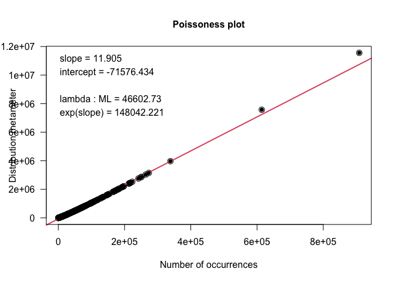

Georgia’s Debts
================
Nick Thieme
4/1/2021

### Intro

This pipeline takes in already heavily formatted debt data from
voluntary petitions and analyzes them, turning the cleaned data into
novel inferences about how and which Georgia debtors owe what kinds of
debts.

More specifically, the input data is a dataset of individual debts
describing which debtor owes what creditor how much money, as well as
the naics classification of the creditor–classified through a deduping
process that combines creditor names with canonical names from
ReferenceUSA. The amount of the debt is split into secured and unsecured
amounts for secured debts and priority or non-priority for unsecured
debts. This process is lengthy and described elsewhere.

Here, we join that data with Census data, demographic information about
bankruptcy filers and group NAICS codes into larger categories for
analysis.

All of this combines into an analysis that describes discrepancies in
the amount owed and the proportion of one’s debts that fall into
different categories (medical debt, student loans, collections,…) along
class and race lines.

This data is incredibly rich, and this analysis likely does not scratch
the surface of the worthwhile inferences trapped below the layers of
hard-to-penetrate data.

### Library and setup

# Data and EDA

With the data loaded, we can start our analyses.

Currently, the data is a table of individual debts with variables
specifying which debtor owes the debt, the name of the company to whom
the debt is owed, the naics code of the company, the amount owed for
this particular debt, the home address of the debtor, a variety of
characteristics about the debtor including monthly income, total assets
and liabilities,…, and characteristics of the filer’s home census tract
including median income, race statistics,…

To prefigure some later results, we show density plots of the
differences in mortgage debt by income, student loans by race and auto
debt by race.

``` r
D_cred_naics_f %>% filter(naics_man_def=="mortgage", race_pred%in%c("white","black")) %>% ggplot(aes(x = amount_owed, fill= inc_level))+geom_density(alpha = .5)+bbc_style()
```

<!-- -->

``` r
D_cred_naics_f %>% filter(naics_man_def=="student_loans", race_pred%in%c("white","black")) %>% ggplot(aes(x = amount_owed, fill= race_pred))+geom_density(alpha = .5)+bbc_style()
```

    ## Warning: Removed 15 rows containing non-finite values (stat_density).

<!-- -->

``` r
D_cred_naics_f %>% filter(naics_man_def=="auto", race_pred%in%c("white","black")) %>% ggplot(aes(x = amount_owed, fill= race_pred))+geom_density(alpha = .5)+bbc_style()
```

    ## Warning: Removed 15 rows containing non-finite values (stat_density).

<!-- -->

We can clearly see that each wealth quartile owes significantly more
mortgage debt than the previous quartile. This is easily understood as
rich people can get loans for houses, while poorer people can’t.

Interestingly, there is only a slight difference in the raw total amount
of student loan debt owed by black and white filers. We will return to
this.

Lastly, there is a clear difference in the distribution of auto debt
owed by black filers and white filers, with more black filers owing more
auto debt than white filers. We rely on Robert Lawless and Mary Hansen
to explain this in the story.

One caveat with our data load is that there’s a bug with the DirichReg
function that leads properly converged optimizations to report
non-convergence. We source the DirichReg\_debug code to fix that bug.

### T-tests and Z-tests

However, while these visual difference can be useful guiding principles,
we need to know the degree to which they can be substantiaed. This is
especially important in high-dimensional data.

To do this, we supplement our raw data with so-called compositional
data. Compositional data transforms a list of related raw variables into
the proportion of the whole that each varible represents. In our case,
that means converting the raw amount of student loan debt, mortgage
debt, …, into the proportion of an individuals debt that falls into the
category of student loans, mortgages,…

We then perform two-sample t-tests for differences in the raw totals of
debt by race and income. One issue we need to be very careful about,
however, is multiple comparisons.

By making raw and compositional comparisons over race and income, we are
performing 8 hypothesis tests (2 for race + 6 for income) per debt type.
With 26 debt types, that means we’re performing 208 tests (really 202
because one debt type doesn’t have enough observations to support the
income tests). If we don’t correct for multiple comparisons, we could
easily fall into the trap of randomness. Thus, we correct with
Benjamini-Hochberg.

``` r
#this code creates compositional data from our raw data
race_pandemic_naics_man_tbl<-D_cred_naics_f %>%filter(amount_owed!="none") %>% 
  group_by(race_pred, pandemic) %>% 
  mutate(n_filers_race = length(unique(bk_id))) %>% 
  group_by(race_pred, pandemic, naics_man_def) %>% 
  summarise(n_debts = n(),
            n_filers = length(unique(bk_id)),
            tot_d = sum(as.numeric(amount_owed), na.rm= TRUE),
            avg_d = mean(as.numeric(amount_owed), na.rm=TRUE),
            sd_d = sd(as.numeric(amount_owed), na.rm=TRUE),
            avg_n_have = n_debts / n_filers,
            n_filers_race = n_filers_race[1]) %>% ungroup %>% 
  group_by(race_pred,pandemic) %>% 
  mutate(perc_of_filers = n_filers/n_filers_race) %>% 
  arrange(desc(perc_of_filers)) %>% select(-avg_n_have) %>% 
  filter(race_pred!="hisp")

#this lets you see differences within races
diff_pand<-race_pandemic_naics_man_tbl %>% ungroup %>% 
  pivot_wider(names_from = c(pandemic),
              values_from = c(n_filers,perc_of_filers, tot_d, avg_d,sd_d,n_debts,n_filers_race)) %>% 
  mutate(diff_tot = tot_d_pre_pand/tot_d_post_pand,
         diff_avg = avg_d_post_pand-avg_d_pre_pand,
         diff_num = n_filers_pre_pand-n_filers_post_pand,
         diff_perc = perc_of_filers_pre_pand-perc_of_filers_post_pand) 

#here we perform proportion tests and and two-sample t tests of the compositions and raw differences. there's a lot of manual coding here to get the tests into our tidy data,
#but it makes the inference a little easier

diff_pand_tbl<-diff_pand %>% filter(race_pred!="other") %>% 
  pivot_wider(names_from = c(race_pred),
              values_from = c(n_filers_pre_pand,n_filers_post_pand,
                              perc_of_filers_pre_pand, perc_of_filers_post_pand,
                              tot_d_pre_pand, tot_d_post_pand,
                              avg_d_pre_pand,sd_d_pre_pand, n_debts_pre_pand,
                              avg_d_post_pand,sd_d_post_pand, n_debts_post_pand,
                              n_filers_race_pre_pand, n_filers_race_post_pand,
                              diff_tot, diff_avg, diff_num, diff_perc),
              ) %>% 
  mutate(diff_perc_pand_race=diff_perc_black-diff_perc_white,
         diff_perc_race=perc_of_filers_post_pand_black-perc_of_filers_post_pand_white,
         diff_avg_pand_race=diff_avg_black-diff_avg_white,
         diff_avg_race=avg_d_post_pand_black- avg_d_post_pand_white) %>%  
  filter(n_filers_race_post_pand_white>20,
         n_filers_pre_pand_black<n_filers_race_post_pand_black,
         n_filers_pre_pand_white<n_filers_race_post_pand_white) %>% 
  rowwise %>% 
  mutate(test_l_p = prop.test(x=c(n_filers_pre_pand_black,n_filers_pre_pand_white), 
                            n=c(n_filers_race_post_pand_black,n_filers_race_post_pand_white))$
           conf.int[1],
         test_u_p = prop.test(x=c(n_filers_pre_pand_black,n_filers_pre_pand_white), 
                            n=c(n_filers_race_post_pand_black,n_filers_race_post_pand_white))$
           conf.int[2],
         p.val_p = prop.test(x=c(n_filers_pre_pand_black,n_filers_pre_pand_white), 
                            n=c(n_filers_race_post_pand_black,n_filers_race_post_pand_white))$
           p.value,
         test_diff = t.test2(avg_d_post_pand_black, avg_d_post_pand_white, sd_d_post_pand_black,sd_d_post_pand_white,n_debts_post_pand_black,n_debts_post_pand_white )[1],
        test_l_avg= test_diff-1.96*t.test2(avg_d_post_pand_black, avg_d_post_pand_white, sd_d_post_pand_black,sd_d_post_pand_white,n_debts_post_pand_black,n_debts_post_pand_white )[2],
         test_u_avg = test_diff+1.96*t.test2(avg_d_post_pand_black, avg_d_post_pand_white, sd_d_post_pand_black,sd_d_post_pand_white,n_debts_post_pand_black,n_debts_post_pand_white )[2],
         p.val_avg=t.test2(avg_d_post_pand_black, avg_d_post_pand_white, sd_d_post_pand_black,sd_d_post_pand_white,n_debts_post_pand_black,n_debts_post_pand_white )[4]
         ) 
```

``` r
#now we do the same thing with income
inc_pandemic_naics_man_tbl<-D_cred_naics_f %>%filter(amount_owed!="none") %>% 
  group_by(inc_level) %>% 
  mutate(n_filers_race = length(unique(bk_id))) %>% 
  group_by(inc_level, naics_man_def) %>% 
  summarise(n_debts = n(),
            n_filers = length(unique(bk_id)),
            tot_d = sum(as.numeric(amount_owed), na.rm= TRUE),
            avg_d = mean(as.numeric(amount_owed), na.rm=TRUE),
            sd_d = sd(as.numeric(amount_owed), na.rm=TRUE),
            avg_n_have = n_debts / n_filers,
            n_filers_race = n_filers_race[1]) %>% ungroup %>% 
  group_by(inc_level) %>% 
  mutate(perc_of_filers = n_filers/n_filers_race) %>% 
  arrange(desc(perc_of_filers)) %>% select(-avg_n_have) %>% 
  filter(inc_level!="upper+")

diff_pand_tbl_inc<-inc_pandemic_naics_man_tbl  %>% na.omit %>% 
  pivot_wider(names_from = inc_level,
              values_from = c(n_filers,
                              n_filers_race,
                              perc_of_filers, 
                              tot_d, 
                              avg_d,sd_d, n_debts
                              )
              ) %>% 
  filter(n_filers_race_q1_to_med>20) %>% 
  rowwise %>% na.omit %>% 
  mutate(
    test_l_p_1_2 = prop.test(x=c(n_filers_first_q,n_filers_q1_to_med), 
                            n=c(n_filers_race_first_q,n_filers_race_q1_to_med))$
           conf.int[1],
         
    test_u_p_1_2 = prop.test(x=c(n_filers_first_q,n_filers_q1_to_med), 
                            n=c(n_filers_race_first_q,n_filers_race_q1_to_med))$
           conf.int[2],
    
    p.val_p_1_2 = prop.test(x=c(n_filers_first_q,n_filers_q1_to_med), 
                            n=c(n_filers_race_first_q,n_filers_race_q1_to_med))$
           p.value,
    
    test_l_p_1_3 = prop.test(x=c(n_filers_first_q,n_filers_med_to_3rd), 
                            n=c(n_filers_race_first_q,n_filers_race_med_to_3rd))$
           conf.int[1],
         
    test_u_p_1_3 = prop.test(x=c(n_filers_first_q,n_filers_med_to_3rd), 
                            n=c(n_filers_race_first_q,n_filers_race_med_to_3rd))$
           conf.int[2],
    
    p.val_p_1_3 = prop.test(x=c(n_filers_first_q,n_filers_med_to_3rd), 
                            n=c(n_filers_race_first_q,n_filers_race_med_to_3rd))$
           p.value,
    
    test_l_p_2_3 = prop.test(x=c(n_filers_q1_to_med,n_filers_med_to_3rd), 
                            n=c(n_filers_race_q1_to_med,n_filers_race_med_to_3rd))$
           conf.int[1],
         
    test_u_p_2_3 = prop.test(x=c(n_filers_q1_to_med,n_filers_med_to_3rd), 
                            n=c(n_filers_race_q1_to_med,n_filers_race_med_to_3rd))$
           conf.int[2],
    
    p.val_p_2_3 = prop.test(x=c(n_filers_q1_to_med,n_filers_med_to_3rd), 
                            n=c(n_filers_race_q1_to_med,n_filers_race_med_to_3rd))$
           p.value,
    
    test_diff_1_2 = t.test2(avg_d_first_q, avg_d_q1_to_med,
                        sd_d_first_q,sd_d_q1_to_med,
                        n_debts_first_q,n_debts_q1_to_med )[1],
    
    test_l_avg_1_2= test_diff_1_2-1.96*
      t.test2(avg_d_first_q, avg_d_q1_to_med,
              sd_d_first_q,sd_d_q1_to_med,
              n_debts_first_q,n_debts_q1_to_med )[2],
    
    test_u_avg_1_2 = test_diff_1_2+1.96*
      t.test2(avg_d_first_q, avg_d_q1_to_med,
              sd_d_first_q,sd_d_q1_to_med,
              n_debts_first_q,n_debts_q1_to_med )[2],
    
    p.val_avg_1_2=t.test2(avg_d_first_q, avg_d_q1_to_med,
                           sd_d_first_q,sd_d_q1_to_med,
                           n_debts_first_q,n_debts_q1_to_med )[4],
    
    test_diff_1_3 = t.test2(avg_d_first_q, avg_d_med_to_3rd ,
                        sd_d_first_q,sd_d_med_to_3rd,
                        n_debts_first_q,n_debts_med_to_3rd )[1],
    
    test_l_avg_1_3= test_diff_1_3-1.96*
      t.test2(avg_d_first_q, avg_d_med_to_3rd ,
              sd_d_first_q,sd_d_med_to_3rd,
              n_debts_first_q,n_debts_med_to_3rd )[2],
    
    test_u_avg_1_3 = test_diff_1_3+1.96*
      t.test2(avg_d_first_q, avg_d_med_to_3rd ,
              sd_d_first_q,sd_d_med_to_3rd,
              n_debts_first_q,n_debts_med_to_3rd )[2],
    
    p.val_avg_1_3=t.test2(avg_d_first_q, avg_d_med_to_3rd ,
                           sd_d_first_q,sd_d_med_to_3rd,
                           n_debts_first_q,n_debts_med_to_3rd )[4],
    
    test_diff_2_3 = t.test2(avg_d_q1_to_med, avg_d_med_to_3rd ,
                        sd_d_q1_to_med,sd_d_med_to_3rd,
                        n_debts_q1_to_med,n_debts_med_to_3rd )[1],
    
    test_l_avg_2_3= test_diff_2_3-1.96*
      t.test2(avg_d_q1_to_med, avg_d_med_to_3rd ,
              sd_d_q1_to_med,sd_d_med_to_3rd,
              n_debts_q1_to_med,n_debts_med_to_3rd )[2],
    
    test_u_avg_2_3 = test_diff_2_3+1.96*
      t.test2(avg_d_q1_to_med, avg_d_med_to_3rd ,
              sd_d_q1_to_med,sd_d_med_to_3rd,
              n_debts_q1_to_med,n_debts_med_to_3rd )[2],
    
    p.val_avg_2_3=t.test2(avg_d_q1_to_med, avg_d_med_to_3rd ,
                           sd_d_q1_to_med,sd_d_med_to_3rd,
                           n_debts_q1_to_med,n_debts_med_to_3rd )[4]
         ) 

#we've just done 208 hypothesis tests, so we absolutely need to correct for multiple 
#comparisons. 

p_adj<-p.adjust(c(diff_pand_tbl$p.val_p, diff_pand_tbl$p.val_avg,
                  diff_pand_tbl_inc$p.val_p_1_2,
                  diff_pand_tbl_inc$p.val_p_1_3,
                  diff_pand_tbl_inc$p.val_p_2_3,
                  diff_pand_tbl_inc$p.val_avg_1_2,
                  diff_pand_tbl_inc$p.val_avg_1_3,
                  diff_pand_tbl_inc$p.val_avg_2_3
                  ), method = "BH")

#i don't feel like typing where each set of tests starts and stops so i do this
list_ps<- list(a =diff_pand_tbl$p.val_p,
     b = diff_pand_tbl$p.val_avg,
     c = diff_pand_tbl_inc$p.val_p_1_2,
     d = diff_pand_tbl_inc$p.val_p_1_3,
     e = diff_pand_tbl_inc$p.val_p_2_3,
     f = diff_pand_tbl_inc$p.val_avg_1_2,
     g = diff_pand_tbl_inc$p.val_avg_1_3,
     h = diff_pand_tbl_inc$p.val_avg_2_3)

list_lens<-lapply(list_ps, length) %>% unlist %>% cumsum

p_adj_p <- p_adj[1:list_lens[1]]
p_adj_avg <- p_adj[(list_lens[1]+1):list_lens[2]]
p_adj_1_2 <- p_adj[ (list_lens[2]+1):list_lens[3]]
p_adj_1_3 <- p_adj[ (list_lens[3]+1):list_lens[4]]
p_adj_2_3 <- p_adj[ (list_lens[4]+1):list_lens[5]]
p.adj_avg_1_2 <- p_adj[ (list_lens[5]+1):list_lens[6]]
p.adj_avg_1_3 <- p_adj[ (list_lens[6]+1):list_lens[7]]
p.adj_avg_2_3 <- p_adj[ (list_lens[7]+1):list_lens[8]]

diff_pand_tbl$p.val_p<-p_adj_p
diff_pand_tbl$p.val_avg<-p_adj_avg
diff_pand_tbl_inc$p_adj_1_2<-p_adj_1_2
diff_pand_tbl_inc$p_adj_1_3<-p_adj_1_3
diff_pand_tbl_inc$p_adj_2_3<-p_adj_2_3
diff_pand_tbl_inc$p.adj_avg_1_2<-p.adj_avg_1_2
diff_pand_tbl_inc$p.adj_avg_1_3<-p.adj_avg_1_3
diff_pand_tbl_inc$p.adj_avg_2_3<-p.adj_avg_2_3

##now we pull out the differences that are below .1. These are largely guiding 
##inferences that will inform what we look for later and that we will point to as 
##worth investigating more. 

diff_pand_tbl %>% filter((p.val_p<.1)) %>% 
  select(naics_man_def,
         diff_perc_race, test_l_p, test_u_p, p.val_p)
```

    ## # A tibble: 2 x 5
    ## # Rowwise: 
    ##   naics_man_def diff_perc_race test_l_p test_u_p  p.val_p
    ##   <fct>                  <dbl>    <dbl>    <dbl>    <dbl>
    ## 1 student_loans          0.140   0.0304   0.139  0.0144  
    ## 2 sec_banking           -0.126  -0.134   -0.0483 0.000867

Here we print out the results of the adjusted z-tests. Above are the corrected percent differences along race lines.

``` r
diff_pand_tbl %>% filter((p.val_avg<.1)) %>% 
  select(naics_man_def,
         test_diff,test_l_avg,test_u_avg,p.val_avg)
```

    ## # A tibble: 4 x 5
    ## # Rowwise: 
    ##   naics_man_def test_diff test_l_avg test_u_avg p.val_avg
    ##   <fct>             <dbl>      <dbl>      <dbl>     <dbl>
    ## 1 unsec_banking    -1504.     -2392.      -616.   0.00919
    ## 2 credit_card       -566.      -870.      -262.   0.00364
    ## 3 student_loans     5818.      1890.      9745.   0.0256 
    ## 4 auto              2782.       917.      4647.   0.0256

The corrected raw differences along race lines.

``` r
diff_pand_tbl_inc %>% filter(p_adj_1_2<.1) %>% 
  mutate(diff_perc = perc_of_filers_first_q- perc_of_filers_q1_to_med) %>% 
  select(naics_man_def, diff_perc,test_l_p_1_2,test_u_p_1_2,p.val_p_1_2)
```

    ## # A tibble: 5 x 5
    ## # Rowwise: 
    ##   naics_man_def   diff_perc test_l_p_1_2 test_u_p_1_2 p.val_p_1_2
    ##   <fct>               <dbl>        <dbl>        <dbl>       <dbl>
    ## 1 credit_card       -0.0728       -0.128      -0.0177 0.00861    
    ## 2 unsec_other       -0.0754       -0.130      -0.0206 0.00617    
    ## 3 mortgage          -0.117        -0.158      -0.0766 0.000000122
    ## 4 auto              -0.0772       -0.131      -0.0234 0.00519    
    ## 5 sec_credit_card   -0.0637       -0.109      -0.0183 0.00735

These test tables correspond to the differences along income lines. 

As can be seen, there are more debt types which differ (in both raw and percentage terms) along income lines than along race lines. There are more comparisons to make along income lines (four categories v three), but this can't explain the difference because even when comparing one income class against another income class, we see a larger number of differing debt types than when comparing along race lines.

The first table corresponds to percentage differences for the first quartile against the second quartile.
``` r
diff_pand_tbl_inc %>% filter(p_adj_1_3<.1) %>% 
  mutate(diff_perc = perc_of_filers_first_q- perc_of_filers_med_to_3rd) %>% 
  select(naics_man_def, diff_perc,test_l_p_1_3,test_u_p_1_3,p.val_p_1_3)
```

    ## # A tibble: 7 x 5
    ## # Rowwise: 
    ##   naics_man_def diff_perc test_l_p_1_3 test_u_p_1_3 p.val_p_1_3
    ##   <fct>             <dbl>        <dbl>        <dbl>       <dbl>
    ## 1 unsec_banking   -0.112        -0.173     -0.0515     4.89e- 4
    ## 2 credit_card     -0.235        -0.302     -0.168      5.99e-11
    ## 3 unsec_other     -0.108        -0.180     -0.0354     3.78e- 3
    ## 4 professional    -0.101        -0.176     -0.0255     8.42e- 3
    ## 5 mortgage        -0.334        -0.401     -0.267      8.31e-26
    ## 6 sec_banking     -0.177        -0.243     -0.111      1.33e- 8
    ## 7 associations    -0.0554       -0.103     -0.00728    1.55e- 2

To the percentage differences for the first quartile against the third quartile.

``` r
diff_pand_tbl_inc %>% filter(p_adj_2_3<.1) %>% 
  mutate(diff_perc = perc_of_filers_q1_to_med- perc_of_filers_med_to_3rd) %>% 
  select(naics_man_def, diff_perc,test_l_p_2_3,test_u_p_2_3,p.val_p_2_3)
```

    ## # A tibble: 5 x 5
    ## # Rowwise: 
    ##   naics_man_def diff_perc test_l_p_2_3 test_u_p_2_3 p.val_p_2_3
    ##   <fct>             <dbl>        <dbl>        <dbl>       <dbl>
    ## 1 unsec_banking   -0.0789      -0.132       -0.0259    6.42e- 3
    ## 2 credit_card     -0.162       -0.221       -0.104     4.71e- 7
    ## 3 collections      0.0845       0.0169       0.152     1.20e- 2
    ## 4 mortgage        -0.217       -0.283       -0.151     1.71e-12
    ## 5 sec_banking     -0.140       -0.202       -0.0775    1.02e- 6

To the percentage differences for the second quartile against the third quartile.

``` r
diff_pand_tbl_inc %>% filter(p.adj_avg_1_2<.1) %>% 
  select(naics_man_def, test_diff_1_2,test_l_avg_1_2,test_u_avg_1_2,p.adj_avg_1_2)
```

    ## # A tibble: 8 x 5
    ## # Rowwise: 
    ##   naics_man_def   test_diff_1_2 test_l_avg_1_2 test_u_avg_1_2 p.adj_avg_1_2
    ##   <fct>                   <dbl>          <dbl>          <dbl>         <dbl>
    ## 1 unsec_loans             -817.         -1463.          -171.       0.0643 
    ## 2 professional           -2086.         -3871.          -302.       0.0979 
    ## 3 mortgage              -40842.        -65893.        -15790.       0.0158 
    ## 4 auto                   -2667.         -4342.          -992.       0.0158 
    ## 5 student_loans          -3460.         -6126.          -795.       0.0578 
    ## 6 sec_credit_card        -7973.        -11865.         -4080.       0.00102
    ## 7 housing                -6745.        -11077.         -2414.       0.0194 
    ## 8 pawn_payday             -913.         -1604.          -221.       0.0583

To the raw differences for the first quartile against the second quartile.

``` r
diff_pand_tbl_inc %>% filter(p.adj_avg_1_3<.1) %>% 
  select(naics_man_def, test_diff_1_3,test_l_avg_1_3,test_u_avg_1_3,p.adj_avg_1_3)
```

    ## # A tibble: 8 x 5
    ## # Rowwise: 
    ##   naics_man_def   test_diff_1_3 test_l_avg_1_3 test_u_avg_1_3 p.adj_avg_1_3
    ##   <fct>                   <dbl>          <dbl>          <dbl>         <dbl>
    ## 1 credit_card             -722.         -1027.          -417.   0.0000741  
    ## 2 unsec_other            -1269.         -2037.          -501.   0.0120     
    ## 3 unsec_loans            -2222.         -3218.         -1226.   0.000258   
    ## 4 professional           -2983.         -5345.          -621.   0.0643     
    ## 5 mortgage              -89289.       -117600.        -60979.   0.000000404
    ## 6 auto                   -3815.         -6208.         -1422.   0.0158     
    ## 7 student_loans          -5594.        -10033.         -1156.   0.0643     
    ## 8 sec_credit_card       -20340.        -32012.         -8667.   0.00919

To the raw differences for the first quartile against the third quartile.

``` r
diff_pand_tbl_inc %>% filter(p.adj_avg_2_3<.1) %>% 
  select(naics_man_def, test_diff_2_3,test_l_avg_2_3,test_u_avg_2_3,p.adj_avg_2_3)
```

    ## # A tibble: 6 x 5
    ## # Rowwise: 
    ##   naics_man_def test_diff_2_3 test_l_avg_2_3 test_u_avg_2_3 p.adj_avg_2_3
    ##   <fct>                 <dbl>          <dbl>          <dbl>         <dbl>
    ## 1 unsec_banking        -1535.         -2228.          -842.     0.000258 
    ## 2 credit_card           -501.          -783.          -220.     0.00554  
    ## 3 taxes                -2689.         -4181.         -1197.     0.00554  
    ## 4 unsec_other          -1111.         -1860.          -362.     0.0256   
    ## 5 unsec_loans          -1405.         -2390.          -420.     0.0331   
    ## 6 mortgage            -48448.        -66935.        -29960.     0.0000135

And finally, to the percentage differences for the second quartile against the third quartile.

Here we find one of our first foundational inferences. While debtors
differ in five categories by race, they differ in fourteen categories by
income. In debt, as in many slices of economic and social life, people
are more alike than different by race, but more different than alike by
class.

Nonetheless, the race differences that do exist, are important. Black
filers owe about $6k and 13% more student loan debt than white filers,
and they owe $3k more auto debt.

We examine these differences more carefully in the story itself.

Underwater mortgages is another place that we see discrepancies along
race lines. We use the value of the secured and total portion of the
loan to determine which loans over $100k are worth more than the
property securing them. We then group these by race.

``` r
underwater_tbl<-D_sec_cred_naics_f_geo_f %>% group_by(loan_val_c, race_pred) %>%
  summarise(n = n(), n_under = length(which(underwater)),
            underwater = length(which(underwater))/n)

D_mort <- read_csv("~/Downloads/state_GA.csv")
```

``` r
#this shows that blacks pay higher interest rates and higher loan to value ratio. 
#this is probably what account for it. 94% loan to value v 80% loan to value blk v wht
D_cens_tract_mort<-D_mort %>% group_by(census_tract) %>% 
  summarise(n =n(),
            m_int = mean(interest_rate, na.rm=T), 
            m_rat = median(loan_to_value_ratio, na.rm=T))

#this says that the average black filer with housing debt in our dataset lived in a 
#census tract where mortgage loans were 89% of the value of the house and paid an interest 
#rate of over 5%. The average white filer lived in a census tract where loans were 85% of value
#and paid an interest rate of 4.83.

##even more specifically, black filers with mortgages underwater paid an average interest
##rate of 5.21%, while white underwater filers paid an average of 4.9%. 
```

We see that about 1/3 of mortgages in Black neighborhoods are
underwater, compared with about 23 percent of mortgages in white
neighborhoods.

We also use Federal Financial Institutions Examination Council (FFIEC)
data on mortgage characteristics to try and understand the racial
disparity. FFIEC data comes at the census tract level. We calculate
aggregate mortgage characteristics per census tract and then spatially
join geocoded filer addresses with the census tracts in the FFIEC data
to determine the average mortgage characteristics of census tracts in
which our filers live. Using this joined dataset, we can see whether
there are differences in average characteristics by race.

We see that there are. Black neighborhoods pay see higher loan-to-value
ratios from their beginnings and are subject to higher interest rates.

We have one final \~EDA. We present grouped bar charts that examine
different debt distributions by race and income. These are the charts
that feed the scrollytelling visualization and interactive in the story.

``` r
D_demo<-D_cred_naics_f %>%filter(amount_owed!="none")  %>% 
  select(bk_id, race_pred, inc_level,case_chapter) %>% distinct
  
#this gives me the amount owed by each person and the percent of their amount owed that is 
#due to each broad category. here we also  backfill the categories each debtor doesn't owe

#only keep groups with more than 30
D_perc_tot<-D_cred_naics_f %>%filter(amount_owed!="none") %>% 
  group_by(bk_id, naics_man_def, pandemic) %>% 
  summarise(val_debt = sum(as.numeric(amount_owed), na.rm=TRUE), med_ind = med_inc[1]) %>% 
  group_by(bk_id, pandemic) %>% mutate(total_owed = sum(val_debt)) %>% 
  mutate(perc_of_total=val_debt/total_owed) %>%
  complete(bk_id, naics_man_def, pandemic) %>%
  mutate(val_debt = replace_na(val_debt,0),
         total_owed = max(total_owed, na.rm = TRUE),
         perc_of_total = replace_na(perc_of_total,0)) %>% 
  left_join(D_demo)%>% 
  group_by( race_pred, inc_level, naics_man_def) %>% 
  summarise(n_filers = length(unique(bk_id[which(perc_of_total>0)])),
            med_perc = mean(perc_of_total),
            sd(perc_of_total)) %>% 
  filter(race_pred%in%c("hisp","other")==FALSE) %>% ungroup %>% filter(n_filers>20)
```

``` r
D_perc_tot %>% filter(naics_man_def!="Warehouses-Mini & Self Storage") %>% 
  arrange(desc(med_perc))  %>% na.omit %>% 
  ggplot(aes(y = med_perc, x = naics_man_def, fill = race_pred))+
  geom_bar(stat = "identity",position = "dodge")+facet_wrap(~inc_level)+
  theme(axis.text.x = element_text(angle = 45, vjust = 1, hjust=1))
```

<!-- -->

``` r
D_perc_tot %>% mutate(m_sum= med_perc*n_filers) %>% group_by(race_pred, naics_man_def) %>% summarise(n_fil = sum(n_filers), m_perc = sum(m_sum)/n_fil) %>% filter(naics_man_def=="studentloan")
```


### Regression

Finally, we want to examine the previously identified discrepancies in
the presence of covariates. How, exactly, do race and class interact to
create discrepancies in the kinds of debt owed? Does this differ at
different wage levels? Pre/post-pandemic? Two-income households?
Dependents?…

To do this, we begin by preparing the data for Dirichlet regression as
initially developed by Campbell and Mosimann (1987) and expanded and
investigated by Hijazi (2003), (2006),…, and MJ Maier.

``` r
D_cred_naics_f_2<-D_cred_naics_f %>% mutate(
  naics_man_def = fct_collapse(naics_man_def,
                               medical = c("medical", "Skin Treatments", "medical_2"),
                               professional = c("professional", "associations","tech","other_insurance"),
                               personal = c("personal","household","housing"),
                               sec_banking = c("sec_banking","sec_other","sec_credit_card","sec_other_loan"),
                               auto = c("auto"),
                               collections_pawn_payday = c("collections","pawn_payday", "credit_reporting"),
                               tax_gov = c("taxes", "gov_legal"),
                               mortgage = c("mortgage"),
                               unsec_banking = c("unsec_other","unsec_banking","unsec_loans"),
                               utilities = c("utilities"),
                               student_loans = c("student_loans")
                               
                               
                                                       )
                          )

D_cred_model<-D_cred_naics_f_2 %>%filter(amount_owed!="none") %>% 
  group_by(bk_id, naics_man_def, pandemic) %>% 
  summarise(val_debt = sum(as.numeric(amount_owed), na.rm=TRUE)) %>% 
  group_by(bk_id, pandemic) %>% mutate(total_owed = sum(val_debt)) %>% 
  mutate(perc_of_total=val_debt/total_owed) %>%
  complete(bk_id, naics_man_def, pandemic) %>%
  mutate(val_debt = replace_na(val_debt,0),
         total_owed = max(total_owed, na.rm = TRUE),
         perc_of_total = replace_na(perc_of_total,0)) %>% 
  left_join(D_demo)%>% 
  mutate(naics_man_def = droplevels(naics_man_def))
```

``` r
D_dir_mod<-D_cred_model %>% select(-val_debt) %>% 
  pivot_wider(names_from = naics_man_def, values_from = perc_of_total) %>% 
  select(-"NA")

D_covariates<-D_cred_naics_f_2 %>%filter(amount_owed!="none") %>% 
  select(bk_id,mgw_1, mgw_2, rent_exp, child, food,mon_exp) %>% distinct %>% 
  mutate(wage_1 = str_remove(mgw_1,"\\$") %>% str_remove(",") %>% as.numeric %>% 
           replace_na(0),
         
         wage_2 = str_remove(mgw_2,"\\$") %>% str_remove(",") %>% as.numeric%>% 
           replace_na(0),
         
         rent = str_remove(rent_exp,"\\$") %>% str_remove(",") %>% as.numeric%>% 
           replace_na(0),
         
         child = str_remove(child,"\\$") %>% str_remove(",") %>% as.numeric%>% 
           replace_na(0),
         
         food = str_remove(food,"\\$") %>% str_remove(",") %>% as.numeric%>% 
           replace_na(0),
         
         exp = str_remove(mon_exp,"\\$") %>% as.numeric%>% 
           replace_na(0),
         wage = wage_1+wage_2
         ) %>% 
  select(bk_id, wage, rent, child, food, exp) 
```

``` r
l <- 1

D_dir_mod_f<-D_dir_mod %>% left_join(D_covariates, by = "bk_id") %>%
  select(-none) %>% 
  filter(race_pred!="mixed", inc_level!="upper+",medical<l&professional<l&personal<l&
           sec_banking<l&auto<l&collections_pawn_payday<l&tax_gov<l&
           mortgage<l&unsec_banking<l&
           utilities<l&student_loans<l)
           
bk_perc_dir <- DR_data(D_dir_mod_f %>%ungroup %>%  select("medical",
                                                          "personal","professional",
                                              "sec_banking","auto",
                                              "tax_gov",
                                              "mortgage","collections_pawn_payday","utilities",
                                              "student_loans",
                                              "unsec_banking"))
```

DirichReg outputs a separate regression for each dependent component, so you can read the output below like the usual regression output, where each separate regression output corresponds to the debt component in the title.

``` r
#model checking on dirichlet
mod_dirich_1<-
  DirichReg(
    bk_perc_dir~race_pred+inc_level+case_chapter+wage+rent+child+food+exp+total_owed,
    data= D_dir_mod_f, model = "common", control  = list(iterlim = 10000000))

summary(mod_dirich_1)
```

    ## Call:
    ## DirichReg(formula = bk_perc_dir ~ race_pred + inc_level + case_chapter + wage +
    ## rent + child + food + exp + total_owed, data = D_dir_mod_f, model = "common",
    ## control = list(iterlim = 1e+07))
    ## 
    ## Standardized Residuals:
    ##                              Min       1Q   Median       3Q     Max
    ## medical                  -0.5635  -0.5057  -0.4811  -0.3575  6.2415
    ## personal                 -0.5531  -0.5234  -0.5052  -0.2830  7.7586
    ## professional             -0.6393  -0.5475  -0.5157  -0.2063  5.4231
    ## sec_banking              -0.8628  -0.5748  -0.4498   0.6846  5.8640
    ## auto                     -0.5776  -0.5192  -0.4935   0.1889  5.9650
    ## tax_gov                  -0.5474  -0.4779  -0.4628  -0.4285  6.9546
    ## mortgage                 -1.8820  -0.4816  -0.4425  -0.3830  7.5518
    ## collections_pawn_payday  -0.6478  -0.5610  -0.4950  -0.2815  4.3379
    ## utilities                -0.4915  -0.4626  -0.4524  -0.4316  2.5562
    ## student_loans            -0.7716  -0.5174  -0.4714   0.2812  6.0601
    ## unsec_banking            -1.2632  -0.7148  -0.3758   0.3878  3.7761
    ## 
    ## ------------------------------------------------------------------
    ## Beta-Coefficients for variable no. 1: medical
    ##                       Estimate Std. Error z value Pr(>|z|)    
    ## (Intercept)         -1.892e+00  1.170e-01 -16.176   <2e-16 ***
    ## race_predhisp        5.246e-02  3.199e-01   0.164   0.8698    
    ## race_predwhite       1.020e-01  5.234e-02   1.948   0.0514 .  
    ## inc_levelmed_to_3rd -2.999e-02  1.060e-01  -0.283   0.7772    
    ## inc_levelq1_to_med  -1.934e-02  6.660e-02  -0.290   0.7715    
    ## case_chapter         6.448e-03  9.161e-03   0.704   0.4815    
    ## wage                -1.362e-06  1.199e-05  -0.114   0.9096    
    ## rent                -6.075e-05  5.141e-05  -1.182   0.2374    
    ## child                1.877e-04  2.183e-04   0.860   0.3900    
    ## food                 9.020e-05  1.202e-04   0.750   0.4530    
    ## exp                  1.673e-05  2.889e-05   0.579   0.5626    
    ## total_owed          -1.553e-07  2.131e-07  -0.729   0.4663    
    ## ------------------------------------------------------------------
    ## Beta-Coefficients for variable no. 2: personal
    ##                       Estimate Std. Error z value Pr(>|z|)    
    ## (Intercept)         -1.882e+00  1.179e-01 -15.953   <2e-16 ***
    ## race_predhisp        3.786e-02  3.193e-01   0.119    0.906    
    ## race_predwhite       2.397e-02  5.225e-02   0.459    0.646    
    ## inc_levelmed_to_3rd  1.566e-02  1.072e-01   0.146    0.884    
    ## inc_levelq1_to_med   1.706e-02  6.688e-02   0.255    0.799    
    ## case_chapter         6.717e-03  9.067e-03   0.741    0.459    
    ## wage                -1.982e-06  1.222e-05  -0.162    0.871    
    ## rent                 1.815e-06  5.075e-05   0.036    0.971    
    ## child                1.193e-04  2.107e-04   0.566    0.571    
    ## food                 8.548e-05  1.227e-04   0.697    0.486    
    ## exp                  8.925e-06  2.887e-05   0.309    0.757    
    ## total_owed           9.650e-08  2.176e-07   0.443    0.657    
    ## ------------------------------------------------------------------
    ## Beta-Coefficients for variable no. 3: professional
    ##                       Estimate Std. Error z value Pr(>|z|)    
    ## (Intercept)         -1.726e+00  1.210e-01 -14.263   <2e-16 ***
    ## race_predhisp       -1.437e-01  3.185e-01  -0.451    0.652    
    ## race_predwhite      -4.973e-02  5.212e-02  -0.954    0.340    
    ## inc_levelmed_to_3rd  7.370e-02  1.043e-01   0.707    0.480    
    ## inc_levelq1_to_med   8.842e-02  6.650e-02   1.330    0.184    
    ## case_chapter         3.655e-03  9.158e-03   0.399    0.690    
    ## wage                 1.530e-05  1.223e-05   1.251    0.211    
    ## rent                -1.935e-05  5.045e-05  -0.384    0.701    
    ## child                2.009e-04  2.104e-04   0.955    0.340    
    ## food                -8.070e-05  1.207e-04  -0.668    0.504    
    ## exp                  5.518e-06  2.812e-05   0.196    0.844    
    ## total_owed           1.008e-07  2.029e-07   0.497    0.619    
    ## ------------------------------------------------------------------
    ## Beta-Coefficients for variable no. 4: sec_banking
    ##                       Estimate Std. Error z value Pr(>|z|)    
    ## (Intercept)         -2.136e+00  1.166e-01 -18.312  < 2e-16 ***
    ## race_predhisp        2.703e-01  3.186e-01   0.849 0.396147    
    ## race_predwhite       1.970e-01  5.228e-02   3.769 0.000164 ***
    ## inc_levelmed_to_3rd  4.015e-02  1.014e-01   0.396 0.692222    
    ## inc_levelq1_to_med   5.784e-02  6.518e-02   0.887 0.374851    
    ## case_chapter         3.661e-02  9.021e-03   4.058 4.94e-05 ***
    ## wage                 4.319e-05  1.216e-05   3.553 0.000381 ***
    ## rent                -1.334e-04  4.961e-05  -2.688 0.007183 ** 
    ## child               -5.186e-04  2.113e-04  -2.454 0.014127 *  
    ## food                -2.119e-05  1.191e-04  -0.178 0.858745    
    ## exp                 -3.803e-05  2.629e-05  -1.446 0.148087    
    ## total_owed          -3.290e-07  2.028e-07  -1.623 0.104679    
    ## ------------------------------------------------------------------
    ## Beta-Coefficients for variable no. 5: auto
    ##                       Estimate Std. Error z value Pr(>|z|)    
    ## (Intercept)         -1.969e+00  1.179e-01 -16.693   <2e-16 ***
    ## race_predhisp       -3.570e-01  3.195e-01  -1.117    0.264    
    ## race_predwhite      -5.788e-02  5.220e-02  -1.109    0.268    
    ## inc_levelmed_to_3rd -8.356e-03  1.054e-01  -0.079    0.937    
    ## inc_levelq1_to_med   9.371e-02  6.630e-02   1.413    0.158    
    ## case_chapter         1.247e-02  9.121e-03   1.367    0.172    
    ## wage                 9.836e-06  1.228e-05   0.801    0.423    
    ## rent                 8.105e-07  5.141e-05   0.016    0.987    
    ## child                9.980e-05  2.018e-04   0.495    0.621    
    ## food                 7.361e-05  1.202e-04   0.613    0.540    
    ## exp                  8.620e-07  2.831e-05   0.030    0.976    
    ## total_owed          -2.578e-07  2.130e-07  -1.211    0.226    
    ## ------------------------------------------------------------------
    ## Beta-Coefficients for variable no. 6: tax_gov
    ##                       Estimate Std. Error z value Pr(>|z|)    
    ## (Intercept)         -2.061e+00  1.175e-01 -17.534   <2e-16 ***
    ## race_predhisp        9.230e-02  3.197e-01   0.289    0.773    
    ## race_predwhite      -3.497e-02  5.238e-02  -0.668    0.504    
    ## inc_levelmed_to_3rd  3.534e-02  1.069e-01   0.331    0.741    
    ## inc_levelq1_to_med   2.330e-02  6.674e-02   0.349    0.727    
    ## case_chapter         8.444e-03  9.114e-03   0.927    0.354    
    ## wage                 2.437e-05  1.254e-05   1.943    0.052 .  
    ## rent                 6.956e-06  5.128e-05   0.136    0.892    
    ## child               -1.649e-04  2.181e-04  -0.756    0.450    
    ## food                -1.701e-04  1.230e-04  -1.382    0.167    
    ## exp                 -1.697e-05  2.829e-05  -0.600    0.549    
    ## total_owed           5.466e-08  2.199e-07   0.249    0.804    
    ## ------------------------------------------------------------------
    ## Beta-Coefficients for variable no. 7: mortgage
    ##                       Estimate Std. Error z value Pr(>|z|)    
    ## (Intercept)         -2.619e+00  1.195e-01 -21.922  < 2e-16 ***
    ## race_predhisp       -9.759e-02  3.191e-01  -0.306 0.759705    
    ## race_predwhite       6.837e-02  5.267e-02   1.298 0.194272    
    ## inc_levelmed_to_3rd  2.180e-01  1.009e-01   2.160 0.030756 *  
    ## inc_levelq1_to_med   3.196e-02  6.589e-02   0.485 0.627670    
    ## case_chapter         3.297e-02  9.169e-03   3.596 0.000323 ***
    ## wage                 1.628e-05  1.223e-05   1.331 0.183156    
    ## rent                -1.138e-04  5.121e-05  -2.222 0.026298 *  
    ## child               -3.182e-04  2.215e-04  -1.437 0.150784    
    ## food                -3.422e-05  1.277e-04  -0.268 0.788695    
    ## exp                 -3.093e-05  2.716e-05  -1.139 0.254801    
    ## total_owed           2.422e-06  1.567e-07  15.457  < 2e-16 ***
    ## ------------------------------------------------------------------
    ## Beta-Coefficients for variable no. 8: collections_pawn_payday
    ##                       Estimate Std. Error z value Pr(>|z|)    
    ## (Intercept)         -1.488e+00  1.172e-01 -12.694  < 2e-16 ***
    ## race_predhisp       -3.998e-02  3.181e-01  -0.126  0.89996    
    ## race_predwhite      -1.125e-01  5.214e-02  -2.158  0.03091 *  
    ## inc_levelmed_to_3rd -6.461e-02  1.048e-01  -0.617  0.53754    
    ## inc_levelq1_to_med   2.480e-02  6.620e-02   0.375  0.70797    
    ## case_chapter        -2.162e-03  9.125e-03  -0.237  0.81269    
    ## wage                 3.377e-06  1.193e-05   0.283  0.77700    
    ## rent                 8.390e-06  5.140e-05   0.163  0.87033    
    ## child                1.510e-04  2.021e-04   0.748  0.45473    
    ## food                 1.209e-04  1.194e-04   1.012  0.31139    
    ## exp                  1.093e-05  2.800e-05   0.390  0.69641    
    ## total_owed          -6.374e-07  2.259e-07  -2.822  0.00478 ** 
    ## ------------------------------------------------------------------
    ## Beta-Coefficients for variable no. 9: utilities
    ##                       Estimate Std. Error z value Pr(>|z|)    
    ## (Intercept)         -2.031e+00  1.182e-01 -17.180   <2e-16 ***
    ## race_predhisp        1.157e-02  3.195e-01   0.036    0.971    
    ## race_predwhite      -2.763e-02  5.235e-02  -0.528    0.598    
    ## inc_levelmed_to_3rd -5.837e-02  1.046e-01  -0.558    0.577    
    ## inc_levelq1_to_med  -1.408e-02  6.637e-02  -0.212    0.832    
    ## case_chapter         4.047e-03  9.123e-03   0.444    0.657    
    ## wage                -1.611e-06  1.222e-05  -0.132    0.895    
    ## rent                 6.692e-06  5.114e-05   0.131    0.896    
    ## child                6.667e-05  2.068e-04   0.322    0.747    
    ## food                 1.083e-04  1.214e-04   0.892    0.372    
    ## exp                  5.473e-06  2.821e-05   0.194    0.846    
    ## total_owed          -1.242e-07  2.144e-07  -0.579    0.562    
    ## ------------------------------------------------------------------
    ## Beta-Coefficients for variable no. 10: student_loans
    ##                       Estimate Std. Error z value Pr(>|z|)    
    ## (Intercept)         -1.674e+00  1.176e-01 -14.243  < 2e-16 ***
    ## race_predhisp       -1.264e-01  3.185e-01  -0.397  0.69140    
    ## race_predwhite      -2.245e-01  5.243e-02  -4.281 1.86e-05 ***
    ## inc_levelmed_to_3rd -2.196e-01  1.074e-01  -2.044  0.04092 *  
    ## inc_levelq1_to_med  -5.494e-03  6.603e-02  -0.083  0.93369    
    ## case_chapter        -1.102e-02  8.986e-03  -1.226  0.22021    
    ## wage                 3.693e-05  1.203e-05   3.070  0.00214 ** 
    ## rent                -3.160e-05  5.057e-05  -0.625  0.53208    
    ## child                5.412e-04  2.048e-04   2.642  0.00823 ** 
    ## food                 1.333e-04  1.212e-04   1.100  0.27140    
    ## exp                  3.897e-05  2.754e-05   1.415  0.15714    
    ## total_owed           8.872e-07  1.894e-07   4.686 2.79e-06 ***
    ## ------------------------------------------------------------------
    ## Beta-Coefficients for variable no. 11: unsec_banking
    ##                       Estimate Std. Error z value Pr(>|z|)    
    ## (Intercept)          5.199e-02  1.171e-01   0.444  0.65715    
    ## race_predhisp       -2.946e-01  3.156e-01  -0.933  0.35062    
    ## race_predwhite       1.255e-01  5.119e-02   2.451  0.01425 *  
    ## inc_levelmed_to_3rd  1.764e-01  1.050e-01   1.679  0.09306 .  
    ## inc_levelq1_to_med   5.698e-02  6.636e-02   0.859  0.39055    
    ## case_chapter        -8.640e-02  9.010e-03  -9.589  < 2e-16 ***
    ## wage                -7.271e-06  1.288e-05  -0.565  0.57233    
    ## rent                -1.153e-04  4.928e-05  -2.339  0.01933 *  
    ## child                8.311e-05  1.919e-04   0.433  0.66495    
    ## food                 5.641e-06  1.209e-04   0.047  0.96277    
    ## exp                 -2.819e-05  2.749e-05  -1.026  0.30510    
    ## total_owed          -5.548e-07  2.067e-07  -2.685  0.00726 ** 
    ## ------------------------------------------------------------------
    ## Significance codes: 0 '***' 0.001 '**' 0.01 '*' 0.05 '.' 0.1 ' ' 1
    ## 
    ## Log-likelihood: 63169 on 132 df (1344 BFGS + 2 NR Iterations)
    ## AIC: -126074, BIC: -125371
    ## Number of Observations: 1525
    ## Link: Log
    ## Parametrization: common

``` r
X_plot<-tibble(fitted =as.vector(mod_dirich_1$fitted.values$mu), 
             residuals = as.vector(residuals(mod_dirich_1,"standardized")),
       perc = as.vector(mod_dirich_1$Y)
       )

i = 25
to_rm <- which(bk_perc_dir<3^-5)
X_plot_i <- tibble(fitted =as.vector(mod_dirich_1$fitted.values$mu[-to_rm,]), 
             residuals = as.vector(residuals(mod_dirich_1,"standardized")[-to_rm,]),
       perc = as.vector(mod_dirich_1$Y[-to_rm,])
       )

#this confirms the guess that large residuals are due to observations with large 
#concentrations of debt in one area. this is likely due to the stuff of life that isn't 
#captured (and possible can't be captured) in the data
X_plot %>% ggplot(aes(x = fitted, y = residuals, col = perc))+
  geom_point(size = .1, alpha = .4)+labs(title = "Dirich Errors")
```

<!-- -->

``` r
X_plot_i %>% ggplot(aes(x = fitted, y = residuals, col = perc))+
  geom_point(size = .1, alpha = .4)+labs(title = str_c("Dirich Errors for ", colnames(bk_perc_dir)[i]))
```

<!-- -->

``` r
  #race_pred+inc_level+case_chapter+wage+rent+child+food+exp+total_owed
mod_dirich_alt<-DirichReg(bk_perc_dir~1, D_dir_mod_f)
```


``` r
1-(log(mod_dirich_alt$logLik)/log(mod_dirich_1$logLik))^(2/nrow(bk_perc_dir))
```

    ## [1] 5.195042e-07

``` r
  #section to get pseudo r_2 from hijazi
gm_mean = function(x, na.rm=TRUE){
  return(exp(mean(log(x), na.rm = na.rm)))  
}

d_comp <- function(x, y){
  inside = log(x/gm_mean(x))-log(y/gm_mean(y))
  d = sqrt(sum(inside^2))
  return(d)
}

#constant for closure
g <- apply(mod_dirich_1$Y, 2, gm_mean)
g <- g/sum(g)

g_m <- apply(mod_dirich_1$Y, 2, mean)
g_m <- g_m/sum(g_m)


#using geometric
R_2_trad<-1-sum((mod_dirich_1$fitted.values$mu-mod_dirich_1$Y)^2)/
  sum(((replicate(nrow(mod_dirich_1$Y), g) %>% t)-mod_dirich_1$Y)^2)

csst_vec <- rep(0, nrow(mod_dirich_1$Y))

for(i in 1:nrow(mod_dirich_1$Y)){
  csst_vec[i]<-d_comp(mod_dirich_1$Y[i,], g)
}

csst<-sum(csst_vec^2)

csse_1_vec <- rep(0, nrow(mod_dirich_1$Y))

for(i in 1:nrow(mod_dirich_1$Y)){
  csse_1_vec[i]<-d_comp(mod_dirich_1$Y[i,], mod_dirich_1$fitted.values$alpha[i,])
}

csse_1<-sum(csse_1_vec^2)

1-csse_1/csst
```

    ## [1] -0.09326273

``` r
csse_alt_vec <- rep(0, nrow(mod_dirich_1$Y))

### limit analysis to obs in the middle of the simplex

for(i in 1:nrow(mod_dirich_1$Y)){
  csse_alt_vec[i]<-d_comp(mod_dirich_1$Y[i,], mod_dirich_alt$fitted.values$mu[i,])
}

csse_alt<-sum(csse_alt_vec^2)

1-csse_alt/csst
```

    ## [1] -0.1191473

``` r
#using geometric mean trad
1-sum((mod_dirich_1$fitted.values$mu-mod_dirich_1$Y)^2)/
  sum(((replicate(nrow(mod_dirich_1$Y), g) %>% t)-mod_dirich_1$Y)^2)
```

    ## [1] 0.5153792

``` r
# mean
1-sum((mod_dirich_1$fitted.values$mu-mod_dirich_1$Y)^2)/
  sum(((replicate(nrow(mod_dirich_1$Y), g_m) %>% t)-mod_dirich_1$Y)^2)
```

    ## [1] 0.007816778

As can be seen, while the inference reveals interesting connections
between covariates and several of response proportions (as expected,
those we have already examined: student loans, auto loans, mortgages,…),
diagnostics and model fit at the level of the aggregated errors show
that we’re fitting the data rather poorly. Errors display several forms
of significant dependence and overall residual analysis shows the model
performs no better than well-chosen averages (Hijazi 2003).

What is causing this?

To simultaneously examine the somewhat contradictory inference and
model-fitting results, as well as check for model dependence, we fit a
logratio regression following the earliest work by Aitchison (1986).

``` r
##comp reg
bk_comp<-D_dir_mod_f %>%ungroup %>%  select("medical",
                                                          "personal","professional",
                                              "sec_banking","auto",
                                              "tax_gov",
                                              "mortgage","collections_pawn_payday","utilities",
                                              "student_loans",
                                              "unsec_banking")
y_comp<-acomp(bk_comp)

mylm <- lm(ilr(y_comp)~race_pred+inc_level+case_chapter+wage+rent+child+food+exp+total_owed,data= D_dir_mod_f)

i = 10
to_rm <- which(y_comp[,i+1]==0)
plot(predict(mylm)[-to_rm,i],resid(mylm)[-to_rm,i])
```

<!-- -->

``` r
summary(mylm)[[i]]
```

    ## 
    ## Call:
    ## lm(formula = Y10 ~ race_pred + inc_level + case_chapter + wage + 
    ##     rent + child + food + exp + total_owed, data = D_dir_mod_f)
    ## 
    ## Residuals:
    ##     Min      1Q  Median      3Q     Max 
    ## -7.6126 -0.6989  0.0269  0.8216  4.7279 
    ## 
    ## Coefficients:
    ##                       Estimate Std. Error t value Pr(>|t|)    
    ## (Intercept)          1.119e+00  1.510e-01   7.413 2.05e-13 ***
    ## race_predhisp       -6.179e-02  4.058e-01  -0.152   0.8790    
    ## race_predwhite       2.674e-01  6.659e-02   4.015 6.22e-05 ***
    ## inc_levelmed_to_3rd  2.216e-01  1.341e-01   1.653   0.0985 .  
    ## inc_levelq1_to_med   7.232e-02  8.441e-02   0.857   0.3917    
    ## case_chapter        -8.413e-02  1.162e-02  -7.240 7.12e-13 ***
    ## wage                 1.397e-05  1.569e-05   0.890   0.3735    
    ## rent                -8.530e-05  6.491e-05  -1.314   0.1890    
    ## child                3.626e-04  2.708e-04   1.339   0.1808    
    ## food                -1.542e-04  1.549e-04  -0.996   0.3197    
    ## exp                  1.588e-06  3.598e-05   0.044   0.9648    
    ## total_owed          -6.009e-07  2.648e-07  -2.269   0.0234 *  
    ## ---
    ## Signif. codes:  0 '***' 0.001 '**' 0.01 '*' 0.05 '.' 0.1 ' ' 1
    ## 
    ## Residual standard error: 1.265 on 1514 degrees of freedom
    ## Multiple R-squared:  0.05362,    Adjusted R-squared:  0.04674 
    ## F-statistic: 7.798 on 11 and 1514 DF,  p-value: 2.855e-13

``` r
i = 9
to_rm <- which(y_comp[,i+1]==0)
plot(predict(mylm)[-to_rm,i],resid(mylm)[-to_rm,i])
```

<!-- -->

``` r
summary(mylm)[[i]]
```

    ## 
    ## Call:
    ## lm(formula = Y9 ~ race_pred + inc_level + case_chapter + wage + 
    ##     rent + child + food + exp + total_owed, data = D_dir_mod_f)
    ## 
    ## Residuals:
    ##     Min      1Q  Median      3Q     Max 
    ## -6.7763 -0.4865 -0.2548  0.1699  5.3876 
    ## 
    ## Coefficients:
    ##                       Estimate Std. Error t value Pr(>|t|)    
    ## (Intercept)          4.567e-01  1.217e-01   3.752 0.000182 ***
    ## race_predhisp       -2.766e-01  3.271e-01  -0.845 0.397970    
    ## race_predwhite      -2.301e-01  5.368e-02  -4.287 1.93e-05 ***
    ## inc_levelmed_to_3rd -3.508e-01  1.081e-01  -3.246 0.001196 ** 
    ## inc_levelq1_to_med  -4.568e-02  6.804e-02  -0.671 0.502082    
    ## case_chapter        -5.445e-03  9.368e-03  -0.581 0.561189    
    ## wage                 3.884e-05  1.265e-05   3.070 0.002176 ** 
    ## rent                 4.767e-05  5.233e-05   0.911 0.362425    
    ## child                3.988e-04  2.183e-04   1.827 0.067877 .  
    ## food                 2.900e-04  1.249e-04   2.322 0.020343 *  
    ## exp                  7.305e-05  2.901e-05   2.518 0.011894 *  
    ## total_owed           1.449e-06  2.135e-07   6.789 1.61e-11 ***
    ## ---
    ## Signif. codes:  0 '***' 0.001 '**' 0.01 '*' 0.05 '.' 0.1 ' ' 1
    ## 
    ## Residual standard error: 1.02 on 1514 degrees of freedom
    ## Multiple R-squared:  0.05581,    Adjusted R-squared:  0.04895 
    ## F-statistic: 8.136 on 11 and 1514 DF,  p-value: 5.866e-14

Here we can see the prevailing cause of the contradiction. Some debt
elements (student loans, auto, mortgage) show much better fits and
diagnostics than others (unsec\_loans, tech,…), making overall
diagnostics misleading. Likewise, coefficient estimates from the
logratio analysis are acceptably similar to results from Dirichlet
regression. Given the necessary presence of outliers and Dirichlet
regression’s improved robustness to outliers, we report coefficients
from the Dirichlet results in the story.

We also investigate discrepancies by raw totals. That is, what is the
effect of being black or poor on the total amount of different kinds of
debt a filer owes. It turns out that this modeling step is more
effective that the previous.

Because of the zero-inflation observed in the data (there appears to be
a separate point mass of filers who owe 0 student loans, 0 auto loans,
but significant other loans), we fit a logistic regression to the filers
who owe 0 student loans / auto loans, and a separate poisson regression
for those who owe some amount of those debts. While zif models are
sometimes overused, it makes conceptual sense that we are really
modeling two separate populations here. We present the estimated
probability differences below.

``` r
D_dir_mod_f_2<-D_dir_mod_f %>% filter(race_pred!="hisp") %>% 
  mutate(inc_level = factor(inc_level, ordered = TRUE, levels = c("first_q", "q1_to_med", "med_to_3rd")),
         y_sl = round(student_loans*total_owed),
         sl_zer = sign(student_loans),
         y_au=round(auto*total_owed),
         au_zer = sign(auto))

mod_gam_sl<-glm(y_sl~race_pred+inc_level+case_chapter+race_pred*inc_level+rent+child+food+exp+total_owed,family = "quasipoisson", data = D_dir_mod_f_2 %>% filter(student_loans>0))

distplot(D_dir_mod_f_2%>% filter(student_loans>0) %>% pull(y_sl), type="poisson")
```

<!-- -->

``` r
par(mfrow=c(2,2))
plot(mod_gam_sl)
```

<!-- -->

``` r
summary(mod_gam_sl)
```

    ## 
    ## Call:
    ## glm(formula = y_sl ~ race_pred + inc_level + case_chapter + race_pred * 
    ##     inc_level + rent + child + food + exp + total_owed, family = "quasipoisson", 
    ##     data = D_dir_mod_f_2 %>% filter(student_loans > 0))
    ## 
    ## Deviance Residuals: 
    ##     Min       1Q   Median       3Q      Max  
    ## -738.59  -164.52   -65.74    86.84   579.56  
    ## 
    ## Coefficients:
    ##                              Estimate Std. Error t value Pr(>|t|)    
    ## (Intercept)                 1.034e+01  2.308e-01  44.812  < 2e-16 ***
    ## race_predwhite             -3.229e-01  9.255e-02  -3.489 0.000529 ***
    ## inc_level.L                -4.004e-04  1.553e-01  -0.003 0.997944    
    ## inc_level.Q                -1.362e-02  8.961e-02  -0.152 0.879274    
    ## case_chapter               -1.070e-02  1.491e-02  -0.718 0.473340    
    ## rent                        2.602e-05  7.186e-05   0.362 0.717461    
    ## child                       1.350e-04  2.451e-04   0.551 0.581969    
    ## food                        1.988e-04  1.796e-04   1.107 0.268867    
    ## exp                         3.317e-05  4.679e-05   0.709 0.478785    
    ## total_owed                  3.169e-06  1.656e-07  19.139  < 2e-16 ***
    ## race_predwhite:inc_level.L -2.215e-01  1.812e-01  -1.222 0.222263    
    ## race_predwhite:inc_level.Q -5.775e-02  1.371e-01  -0.421 0.673804    
    ## ---
    ## Signif. codes:  0 '***' 0.001 '**' 0.01 '*' 0.05 '.' 0.1 ' ' 1
    ## 
    ## (Dispersion parameter for quasipoisson family taken to be 36691.26)
    ## 
    ##     Null deviance: 30143354  on 507  degrees of freedom
    ## Residual deviance: 17830207  on 496  degrees of freedom
    ## AIC: NA
    ## 
    ## Number of Fisher Scoring iterations: 5

``` r
effects_sl_no_z<-allEffects(mod_gam_sl)
plot(effects_sl_no_z$`race_pred:inc_level`)
```

<!-- -->

``` r
mod_gam_sl_z<-glm(sl_zer~race_pred+inc_level+case_chapter+race_pred*inc_level+rent+child+food+exp+total_owed,family = "binomial", data = D_dir_mod_f_2)

summary(mod_gam_sl_z)
```

    ## 
    ## Call:
    ## glm(formula = sl_zer ~ race_pred + inc_level + case_chapter + 
    ##     race_pred * inc_level + rent + child + food + exp + total_owed, 
    ##     family = "binomial", data = D_dir_mod_f_2)
    ## 
    ## Deviance Residuals: 
    ##     Min       1Q   Median       3Q      Max  
    ## -2.2070  -0.9164  -0.7235   1.2718   1.9536  
    ## 
    ## Coefficients:
    ##                              Estimate Std. Error z value Pr(>|z|)    
    ## (Intercept)                -4.640e-01  2.970e-01  -1.562 0.118184    
    ## race_predwhite             -5.958e-01  1.336e-01  -4.461 8.16e-06 ***
    ## inc_level.L                -4.631e-01  2.304e-01  -2.010 0.044451 *  
    ## inc_level.Q                -3.043e-01  1.487e-01  -2.046 0.040772 *  
    ## case_chapter               -2.871e-02  2.012e-02  -1.427 0.153505    
    ## rent                       -1.186e-04  1.135e-04  -1.045 0.295988    
    ## child                       1.571e-03  4.571e-04   3.437 0.000589 ***
    ## food                        4.490e-04  2.666e-04   1.684 0.092111 .  
    ## exp                         9.843e-05  6.292e-05   1.564 0.117731    
    ## total_owed                  2.905e-06  4.788e-07   6.067 1.31e-09 ***
    ## race_predwhite:inc_level.L  4.008e-01  2.618e-01   1.531 0.125777    
    ## race_predwhite:inc_level.Q  8.960e-02  1.949e-01   0.460 0.645686    
    ## ---
    ## Signif. codes:  0 '***' 0.001 '**' 0.01 '*' 0.05 '.' 0.1 ' ' 1
    ## 
    ## (Dispersion parameter for binomial family taken to be 1)
    ## 
    ##     Null deviance: 1933.6  on 1515  degrees of freedom
    ## Residual deviance: 1840.4  on 1504  degrees of freedom
    ## AIC: 1864.4
    ## 
    ## Number of Fisher Scoring iterations: 4

``` r
effects_sl_z <- allEffects(mod_gam_sl_z)
plot(effects_sl_z$`race_pred:inc_level`)
```

<!-- -->

``` r
mod_gam_auto_no_z<-glm(y_au~race_pred+inc_level+case_chapter+race_pred*inc_level+rent+child+food+exp+total_owed,family = "quasipoisson", data = D_dir_mod_f_2 %>% filter(auto>0))

distplot(D_dir_mod_f_2%>% filter(student_loans>0) %>% pull(y_au), type="poisson")
```

<!-- -->

``` r
par(mfrow=c(2,2))
plot(mod_gam_auto_no_z)
```

<!-- -->

``` r
summary(mod_gam_auto_no_z)
```

    ## 
    ## Call:
    ## glm(formula = y_au ~ race_pred + inc_level + case_chapter + race_pred * 
    ##     inc_level + rent + child + food + exp + total_owed, family = "quasipoisson", 
    ##     data = D_dir_mod_f_2 %>% filter(auto > 0))
    ## 
    ## Deviance Residuals: 
    ##     Min       1Q   Median       3Q      Max  
    ## -302.55   -94.30   -18.68    40.69   714.29  
    ## 
    ## Coefficients:
    ##                              Estimate Std. Error t value Pr(>|t|)    
    ## (Intercept)                 9.695e+00  2.286e-01  42.411  < 2e-16 ***
    ## race_predwhite             -3.397e-01  9.727e-02  -3.492 0.000518 ***
    ## inc_level.L                 2.926e-01  1.625e-01   1.801 0.072250 .  
    ## inc_level.Q                -4.958e-02  1.003e-01  -0.495 0.621137    
    ## case_chapter                1.585e-02  1.530e-02   1.036 0.300801    
    ## rent                       -4.292e-05  7.831e-05  -0.548 0.583868    
    ## child                      -8.582e-04  4.150e-04  -2.068 0.039130 *  
    ## food                        1.269e-04  1.958e-04   0.648 0.517135    
    ## exp                         9.378e-06  4.534e-05   0.207 0.836201    
    ## total_owed                  8.717e-07  2.581e-07   3.377 0.000785 ***
    ## race_predwhite:inc_level.L -1.544e-01  1.920e-01  -0.804 0.421558    
    ## race_predwhite:inc_level.Q -9.528e-02  1.401e-01  -0.680 0.496662    
    ## ---
    ## Signif. codes:  0 '***' 0.001 '**' 0.01 '*' 0.05 '.' 0.1 ' ' 1
    ## 
    ## (Dispersion parameter for quasipoisson family taken to be 16927.3)
    ## 
    ##     Null deviance: 8407569  on 553  degrees of freedom
    ## Residual deviance: 7637879  on 542  degrees of freedom
    ## AIC: NA
    ## 
    ## Number of Fisher Scoring iterations: 6

``` r
effects_au_no_z<-allEffects(mod_gam_auto_no_z)
plot(effects_au_no_z$`race_pred:inc_level`)
```

<!-- -->

``` r
mod_gam_auto_z<-glm(au_zer~race_pred+inc_level+case_chapter+race_pred*inc_level+rent+child+food+exp+total_owed,family = "binomial", data = D_dir_mod_f_2%>%  mutate(au_zer = sign(auto)) )

summary(mod_gam_auto_z)
```

    ## 
    ## Call:
    ## glm(formula = au_zer ~ race_pred + inc_level + case_chapter + 
    ##     race_pred * inc_level + rent + child + food + exp + total_owed, 
    ##     family = "binomial", data = D_dir_mod_f_2 %>% mutate(au_zer = sign(auto)))
    ## 
    ## Deviance Residuals: 
    ##     Min       1Q   Median       3Q      Max  
    ## -1.2841  -0.9752  -0.8606   1.3487   1.6917  
    ## 
    ## Coefficients:
    ##                              Estimate Std. Error z value Pr(>|z|)    
    ## (Intercept)                -1.365e+00  2.929e-01  -4.661 3.14e-06 ***
    ## race_predwhite             -4.542e-02  1.283e-01  -0.354  0.72337    
    ## inc_level.L                -3.512e-02  2.271e-01  -0.155  0.87711    
    ## inc_level.Q                -4.364e-01  1.470e-01  -2.968  0.00299 ** 
    ## case_chapter                5.624e-02  1.949e-02   2.886  0.00390 ** 
    ## rent                        4.286e-05  1.074e-04   0.399  0.68989    
    ## child                       3.520e-04  4.370e-04   0.806  0.42052    
    ## food                        2.897e-04  2.544e-04   1.139  0.25479    
    ## exp                         4.983e-06  6.024e-05   0.083  0.93408    
    ## total_owed                  6.175e-08  4.372e-07   0.141  0.88768    
    ## race_predwhite:inc_level.L  2.805e-02  2.516e-01   0.111  0.91124    
    ## race_predwhite:inc_level.Q  3.079e-01  1.872e-01   1.644  0.10008    
    ## ---
    ## Signif. codes:  0 '***' 0.001 '**' 0.01 '*' 0.05 '.' 0.1 ' ' 1
    ## 
    ## (Dispersion parameter for binomial family taken to be 1)
    ## 
    ##     Null deviance: 1990.5  on 1515  degrees of freedom
    ## Residual deviance: 1964.1  on 1504  degrees of freedom
    ## AIC: 1988.1
    ## 
    ## Number of Fisher Scoring iterations: 4

``` r
effects_au_z <- allEffects(mod_gam_auto_z)
plot(effects_au_z$`race_pred:inc_level`)
```

<!-- --> The
majority of the output above is diagnostic and demonstrates much better
fit that the Dirichlet regression. Fitting GAM’s with smooth terms in
the same families as the GLM’s above improves the fit somewhat (both in
terms of GOF and diagnostics), but makes explaining the results somewhat
harder and limits the accessibility for a limit statistical improvement.

Most interesting in what’s seen above are the summary outputs and
interaction plots. The summaries show that the relationships we
identified earlier appear to remain relevant. Specifically, the
relationship between race and the raw amount of student loan debt/the
probability of having student loan debt are significant and sizable. The
same is true for income and student loan debt.

The binomial interaction plots for student loans (plot 5) show the
estimated probabilities of possessing student loan debt by race and
class. This plot supports the argument in the race and class section of
the story. As described there, Black filers are more likely to owe
student loan debt than white filers, but that wealthier black filers are
slightly less likely than middle income white filers and much less
likekly than poor Black filers.

One possible further inference comes from comparing the binomial regression and quasipoisson regression. We're discretizing student loans into [has student loans, doesn't have student loans] and fitting a binomial model to that data. We're then also fitting a quasipoisson model to all debtors with student loan data. This gives us a sense of 1) who's most likely to have student loans and 2) of the people who have student loans, who has more?

What we can see is that income and race seem to have effects on having student loans, but only race affects the amount of student loans student loan debtors have. That is, less wealthy filers and Black filers are more likely to have student loans debt, but the quantity of the debt they have is affected by their race.
 
The plot just prior to this, a quasi-poisson interaction plot, shows
something similar but for raw debt totals.

The auto debt interaction plots, 8 (quasi-poisson) and 9 (binomial),
show the interaction effects for raw totals of auto debt and probability
of owing such debt. Our results here and in the summary ouput also
support the claims made in the class section of the story. Auto debt
varies more by income than race and we can make stronger statements
about its variation.

One final note worth mentioning is that all analyses here were first fit
and chosen on a training set.
