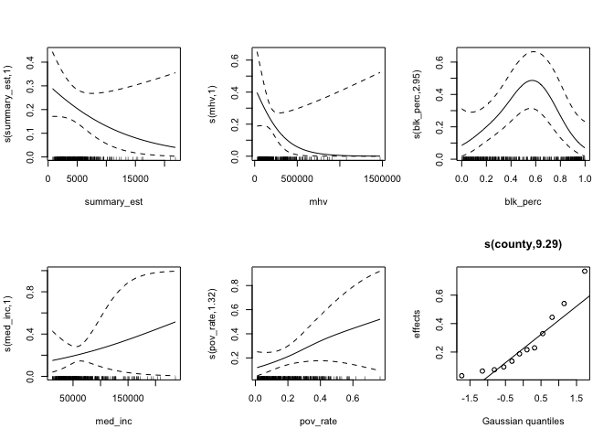
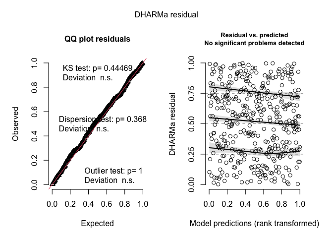

superfund_analysis
================
Nick Thieme
2/7/2022

## Superfunds in GA analysis

This is the code that accompanies the AJC story “Across Georgia,
uncovering a legacy of environmental injustice.”

This analysis uses the EPA’s Facility Registry Service (FRS), a
centrally-managed database that identifies facilities, sites, or places
subject to environmental regulations or of environmental interest, in
concert with Census data to examine the demographics of Census tracts
near Superfund sites.

First, we load in the EPA data and Census data.

### GIS analysis

Next, we define what we mean by Superfund tracts. Here, we follow the
literature and take Census tracts within 2 miles of a Superfund site to
be Superfund tracts, and define all other tracts to be non-Superfund
sites. The parameter for changing this is the magic number in line 118.
We’ve examined the sensitivity of the inferences to a variety of other
buffer distances, and, while the results are interesting, they’re
broadly similar, so we exclude them here.

Additionally, there are a varety of classifications that one could call
Superfund sites. In addition to tracking sites of hazardous waste, the
EPA maintains a National Priority List (NPL) of waste sites sufficiently
hazardous to potentially merit federal funds for cleanup. Further, the
EPA then selects a subset of the NPL to actively clean up. That,
effectively, designates three levels of Superfund sites–Superfund sites
regardless of NPL or remediation status, Superfund sites on the NPL
regardless of remediation status, and Superfund sites on the NPL and
actively in remediation. We can view these sets as creating a hierarchy
with each set contained in the sets before it. We analyse all three sets
separately, as well as a joint model of all sites, accouting for NPL and
remediation status.

In the end, the story uses the inferences from the analysis at the
‘Superfund sites on the NPL regardless of remediation status’ level.
What we care about is the demographics in Census tracts near Superfund
sites the EPA has decided are hazardous enough to potentially warrant
federal aid, regardless of whether that federal aid has come through
yet.

The process below draws a 2 mile buffer around the sites included in
each set and creates a dataframe for each level of analysis.

``` r
r_2_m <- set_units(2, "miles") 

# change to Irish grid, which uses meters
D_GA_irish_all <- st_transform(GA_super_all, 29902)
D_GA_buffer_all <-  st_buffer(D_GA_irish_all, r_2_m)

D_GA_irish_NPL_a_rem <- st_transform(GA_super_NPL_a_rem, 29902)
D_GA_buffer_NPL_a_rem <-  st_buffer(D_GA_irish_NPL_a_rem, r_2_m)

D_GA_irish_rem <- st_transform(GA_super_rem, 29902)
D_GA_buffer_rem <-  st_buffer(D_GA_irish_rem, r_2_m)


# eventually convert back to WSG84 if needed for other purposes
D_GA_buffer_all <- st_transform(D_GA_buffer_all, 4326)
D_GA_buffer_NPL_a_rem <- st_transform(D_GA_buffer_NPL_a_rem, 4326)
D_GA_buffer_rem <- st_transform(D_GA_buffer_rem, 4326)

st_crs(GA_wide_sf)<-st_crs(D_GA_buffer_all)
```

    ## Warning: st_crs<- : replacing crs does not reproject data; use st_transform for
    ## that

``` r
D_joined_all<-st_join(D_GA_buffer_all, GA_wide_sf)
```

    ## although coordinates are longitude/latitude, st_intersects assumes that they are planar

``` r
st_crs(GA_wide_sf)<-st_crs(D_GA_buffer_NPL_a_rem)
D_joined_NPL_a_rem<-st_join(D_GA_buffer_NPL_a_rem, GA_wide_sf)
```

    ## although coordinates are longitude/latitude, st_intersects assumes that they are planar

``` r
st_crs(GA_wide_sf)<-st_crs(D_GA_buffer_rem)
D_joined_rem<-st_join(D_GA_buffer_rem, GA_wide_sf)
```

    ## although coordinates are longitude/latitude, st_intersects assumes that they are planar

``` r
#this looks to have been buffered correctly
D_joined_buffer_mult <- st_join(GA_wide_sf,D_GA_buffer_all) %>% 
  mutate(county = NAME %>% str_split(.,",") %>% lapply(.,function(x)return(x[2])) %>% unlist %>% trimws,
         superfund = case_when(is.na(REGISTRY_ID)~"not_on", is.na(REGISTRY_ID)==FALSE~INTEREST_TYPE)) %>% 
  mutate(superfund= case_when(superfund=="not_on"~"not_on", 
                              superfund=="SUPERFUND (NON-NPL)"~"non_npl",
                              superfund=="REMEDIATION AND REDEVELOPMENT PROGRAMS: SUPERFUND NPL"~"remediation",
                              superfund=="SUPERFUND NPL"~"npl") %>% as_factor())
```

    ## although coordinates are longitude/latitude, st_intersects assumes that they are planar

``` r
D_joined_buffer_all <- st_join(GA_wide_sf,D_GA_buffer_all) %>% 
  mutate(county = NAME %>% str_split(.,",") %>% lapply(.,function(x)return(x[2])) %>% unlist %>% trimws,
         superfund = case_when(is.na(REGISTRY_ID)~FALSE, is.na(REGISTRY_ID)==FALSE~TRUE))
```

    ## although coordinates are longitude/latitude, st_intersects assumes that they are planar

``` r
D_joined_buffer_NPL_a_rem <- st_join(GA_wide_sf,D_GA_buffer_NPL_a_rem) %>% 
  mutate(county = NAME %>% str_split(.,",") %>% lapply(.,function(x)return(x[2])) %>% unlist %>% trimws,
         superfund = case_when(is.na(REGISTRY_ID)~FALSE, is.na(REGISTRY_ID)==FALSE~TRUE))
```

    ## although coordinates are longitude/latitude, st_intersects assumes that they are planar

``` r
D_joined_buffer_rem <- st_join(GA_wide_sf,D_GA_buffer_rem) %>% 
  mutate(county = NAME %>% str_split(.,",") %>% lapply(.,function(x)return(x[2])) %>% unlist %>% trimws,
         superfund = case_when(is.na(REGISTRY_ID)~FALSE, is.na(REGISTRY_ID)==FALSE~TRUE))
```

    ## although coordinates are longitude/latitude, st_intersects assumes that they are planar

``` r
counties_to_keep_all<-D_joined_buffer_all %>% filter(superfund==TRUE) %>% pull(county) %>% unique
counties_to_keep_NPL_a_rem<-D_joined_buffer_NPL_a_rem %>% filter(superfund==TRUE) %>% pull(county) %>% unique
counties_to_keep_rem<-D_joined_buffer_rem %>% filter(superfund==TRUE) %>% pull(county) %>% unique
```

## Simple differences

After defining our Superfund tracts and non-Superfund tracts within a
county, we then average the values for a variety of variables within
each group, and take the difference in average values between the
Superfund and non-Superfund tracts. When a Superfund site is within 2
miles of a county border, we include the overlapped county and calculate
the difference between the overlapped Superfund tracts in the overlapped
county and the non-Superfund tracts in the overlapped county. We then
average the differences across all counties with Superfund tracts in
them. We do this for each set of Superfund sites( Non-NPL, NPL,
remediation).

``` r
difference_table_all<-D_joined_buffer_all %>% as.data.frame %>%
  mutate(wht_perc = white/summary_est, blk_perc = black/summary_est, as_perc = asian/summary_est, hisp_perc = hispanic/summary_est,
         pov_rate = poverty/summary_est) %>% 
  group_by(superfund, county) %>% summarise(
    rent=mean(mgr, na.rm  = TRUE),  
    inc = mean(med_inc, na.rm = TRUE),
    home_value = mean(mhv, na.rm= TRUE),
    white_perc = mean(wht_perc, na.rm = TRUE),
    black_perc = mean(blk_perc, na.rm = TRUE),
    asian_perc = mean(as_perc, na.rm = TRUE),
    hisp_perc = mean(hisp_perc, na.rm = TRUE),
    pov_perc =  mean(pov_rate, na.rm = TRUE)
    ) %>% pivot_wider(names_from = superfund, values_from = c(rent, inc, home_value, white_perc, black_perc, asian_perc, hisp_perc,pov_perc))  %>% 
  na.omit %>% mutate(
    rent_diff = rent_TRUE-rent_FALSE,
    inc_diff = inc_TRUE - inc_FALSE,
    rent_diff_p = rent_diff/rent_FALSE,
    inc_diff_p = inc_diff/inc_FALSE,
    home_value_diff = home_value_TRUE-home_value_FALSE,
    home_value_diff_p = home_value_diff/home_value_FALSE,
    white_perc_diff = white_perc_TRUE-white_perc_FALSE,
    black_perc_diff = black_perc_TRUE-black_perc_FALSE,
    asian_perc_diff = asian_perc_TRUE-asian_perc_FALSE,
    hisp_perc_diff = hisp_perc_TRUE-hisp_perc_FALSE,
    pov_perc_diff = pov_perc_TRUE-pov_perc_FALSE
  ) %>%group_by(.) %>% 
  summarise(
    rent_diff = mean(rent_diff),
    inc_diff = mean(inc_diff),
    inc_super  = mean(inc_TRUE),
    inc_not_super  = mean(inc_FALSE),
    rent_diff_p = mean(rent_diff_p),
    inc_diff_p = mean(inc_diff_p),
    home_value_diff = mean(home_value_diff),
    home_value_diff_p = mean(home_value_diff_p),
    home_super = mean(home_value_TRUE),
    home_not_super = mean(home_value_FALSE),
    white_perc_diff = mean(white_perc_diff),
    white_perc_super = mean(white_perc_TRUE),
    white_perc_not_super = mean(white_perc_FALSE),
    black_perc_diff = mean(black_perc_diff),
    black_perc_super = mean(black_perc_TRUE),
    black_perc_not_super = mean(black_perc_FALSE),
    asian_perc_diff = mean(asian_perc_diff),
    hisp_perc_diff = mean(hisp_perc_diff),
    pov_perc_diff = mean(pov_perc_diff),
    pov_super = mean(pov_perc_TRUE),
    pov_not_super = mean(pov_perc_FALSE)
  )
```

    ## `summarise()` has grouped output by 'superfund'. You can override using the `.groups` argument.

``` r
difference_table_NPL_a_rem<-D_joined_buffer_NPL_a_rem %>% as.data.frame %>%
  mutate(wht_perc = white/summary_est, blk_perc = black/summary_est, as_perc = asian/summary_est, hisp_perc = hispanic/summary_est,
         pov_rate = poverty/summary_est) %>% 
  group_by(superfund, county) %>% summarise(
    rent=mean(mgr, na.rm  = TRUE),  
    inc = mean(med_inc, na.rm = TRUE),
    home_value = mean(mhv, na.rm= TRUE),
    white_perc = mean(wht_perc, na.rm = TRUE),
    black_perc = mean(blk_perc, na.rm = TRUE),
    asian_perc = mean(as_perc, na.rm = TRUE),
    hisp_perc = mean(hisp_perc, na.rm = TRUE),
    pov_perc =  mean(pov_rate, na.rm = TRUE)
  ) %>% pivot_wider(names_from = superfund, values_from = c(rent, inc, home_value, white_perc, black_perc, asian_perc, hisp_perc,pov_perc))  %>% 
  na.omit %>% mutate(
    rent_diff = rent_TRUE-rent_FALSE,
    inc_diff = inc_TRUE - inc_FALSE,
    rent_diff_p = rent_diff/rent_FALSE,
    inc_diff_p = inc_diff/inc_FALSE,
    home_value_diff = home_value_TRUE-home_value_FALSE,
    home_value_diff_p = home_value_diff/home_value_FALSE,
    white_perc_diff = white_perc_TRUE-white_perc_FALSE,
    black_perc_diff = black_perc_TRUE-black_perc_FALSE,
    asian_perc_diff = asian_perc_TRUE-asian_perc_FALSE,
    hisp_perc_diff = hisp_perc_TRUE-hisp_perc_FALSE,
    pov_perc_diff = pov_perc_TRUE-pov_perc_FALSE
  ) %>%group_by(.) %>% 
  summarise(
    rent_diff = mean(rent_diff),
    inc_diff = mean(inc_diff),
    inc_super  = mean(inc_TRUE),
    inc_not_super  = mean(inc_FALSE),
    rent_diff_p = mean(rent_diff_p),
    inc_diff_p = mean(inc_diff_p),
    home_value_diff = mean(home_value_diff),
    home_value_diff_p = mean(home_value_diff_p),
    home_super = mean(home_value_TRUE),
    home_not_super = mean(home_value_FALSE),
    white_perc_diff = mean(white_perc_diff),
    white_perc_super = mean(white_perc_TRUE),
    white_perc_not_super = mean(white_perc_FALSE),
    black_perc_diff = mean(black_perc_diff),
    black_perc_super = mean(black_perc_TRUE),
    black_perc_not_super = mean(black_perc_FALSE),
    asian_perc_diff = mean(asian_perc_diff),
    hisp_perc_diff = mean(hisp_perc_diff),
    pov_perc_diff = mean(pov_perc_diff),   
    pov_super = mean(pov_perc_TRUE),
    pov_not_super = mean(pov_perc_FALSE)
  )
```

    ## `summarise()` has grouped output by 'superfund'. You can override using the `.groups` argument.

``` r
difference_table_rem<-D_joined_buffer_rem %>% as.data.frame %>%
  mutate(wht_perc = white/summary_est, blk_perc = black/summary_est, as_perc = asian/summary_est, hisp_perc = hispanic/summary_est,
         pov_rate = poverty/summary_est) %>% 
  group_by(superfund, county) %>% summarise(
    rent=mean(mgr, na.rm  = TRUE),  
    inc = mean(med_inc, na.rm = TRUE),
    home_value = mean(mhv, na.rm= TRUE),
    white_perc = mean(wht_perc, na.rm = TRUE),
    black_perc = mean(blk_perc, na.rm = TRUE),
    asian_perc = mean(as_perc, na.rm = TRUE),
    hisp_perc = mean(hisp_perc, na.rm = TRUE),
    pov_perc =  mean(pov_rate, na.rm = TRUE)
  ) %>% pivot_wider(names_from = superfund, values_from = c(rent, inc, home_value, white_perc, black_perc, asian_perc, hisp_perc,pov_perc))  %>% 
  na.omit %>% mutate(
    rent_diff = rent_TRUE-rent_FALSE,
    inc_diff = inc_TRUE - inc_FALSE,
    rent_diff_p = rent_diff/rent_FALSE,
    inc_diff_p = inc_diff/inc_FALSE,
    home_value_diff = home_value_TRUE-home_value_FALSE,
    home_value_diff_p = home_value_diff/home_value_FALSE,
    white_perc_diff = white_perc_TRUE-white_perc_FALSE,
    black_perc_diff = black_perc_TRUE-black_perc_FALSE,
    asian_perc_diff = asian_perc_TRUE-asian_perc_FALSE,
    hisp_perc_diff = hisp_perc_TRUE-hisp_perc_FALSE,
    pov_perc_diff = pov_perc_TRUE-pov_perc_FALSE
  ) %>%group_by(.) %>% 
  summarise(
    rent_diff = mean(rent_diff),
    inc_diff = mean(inc_diff),
    inc_super  = mean(inc_TRUE),
    inc_not_super  = mean(inc_FALSE),
    rent_diff_p = mean(rent_diff_p),
    inc_diff_p = mean(inc_diff_p),
    home_value_diff = mean(home_value_diff),
    home_value_diff_p = mean(home_value_diff_p),
    home_super = mean(home_value_TRUE),
    home_not_super = mean(home_value_FALSE),
    white_perc_diff = mean(white_perc_diff),
    white_perc_super = mean(white_perc_TRUE),
    white_perc_not_super = mean(white_perc_FALSE),
    black_perc_diff = mean(black_perc_diff),
    black_perc_super = mean(black_perc_TRUE),
    black_perc_not_super = mean(black_perc_FALSE),
    asian_perc_diff = mean(asian_perc_diff),
    hisp_perc_diff = mean(hisp_perc_diff),
    pov_perc_diff = mean(pov_perc_diff),
    pov_super = mean(pov_perc_TRUE),
    pov_not_super = mean(pov_perc_FALSE)
  )
```

    ## `summarise()` has grouped output by 'superfund'. You can override using the `.groups` argument.

``` r
difference_table_all %>% select(inc_diff,inc_super, inc_diff_p, home_value_diff, home_value_diff_p, home_super, white_perc_diff, white_perc_super,
                                black_perc_diff, black_perc_super)
```

    ## # A tibble: 1 x 10
    ##   inc_diff inc_super inc_diff_p home_value_diff home_value_diff_p home_super
    ##      <dbl>     <dbl>      <dbl>           <dbl>             <dbl>      <dbl>
    ## 1   -7083.    48762.     -0.108         -10788.           -0.0252    136608.
    ## # … with 4 more variables: white_perc_diff <dbl>, white_perc_super <dbl>,
    ## #   black_perc_diff <dbl>, black_perc_super <dbl>

``` r
difference_table_NPL_a_rem%>% select(inc_diff,inc_super, inc_diff_p, home_value_diff, home_value_diff_p, home_super, white_perc_diff, white_perc_super,
                                     black_perc_diff, black_perc_super, pov_perc_diff, pov_super, pov_not_super)
```

    ## # A tibble: 1 x 13
    ##   inc_diff inc_super inc_diff_p home_value_diff home_value_diff_p home_super
    ##      <dbl>     <dbl>      <dbl>           <dbl>             <dbl>      <dbl>
    ## 1  -10878.    44016.     -0.153         -53046.            -0.200    111720.
    ## # … with 7 more variables: white_perc_diff <dbl>, white_perc_super <dbl>,
    ## #   black_perc_diff <dbl>, black_perc_super <dbl>, pov_perc_diff <dbl>,
    ## #   pov_super <dbl>, pov_not_super <dbl>

``` r
difference_table_rem%>% select(inc_diff,inc_super, inc_diff_p, home_value_diff, home_value_diff_p, home_super, white_perc_diff, white_perc_super,
                               black_perc_diff, black_perc_super)
```

    ## # A tibble: 1 x 10
    ##   inc_diff inc_super inc_diff_p home_value_diff home_value_diff_p home_super
    ##      <dbl>     <dbl>      <dbl>           <dbl>             <dbl>      <dbl>
    ## 1  -14347.    48324.     -0.207         -77841.            -0.322     145306
    ## # … with 4 more variables: white_perc_diff <dbl>, white_perc_super <dbl>,
    ## #   black_perc_diff <dbl>, black_perc_super <dbl>

While we eventually use the set of NPL sites for the story, a brief word
on the differences here is worthwhile. There is a gradient in the
severity of the difference between Superfund and non-Superfund tracts
that increases as we descend the hierarchy. Differences are greater in
the NPL set than the full set, and greater in the remediation set than
the NPL set. This could mean that the EPA is selecting sites based on
their demographics as mandated to do in 1994 by President Clinton in
order to enact environmental justice policies. It may also just mean
that the EPA is selecting the worst sites, which happen to be in poorer,
more Black neighborhoods. It may be some combination of these, and there
are likely other factors at play. We don’t address the question because
it would take a more sophisticated analysis to tease apart.

### Modeling

To get a better sense of which variables most impact the likelihood of a
Census tract being a Superfund tract, we build and check a variety of
random effect binomial GAM models. Additionally, we build and model
check a multinomial random effects GAM with the multinomial response
being the specific level of the hierarchy mentioned earlier. Here, we
only calculate and report results for the model on the NPL list, but we
leave the code for the other models, in case readers are interested in
examining the inferences themselves.

Because standard residual analysis on binomial models(0-1 response) is
less helpful than for other response type, we use the DHARMa package for
residual analysis. The model performs suprisingly well and the residuals
conform to expectations.

``` r
# D_mod_mult<-D_joined_buffer_mult %>%  filter(county%in%counties_to_keep_all)%>% as.data.frame %>%
#   mutate(wht_perc = white/summary_est, blk_perc = black/summary_est, as_perc = asian/summary_est, hisp_perc = hispanic/summary_est,
#          pov_rate = poverty/summary_est,
#          county = as_factor(county)) %>% 
#   select(county, superfund, mgr, med_inc, mhv,wht_perc,blk_perc,as_perc,hisp_perc,pov_rate, summary_est) %>% distinct

# D_mod_all<-D_joined_buffer_all %>%  filter(county%in%counties_to_keep_all)%>% as.data.frame %>%
#   mutate(wht_perc = white/summary_est, blk_perc = black/summary_est, as_perc = asian/summary_est, hisp_perc = hispanic/summary_est,
#          pov_rate = poverty/summary_est,
#          county = as_factor(county)) %>% 
#   select(county, superfund, mgr, med_inc, mhv,wht_perc,blk_perc,as_perc,hisp_perc,pov_rate, summary_est) %>% distinct

D_mod_NPL_a_rem<-D_joined_buffer_NPL_a_rem %>%  filter(county%in%counties_to_keep_NPL_a_rem)%>% as.data.frame %>%
  mutate(wht_perc = white/summary_est, blk_perc = black/summary_est, as_perc = asian/summary_est, hisp_perc = hispanic/summary_est,
         pov_rate = poverty/summary_est,
         county = as_factor(county)) %>% 
  select(county, superfund, mgr, med_inc, mhv,wht_perc,blk_perc,as_perc,hisp_perc,pov_rate, summary_est) %>% distinct

# D_mod_rem<-D_joined_buffer_rem %>%  filter(county%in%counties_to_keep_rem)%>% as.data.frame %>%
#   mutate(wht_perc = white/summary_est, blk_perc = black/summary_est, as_perc = asian/summary_est, hisp_perc = hispanic/summary_est,
#          pov_rate = poverty/summary_est,
#          county = as_factor(county)) %>% 
#   select(county, superfund, mgr, med_inc, mhv,wht_perc,blk_perc,as_perc,hisp_perc,pov_rate, summary_est) %>% distinct

##build a logistic GAM predicting whether or not a tract is a superfund site based on just its demigraphic characteristics. pretty interesting actually.
##we do a decently good job, even without county. of course, we need to control for county if we want our other estimates to be sensible. 

#in the final accounting, it looks like the percentage of white people and the median home value in a tract tell us something about
#the likelihood of that tract being within 2 mile of a superfund site. 

# mod_gam_mult <- gam(list(superfund~s(summary_est)+s(mhv)+s(blk_perc)+s(med_inc)+s(pov_rate)+s(county, bs = "re" ),
#                          ~s(summary_est)+s(mhv)+s(blk_perc)+s(med_inc)+s(pov_rate)+s(county, bs = "re" ),
#                          ~s(summary_est)+s(mhv)+s(blk_perc)+s(med_inc)+s(pov_rate)+s(county, bs = "re" )), 
#                    family = multinom(K=3),data = D_mod_mult %>% mutate(superfund = as.numeric(superfund) %>% {.-1}))

# mod_gam_all <- gam(superfund~s(summary_est)+s(mhv)+s(blk_perc)+s(med_inc)+s(pov_rate)+s(county, bs = "re" ), 
#                family = "binomial",data = D_mod_all)

mod_gam_NPL_a_rem <- gam(superfund~s(summary_est)+s(mhv)+s(blk_perc)+s(med_inc)+s(pov_rate)+s(county, bs = "re" ), 
               family = "binomial",data = D_mod_NPL_a_rem)

# mod_gam_rem <- gam(superfund~s(summary_est)+s(mhv)+s(blk_perc)+s(med_inc)+s(pov_rate)+s(county, bs = "re" ), 
#                family = "binomial",data = D_mod_rem)

# summary(mod_gam_all)
summary(mod_gam_NPL_a_rem)
```

    ## 
    ## Family: binomial 
    ## Link function: logit 
    ## 
    ## Formula:
    ## superfund ~ s(summary_est) + s(mhv) + s(blk_perc) + s(med_inc) + 
    ##     s(pov_rate) + s(county, bs = "re")
    ## 
    ## Parametric coefficients:
    ##             Estimate Std. Error z value Pr(>|z|)  
    ## (Intercept)   -1.346      0.604  -2.228   0.0259 *
    ## ---
    ## Signif. codes:  0 '***' 0.001 '**' 0.01 '*' 0.05 '.' 0.1 ' ' 1
    ## 
    ## Approximate significance of smooth terms:
    ##                  edf Ref.df Chi.sq  p-value    
    ## s(summary_est) 1.000  1.000  2.194 0.138549    
    ## s(mhv)         1.000  1.000  2.767 0.096230 .  
    ## s(blk_perc)    2.950  3.668 22.098 0.000198 ***
    ## s(med_inc)     1.000  1.000  0.302 0.582878    
    ## s(pov_rate)    1.323  1.586  2.916 0.140325    
    ## s(county)      9.295 11.000 35.584 1.76e-05 ***
    ## ---
    ## Signif. codes:  0 '***' 0.001 '**' 0.01 '*' 0.05 '.' 0.1 ' ' 1
    ## 
    ## R-sq.(adj) =  0.285   Deviance explained = 29.8%
    ## UBRE = -0.23296  Scale est. = 1         n = 394

``` r
# summary(mod_gam_rem)

# plot(mod_gam_mult, trans = plogis, shift = coef(mod_gam_all)[1], page = 4,seWithMean = TRUE, scale =0) 
# plot(mod_gam_all, trans = plogis, shift = coef(mod_gam_all)[1], page =1, seWithMean = TRUE, scale =0) 
plot(mod_gam_NPL_a_rem, trans = plogis, shift = coef(mod_gam_NPL_a_rem)[1], page =1, seWithMean = TRUE, scale =0) 
```

<!-- -->

``` r
# plot(mod_gam_rem, trans = plogis, shift = coef(mod_gam_rem)[1], page =1, seWithMean = TRUE, scale =0) 


# simulationOutput_all <- simulateResiduals(fittedModel = mod_gam_all, plot = F)
# plot(simulationOutput_all)
# gam.check(mod_gam_all)

simulationOutput_NPL_a_rem <- simulateResiduals(fittedModel = mod_gam_NPL_a_rem, plot = F)
```

    ## Registered S3 method overwritten by 'GGally':
    ##   method from   
    ##   +.gg   ggplot2

    ## Registered S3 method overwritten by 'mgcViz':
    ##   method from  
    ##   +.gg   GGally

``` r
plot(simulationOutput_NPL_a_rem)
```

<!-- -->

``` r
#gam.check(mod_gam_NPL_a_rem)

# simulationOutput_rem <- simulateResiduals(fittedModel = mod_gam_rem, plot = F)
# plot(simulationOutput_rem)
# gam.check(mod_gam_all)
```

We see that three variables appear to influence the likelihood of a
Census tract being a Superfund tract: total population, median home
value, and the percentage of black residents. Broadly speaking, more
rural, lower home values, and more Black residents correspond to a
higher likelihood of being a Superfund tract.
