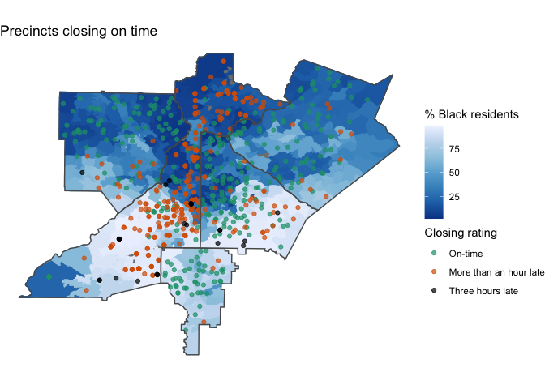
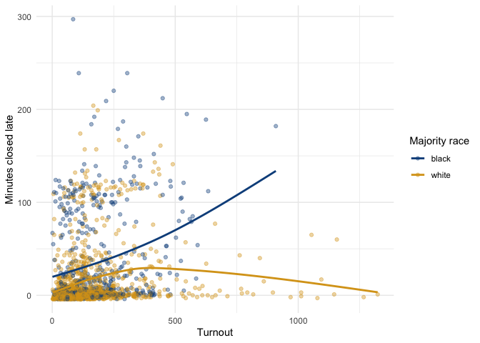
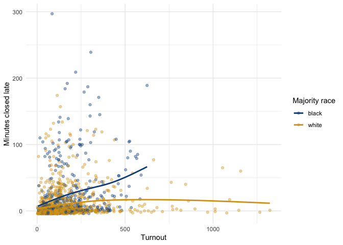

Vote delays in GA 2020
================
Nick Thieme and Mark Niesse
7/28/2020

## Voting delays disproportionately felt by majority Black communities

### link: <https://www.ajc.com/politics/extreme-voting-lines-expose-where-georgia-primary-failed/YQUMSTEBVFAY7CR7UQOQEHSVLI/>

``` r
###Library section
library(tidyverse)
library(tidycensus)
library(readxl)
library(lubridate)
library(tigris)
library(sf)
library(data.table)
library(mgcViz)
library(nnet)
library(ggthemes)
library(ggnewscale)
library(RColorBrewer)
setwd("~/Desktop/Datasets/voter_delay/voter_delays_data/") 
```

GPB has made the data public
[here](https://public.tableau.com/profile/stephen.fowler#!/vizhome/GeorgiaPollsOpenClose69/GA69PollsOpenClose),
and huge credit to them for their work and putting the data out. Our
analysis is based off of the state’s data itself, and if you need a
script for parsing the xlsx files, I’m happy to share one. I’ve set this
notebook up to work off of the public data (for the most part).

One thing you’ll see in the data is that I’m lugging around two copies
of every dataframe. That’s because I wanted to account for geography
when estimating the effect of race on delay. To do that, I re-used the
geocoded precinct location files from our story
[here](https://www.ajc.com/news/state--regional-govt--politics/precinct-closures-harm-voter-turnout-georgia-ajc-analysis-finds/11sVcLyQCHuQRC8qtZ6lYP/).

The problem is that there isn’t a perfect match between the older
geocoded precincts and the new precinct data, and I didn’t want to use
nearly correct data to calculate summary statistics when I had better
data available. So, I created two dataframes in parallel: one for the
statistical modeling, which isn’t used in the article, but directed our
thinking, and another for the results that are used in the article. The
former uses the imperfect matching under the assumption the effects from
the (small number of) missing precincts washes out. The latter uses the
original fully correct data.

``` r
#Load data
setwd("~/Desktop/Datasets/voter_delay/")
D_vote_time_f <-read_csv( "D_voter_processing_20_f.csv")

read_missing_match<-read_csv("D_missing_polls-filled.csv")
polls_to_match<-read_csv("D_polling_places.csv")
read_missing_match_2<-read_csv("poll_missing_join.csv")

read_missing_match<-read_missing_match %>% 
  left_join(D_vote_time_f %>% select(County, Precinct, "In Person EV" ), 
            by = c("county"="County", "county_precinct_id"="Precinct"))

read_missing_match_2<-read_missing_match_2 %>% 
  left_join(D_vote_time_f %>% select(County, Precinct, "In Person EV" ), 
            by = c("county"="County", "county_precinct_id"="Precinct"))

#this code splits precincts to help with the matching
D_vote_new<-data.frame()

for(i in 1:nrow(D_vote_time_f)){
  precincts<-D_vote_time_f[i,]$Precinct
  
  if(str_detect(precincts, "/")){
    precincts_v<-str_split(precincts, "/") %>% unlist
    
    D_new<-D_vote_time_f[i,] %>% select(-Precinct) %>%
      slice(rep(1:n(), each = length(precincts_v)))%>% 
      add_column(Precinct=precincts_v)%>% select(order(colnames(.)))
  }else{
    D_new<-D_vote_time_f[i,]%>% select(order(colnames(.)))
  }
  D_vote_new<-rbind(D_vote_new, D_new)
}
```

This is where the dataframes diverge. In general, if it has an m at the
end, it’s the data frame for the model. This looks like a lot of code,
but it’s mostly data shaping and calculating simple functions of the
data, like converting the number of Black residents in a precinct into
the percentage of a precinct’s population that is Black.

``` r
D_vote_new_f<-D_vote_time_f  %>% #D_vote_new
  select(County, county_precinct_id=Precinct, 
         polling_place=`Polling Place`,
         check_in_avg=`Average Check-In Process Time`,
         first_time =`First Check-In`,
         last_time =  `Last Check-In`,
         in_person_checks=`Total In-Person Check-Ins`,
         time_open=`Total Open Time`,
         votes = `Total Votes`,
         in_person = `In Person EV`,
         white = White,
         black=Black, 
         hispanic=Hispanic
         ) %>% filter(is.na(check_in_avg)==FALSE)

D_vote_new_f_m<-D_vote_new  %>% 
  select(county=County, county_precinct_id=Precinct, 
         polling_place=`Polling Place`,
         check_in_avg=`Average Check-In Process Time`,
         first_time =`First Check-In`,
         last_time =  `Last Check-In`,
         in_person_checks=`Total In-Person Check-Ins`,
         time_open=`Total Open Time`,
         votes = `Total Votes`,
         in_person = `In Person EV`,
         white = White,
         black=Black, 
         hispanic=Hispanic
  ) %>% filter(is.na(check_in_avg)==FALSE)

read_missing_matchs <-polls_to_match%>% 
  left_join(read_missing_match, by =c("id"="id_poll"))  %>% 
  select(county=county.x, county_precinct_id=county_precinct_id.x, 
         polling_place,
         check_in_avg,
         first_time,
         last_time ,
         in_person_checks=in_person_checks_1,
         time_open,
         votes ,
         in_person=`In Person EV`,
         white,
         black, 
         hispanic) %>% na.omit

read_missing_matchs_2 <-polls_to_match%>% 
  left_join(read_missing_match_2, by =c("id"="id_poll")) %>% 
  select(county=county.x, county_precinct_id=county_precinct_id.x, 
         polling_place,
         check_in_avg,
         first_time,
         last_time ,
         in_person_checks=in_person_checks_1,
         time_open,
         votes ,
         in_person=`In Person EV`,
         white,
         black, 
         hispanic) %>% na.omit

D_vote_new_f_2_m<-rbind(read_missing_matchs, read_missing_matchs_2,
                        D_vote_new_f_m) %>% 
  filter(is.na(first_time)==FALSE) %>%  distinct %>% 
  mutate(black_perc = black/(black+white+hispanic),
         white_perc = white/(black+white+hispanic),
         hispanic_perc = hispanic/(black+white+hispanic)
  )

D_vote_new_f_2<-D_vote_new_f %>% 
  filter(is.na(first_time)==FALSE) %>%  distinct %>% 
  mutate(black_perc = black/(black+white+hispanic),
         white_perc = white/(black+white+hispanic),
         hispanic_perc = hispanic/(black+white+hispanic))

D_vote_new_f_3<-D_vote_new_f_2%>% 
  filter((is.na(polling_place)&is.na(first_time)&
            is.na(last_time)&is.na(in_person_checks)&
            is.na(check_in_avg))==FALSE
  ) %>% mutate(total_check_ins=as.numeric(in_person_checks),
               avg_process_time=check_in_avg %>% str_split(":") %>%
                 lapply(function(x)return(str_c("00:",x[1],":",x[2]))) %>% 
                 unlist %>% hms %>% period_to_seconds,
               
               polling_place = str_split(polling_place,"\\(") %>% 
                 lapply(function(x)return(x[1])) %>% unlist %>% trimws,
               
               time_open = time_open %>% hms %>% period_to_seconds(),
               
               open_late=(hms(first_time)-hms("07:00:00")) %>% 
                 period_to_seconds() ,
               
               close_late=(hms(last_time)-hms("19:00:00")) %>% 
                 period_to_seconds()
  )%>% mutate(black_perc = black_perc*100,
              hispanic_perc = hispanic_perc*100,
              white_perc = white_perc*100,
              race_flag =case_when(black_perc>50~"black",white_perc>50~"white"),
              opening_rating= case_when(first_time<hms("07:10:00")~1,
                                        first_time<hms("07:15:00")~2,
                                        first_time<hms("07:29:00")~3,
                                        first_time<hms("09:00:00")~4,
                                        first_time>hms("09:01:00")~5),
              closing_rating= case_when(last_time<hms("19:10:00")~1,
                                        last_time<hms("19:30:00")~2,
                                        last_time<hms("20:00:00")~3,
                                        last_time<hms("22:01:00")~4,
                                        last_time>hms("22:01:00")~5,
                                        )
              )

D_vote_new_f_3_m<-D_vote_new_f_2_m%>% 
  filter((is.na(polling_place)&is.na(first_time)&
            is.na(last_time)&is.na(in_person_checks)&
            is.na(check_in_avg))==FALSE
  ) %>% mutate(total_check_ins=as.numeric(in_person_checks),
               avg_process_time=check_in_avg %>% str_split(":") %>%
                 lapply(function(x)return(str_c("00:",x[1],":",x[2]))) %>% 
                 unlist %>% hms %>% period_to_seconds,
               
               polling_place = str_split(polling_place,"\\(") %>% 
                 lapply(function(x)return(x[1])) %>% unlist %>% trimws,
               
               time_open = time_open %>% hms %>% period_to_seconds(),
               
               open_late=(hms(first_time)-hms("07:00:00")) %>% 
                 period_to_seconds() ,
               
               close_late=(hms(last_time)-hms("19:00:00")) %>% 
                 period_to_seconds()
  )%>% mutate(black_perc = black_perc*100,
              hispanic_perc = hispanic_perc*100,
              white_perc = white_perc*100,
              race_flag =case_when(black_perc>50~"black",white_perc>50~"white"),
              opening_rating= case_when(first_time<hms("07:10:00")~1,
                                        first_time<hms("07:15:00")~2,
                                        first_time<hms("07:29:00")~3,
                                        first_time<hms("09:00:00")~4,
                                        first_time>hms("09:01:00")~5),
              closing_rating= case_when(last_time<hms("19:10:00")~1,
                                        last_time<hms("19:30:00")~2,
                                        last_time<hms("20:00:00")~3,
                                        last_time<hms("22:01:00")~4,
                                        last_time>hms("22:01:00")~5,
                                        )
              )

D_polling_places_to_j<-polls_to_match %>% mutate(
  addr = str_c(`Addr#`," ",`Street Name`, ", ", City)) %>%
  select(county,county_precinct_id, polling_name =`Poll Place Name`,addr, 
         lat, long)

#second is for mod
D_f<-D_vote_new_f_3 

D_f_m<-D_vote_new_f_3_m %>% 
  left_join(D_polling_places_to_j, by = c("county", "county_precinct_id")) %>% 
  add_column(id = 1:nrow(.)) %>% filter(is.na(lat)==FALSE)
# 
# D_f %>% filter(is.na(lat)) %>% write_csv("D_missing_polls.csv")

D_f<-D_f %>% mutate(hispanic_perc=hispanic_perc %>% replace_na(0))
D_f_m<-D_f_m %>% mutate(hispanic_perc=hispanic_perc %>% replace_na(0))
D_f_sf<-D_f_m %>% st_as_sf(coords = c("long", "lat"))
```

## Data from the story

Here are the summary statistics we used in the story.

These give the median and upper quartile comparisons. Notably, the
difference is there, but it’s a relatively small
difference.

``` r
(D_vote_new_f_3 %>% filter(in_person<400) %>% pull(close_late) %>% summary)[5]
```

    ## 3rd Qu. 
    ##     540

``` r
(D_vote_new_f_3 %>% filter(in_person>400) %>% pull(close_late) %>% summary)[5]
```

    ## 3rd Qu. 
    ##    3555

``` r
(D_vote_new_f_3 %>% filter(in_person<400) %>% pull(close_late) %>% median)
```

    ## [1] 0

``` r
(D_vote_new_f_3 %>% filter(in_person>400) %>% pull(close_late) %>% median)
```

    ## [1] 600

It’s only once we account for race that the discrepancy between high and
low turnout precincts becomes clear. That’s because the extremely small
difference in delay for whiter precincts diminishes the apparent size of
the effect when looking at majority Black precincts.

``` r
(D_vote_new_f_3 %>% filter(race_flag=="black",in_person<400) %>% 
  pull(close_late) %>% summary)[5]
```

    ## 3rd Qu. 
    ##    1860

``` r
(D_vote_new_f_3 %>% filter(race_flag=="black",in_person>400) %>% 
  pull(close_late) %>% summary)[5]
```

    ## 3rd Qu. 
    ##    6435

``` r
(D_vote_new_f_3 %>% filter(race_flag=="black",in_person<400) %>% 
    pull(close_late) %>% median)
```

    ## [1] 240

``` r
(D_vote_new_f_3 %>% filter(race_flag=="black",in_person>400) %>% 
    pull(close_late) %>% median)
```

    ## [1] 3180

``` r
#15 as much for white, but just 29 minutes more
(D_vote_new_f_3 %>% filter(race_flag=="white",in_person<400) %>% 
  pull(close_late)%>% summary)[5]
```

    ## 3rd Qu. 
    ##     300

``` r
(D_vote_new_f_3 %>% filter(race_flag=="white",in_person>400) %>% 
  pull(close_late) %>% summary)[5]
```

    ## 3rd Qu. 
    ##    1995

``` r
(D_vote_new_f_3 %>% filter(race_flag=="white",in_person<400) %>% 
    pull(close_late) %>% median)
```

    ## [1] -60

``` r
(D_vote_new_f_3 %>% filter(race_flag=="white",in_person>400) %>% 
    pull(close_late) %>% median)
```

    ## [1] 180

If you want to vary the Black / white threshold (e.g. 40% Black instead
of majority Black), just change p here. These numbers are slightly
different than those in the article because of the different underlying
data.

``` r
p = 50
#black perc greater than
(((D_vote_new_f_3 %>% filter(black_perc>p))$closing_rating %>% 
  table)/sum((D_vote_new_f_3 %>% filter(black_perc>p))$closing_rating%>% 
               table)*100 ) %>% str_sub(.1,5) %>% str_c(.,"%") 
```

    ## [1] "58.99%" "12.77%" "5.882%" "20.33%" "2.016%"

``` r
#black perc less than
(((D_vote_new_f_3 %>% filter(white_perc>p))$closing_rating %>% 
    table)/sum((D_vote_new_f_3 %>% filter(white_perc>p))$closing_rating%>% 
                 table)*100)%>% str_sub(.1,5) %>% str_c(.,"%") 
```

    ## [1] "79.77%" "8.545%" "5.153%" "6.392%" "0.130%"

Here is where we add in the ACS data. I use spatial joins to assign
precincts to census tracts.

``` r
d_acs<-get_acs(
  geography = "tract",
  variables = c(med_inc="B19013_001"),
  state = "GA") %>% data.table

d_tracts_tigris <- tracts(state="GA") %>% st_as_sf() %>% data.table
d_acs_tracts<-d_tracts_tigris[d_acs, on ="GEOID" ] %>% st_as_sf
st_crs(D_f_sf)<-st_crs(d_acs_tracts)
D_tracts_acs<-(D_f_sf) %>% st_join(d_acs_tracts)
D_coords<-st_coordinates(D_tracts_acs)
long<-D_coords[,1]
lat<-D_coords[,2]

#first for summ second for mod
D_tracts_acs_f<-D_f %>% filter(close_late>-6000, open_late<15000)

D_tracts_acs_f_m<-D_tracts_acs %>% add_column(lat = lat, long = long) %>% 
  na.omit %>% filter(close_late>-6000, open_late<15000) 

D_tracts_acs_f_2<-D_tracts_acs_f_m  %>% data.frame %>% select(-geometry)

D_tracts_acs_f_2_n<-D_tracts_acs_f %>% 
  mutate(opening_rating= case_when(first_time<hms("07:10:00")~1,
                                   first_time<hms("07:15:00")~2,
                                   first_time<hms("07:29:00")~3,
                                   first_time<hms("09:00:00")~4,
                                   first_time>hms("09:01:00")~5),
         closing_rating= case_when(last_time<hms("19:10:00")~1,
                                   last_time<hms("19:30:00")~2,
                                   last_time<hms("20:00:00")~3,
                                   last_time<hms("22:01:00")~4,
                                   last_time>hms("22:01:00")~5,
         )
  ) %>% data.frame
```

## Modeling

This section wasn’t used in the story itself, but I needed to make sure
the effects we were seeing were actually supported. It really isn’t
enough to just compare summary statistics and call it a day. I shaped
the data a little more, to quantify the delay in the closing time.

``` r
D_tracts_acs_f_3<-D_tracts_acs_f_2 %>% 
  select(county, county_precinct_id,check_in_avg, in_person_checks, time_open, 
         first_time, 
         last_time, votes,in_person, white, black, white_perc,black_perc,
         hispanic_perc, avg_process_time, open_late, close_late, race_flag,
         estimate, lat, long,opening_rating, closing_rating ) %>% 
  distinct
```

The model itself is pretty straightforward. It’s a general additive
model
[(GAM)](https://m-clark.github.io/generalized-additive-models/introduction.html)
with a gaussian link function, which isn’t too far away from linear
regression. I thought about quasipoisson / negative binomial, but since
delay can be less than 0 if a precinct closed early, it made sense to
allow for negative responses.

The model aims to predict how late a precinct closed (seconds) using the
income of a precinct’s tract, the number of people who checked into a
precinct (but didn’t necesarily vote), the number of in person votes,
the percentage of Black residents in the precinct’s tract, and an
interaction term between the latitude and longitude of a precinct to
account for how geographic differences in voting infrastructure affected
closing delay.

It does a decent enough job of predicting closing delay and the
coefficient sizes / significances / standard errors align well enough
with the summary results, that I feel comfortable saying what we saw
earlier is a real
effect.

``` r
mod_gam_time_last<-gam(close_late~estimate+s(in_person_checks)+in_person+
                         black_perc+s(long, lat), 
                        family="gaussian", data = D_tracts_acs_f_3)

summary(mod_gam_time_last)
```

    ## 
    ## Family: gaussian 
    ## Link function: identity 
    ## 
    ## Formula:
    ## close_late ~ estimate + s(in_person_checks) + in_person + black_perc + 
    ##     s(long, lat)
    ## 
    ## Parametric coefficients:
    ##               Estimate Std. Error t value Pr(>|t|)    
    ## (Intercept) 674.292644 175.067240   3.852 0.000121 ***
    ## estimate      0.003076   0.002074   1.483 0.138257    
    ## in_person    -1.434621   0.394635  -3.635 0.000284 ***
    ## black_perc   18.374234   2.034213   9.033  < 2e-16 ***
    ## ---
    ## Signif. codes:  0 '***' 0.001 '**' 0.01 '*' 0.05 '.' 0.1 ' ' 1
    ## 
    ## Approximate significance of smooth terms:
    ##                        edf Ref.df     F p-value    
    ## s(in_person_checks)  8.056  8.761 73.14  <2e-16 ***
    ## s(long,lat)         26.920 28.732 11.09  <2e-16 ***
    ## ---
    ## Signif. codes:  0 '***' 0.001 '**' 0.01 '*' 0.05 '.' 0.1 ' ' 1
    ## 
    ## R-sq.(adj) =  0.525   Deviance explained = 53.3%
    ## GCV = 3.7333e+06  Scale est. = 3.671e+06  n = 2334

## Plotting

In places where there were disagreements between old and new precincts,
or where matches weren’t possible, I assigned precincts the average
racial demographic of their neighboring precincts.

``` r
D_precincts<-st_read("VTD2018-Shapefile")
st_crs(D_precincts)<-st_crs(D_tracts_acs_f_3)

which(D_tracts_acs_f_3$county_precinct_id=="SC211")

D_five_counties<-D_tracts_acs_f_3 %>% 
  filter(county%in%c("COBB","CLAYTON","DEKALB","FULTON","GWINNETT")) %>% 
  st_as_sf(coords = c("long","lat")) 

D_five_counties_poly<-D_precincts %>% st_join(D_five_counties) %>% na.omit

D_prec_5<-D_precincts %>% 
  filter(CTYNAME%in%c("COBB","CLAYTON","DEKALB","FULTON","GWINNETT")) 

missing_prec<-(D_five_counties_poly %>% data.table)[
  D_prec_5 %>% data.table, 
  on =  c("CTYNAME"="CTYNAME", "PRECINCT_I"="PRECINCT_I")
][is.na(black_perc)==TRUE, .(CTYNAME, PRECINCT_I, i.geometry)] %>% st_as_sf

missing_prec_fixed<-data.table()
 
#  for(i in 1:nrow(missing_prec)){
#    poss_county=D_five_counties_poly %>% 
#      filter(county == missing_prec[i,]$CTYNAME) %>% 
#      select(county, PRECINCT_I, black_perc)
#    
#    dists<-st_distance(missing_prec[i,],poss_county)
#    min_ind<-which.min(dists)
#    med<-poss_county[which(dists==0),] %>% pull(black_perc) %>% median
#    poss_county[min_ind,]$black_perc<-med
#    
#    min_prec<-poss_county[min_ind,] %>% 
#      add_column(geo_death_toll=missing_prec[i,]$i.geometry,
#                 orig_pre = missing_prec[i,]$PRECINCT_I) %>% data.table
#    
#    missing_prec_fixed<-rbind(missing_prec_fixed, min_prec)
#  }
#  
#  missing_prec_fixed_f<-missing_prec_fixed %>%
#    select(county, PRECINCT_I, black_perc, geometry = geo_death_toll ) %>% 
#    st_as_sf 
# 
# save(missing_prec_fixed_f, file="missing_prec_fixed_f")
```

The last thing we do is add the Union City precinct back in. Since it
was the one precinct to close after midnight (midnight\!\!\!), we can’t
filter by “which precincts closed latest?” because the computer thinks
after midnight is early.

``` r
load("missing_prec_fixed_f")

imputed_poly<-missing_prec_fixed_f
real_poly <-D_five_counties_poly %>% select(county, PRECINCT_I, black_perc )
D_five_poly<-rbind(imputed_poly, real_poly)

D_best_worst<-D_five_counties %>% filter(closing_rating%in%c(1,4,5)) %>% 
  mutate(closing_rating=factor(closing_rating),
         more_than_hour = case_when(close_late>10800~"More than 2 hours",
                                    close_late<=10800~"Less than 2 hours"))

GA_counties_5<-counties( state = "GA",cb=TRUE)%>%st_as_sf %>% data.table 

GA_counties_5_f<-GA_counties_5[
  NAME%in%c("Cobb","Clayton","DeKalb","Fulton", "Gwinnett")
  ] %>% st_as_sf

st_crs(GA_counties_5_f)<-st_crs(D_five_poly)
colors<-c(brewer.pal(n = 2, name = "Dark2")[1:2], "#000000")
uc<-(D_best_worst %>% filter(county=="FULTON"))[1,]
uc$black_perc<-.895
uc$in_person <-404
uc$closing_rating <- 5 %>% as.factor
st_geometry(uc) <- st_point(c(-84.522537, 33.556375)) %>% st_sfc
D_best_worst_f<-rbind(D_best_worst, uc)

D_five_poly %>% ggplot()+ geom_sf(aes(color = black_perc, fill = black_perc))+
  scale_color_distiller(palette = "Blues",name = "% Black residents")+
  scale_fill_distiller(palette = "Blues",name = "% Black residents")+
  new_scale_color()+
  geom_sf(aes(color = closing_rating),alpha = .7, data=D_best_worst_f)+
  scale_color_manual(values=colors, name = "Closing rating",
                     labels=c("On-time","More than an hour late", 
                              "Three hours late"))+
  geom_sf(fill = "transparent",data=GA_counties_5_f)+
  ggtitle("Precincts closing on time")+
  theme_void()
```

<!-- --> The
plot shows a clear racial pattern. Whiter areas had fewer delays. Most
of the three hour delay precincts are in majority Black precincts. Also,
Fulton did a very bad job.

Next, here’s the plot of closing delay against turnout, where we split
it up by race. It’s a very clear depiction of the racial disparity we
saw earlier. Majority Black precincts saw longer waits at all turnout
levels, but, while majority white precincts experienced economy of
scale, majority Black precincts absolutely did not.

``` r
D_tracts_acs_f %>% filter(close_late>-250, is.na(race_flag)==FALSE) %>% 
  ggplot(aes(x = in_person, y = close_late/60, col = race_flag))+
  geom_point(alpha = .4)+ylab("Minutes closed late")+xlab("Turnout")+
  theme_minimal()+ scale_color_manual(values=c("#0d4f8b","#d9a21b"), 
                                      name = "Majority race")+
  geom_smooth(alpha = .4, se=FALSE)
```

    ## `geom_smooth()` using method = 'gam' and formula 'y ~ s(x, bs = "cs")'

<!-- -->

Having seen this, we should return to something we noted in the previous
chart: the terrible performance of Fulton County. Fulton did so much
worse than just about every county in the state that it’s worth asking
whether Fulton’s underperformace could be driving the high-level racial
disparities we noted.

We can check that in two ways. One by removing Fulton County and
reproducing the scatterplot we just looked
at:

``` r
D_tracts_acs_f %>% filter(close_late>-250, is.na(race_flag)==FALSE, County!="FULTON") %>% 
  ggplot(aes(x = in_person, y = close_late/60, col = race_flag))+
  geom_point(alpha = .4)+ylab("Minutes closed late")+xlab("Turnout")+
  theme_minimal()+ scale_color_manual(values=c("#0d4f8b","#d9a21b"), 
                                      name = "Majority race")+
  geom_smooth(alpha = .4, se=FALSE)
```

    ## `geom_smooth()` using method = 'gam' and formula 'y ~ s(x, bs = "cs")'

<!-- -->

and two, by removing Fulton County and re-running the
GAM:

``` r
mod_gam_time_last<-gam(close_late~estimate+s(in_person_checks)+in_person+
                         black_perc+s(long, lat), 
                        family="gaussian", data = D_tracts_acs_f_3 %>% filter(county!="FULTON"))

summary(mod_gam_time_last)
```

    ## 
    ## Family: gaussian 
    ## Link function: identity 
    ## 
    ## Formula:
    ## close_late ~ estimate + s(in_person_checks) + in_person + black_perc + 
    ##     s(long, lat)
    ## 
    ## Parametric coefficients:
    ##               Estimate Std. Error t value Pr(>|t|)    
    ## (Intercept) -85.039168 154.135024  -0.552    0.581    
    ## estimate      0.001734   0.001968   0.881    0.379    
    ## in_person     0.102573   0.346493   0.296    0.767    
    ## black_perc   14.207768   1.719622   8.262  2.6e-16 ***
    ## ---
    ## Signif. codes:  0 '***' 0.001 '**' 0.01 '*' 0.05 '.' 0.1 ' ' 1
    ## 
    ## Approximate significance of smooth terms:
    ##                        edf Ref.df      F  p-value    
    ## s(in_person_checks)  5.675  6.801 19.502  < 2e-16 ***
    ## s(long,lat)         20.971 25.535  4.342 3.69e-12 ***
    ## ---
    ## Signif. codes:  0 '***' 0.001 '**' 0.01 '*' 0.05 '.' 0.1 ' ' 1
    ## 
    ## R-sq.(adj) =  0.252   Deviance explained = 26.3%
    ## GCV = 2.3077e+06  Scale est. = 2.2723e+06  n = 1998

Both of those show that while Fulton’s long delays were, on average,
sufficiently worse than the rest of the state so as to drag the overall
estimates of racial disparity upwards, the estimates remain largely the
same due to failures elsewhere. Fulton is a very predictable county, so
the quality of the prediction decreases, which makes me think the
variance is greater in other parts of the state, but the estimates stay
roughly the same.
